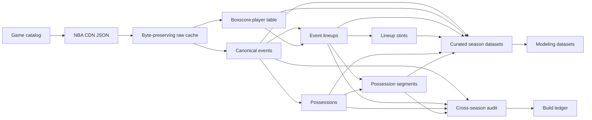

# Data Flow



## Persisted layers

For a game ID such as `0022000180`, the primary builder writes:

```text
data/raw/
  playbyplay/0022000180.json
  playbyplay/0022000180.meta.json
  boxscore/0022000180.json
  boxscore/0022000180.meta.json

data/processed/
  events/0022000180.parquet
  players/0022000180.parquet
  event_lineups/0022000180.parquet
  lineup_stints/0022000180.parquet
  possessions/0022000180.parquet
  possession_segments/0022000180.parquet
```

Audit runs write compact reports:

```text
data/audit/
  games.parquet
  summary.parquet
```

Season-scale runs add:

```text
data/catalog/
  games.parquet

data/manifests/
  builds.parquet

data/curated/{table}/
  season=2025-26/
    season_type=regular/
      part-00000.parquet
```

Raw and derived datasets are intentionally excluded from Git. Schemas,
algorithms, manifests, fixtures, and documentation are version controlled.

## Ordering guarantees

Canonical events are sorted by NBA `orderNumber`. The source order number is
stored as an integer and is not interpreted as elapsed time. Event index is the
dense zero-based position after ordering.

All downstream reconstruction assumes this order and rejects unordered input.
