# Data Flow

```mermaid
flowchart LR
    SCHED["NBA season schedule"] --> SRAW["Schedule raw cache"]
    SRAW --> CAT["Game catalog"]
    CAT --> FLOW["Prefect season fetch"]
    FLOW --> CDN["NBA CDN game JSON"]
    CDN["NBA CDN game JSON"] --> RAW["Byte-preserving raw cache"]
    FLOW --> FMAN["Fetch manifest"]
    RAW --> PFLOW["Prefect season processing"]
    PFLOW --> EVT["Canonical events"]
    RAW --> BOX["Boxscore player table"]
    PFLOW --> QUALITY["Quality reports"]
    PFLOW --> LEDGER["Build ledger"]
    EVT --> LUP["Event lineups"]
    BOX --> LUP
    LUP --> STINT["Lineup stints"]
    EVT --> POSS["Possessions"]
    LUP --> SEG["Possession segments"]
    POSS --> SEG
    EVT --> AUDIT["Cross-season audit"]
    LUP --> AUDIT
    POSS --> AUDIT
    SEG --> AUDIT
    QUALITY --> CFLOW["Prefect season compaction"]
    LEDGER --> CFLOW
    EVT --> CFLOW
    BOX --> CFLOW
    LUP --> CFLOW
    STINT --> CFLOW
    POSS --> CFLOW
    SEG --> CFLOW
    CFLOW --> CURATED["Curated season datasets"]
    PINDEX["NBA historical player index"] --> PRAW["Player raw cache"]
    PBIO["NBA season player bios"] --> PRAW
    PRAW --> PCAT["Player identity catalog"]
    PRAW --> PSEASON["Player-season bios"]
    CURATED --> MART["RAPM stint dataset"]
    MART --> BASE["Mean and team baselines"]
    MART --> RAPM["One-number RAPM"]
    PCAT --> MODEL
    PSEASON --> MODEL
    BASE --> MODEL["Model artifacts"]
    RAPM --> MODEL
    AUDIT --> QUALITY
```



## Persisted layers

For a game ID such as `0022000180`, the primary builder writes:

```text
data/raw/
  scheduleleaguev2/2025-26.json
  scheduleleaguev2/2025-26.meta.json
  playbyplay/0022000180.json
  playbyplay/0022000180.meta.json
  boxscore/0022000180.json
  boxscore/0022000180.meta.json

data/processed/
  events/0022000180.parquet
  players/0022000180.parquet
  event_lineups/0022000180.parquet
  lineup_stints/0022000180.parquet
  possessions/0022000180.parquet
  possession_segments/0022000180.parquet
```

Audit runs write compact reports:

```text
data/audit/
  games.parquet
  summary.parquet
```

Season-scale runs add:

```text
data/catalog/
  games.parquet

data/manifests/
  fetches.parquet
  builds.parquet

data/quality/
  games.parquet
  summary.parquet

data/curated/{table}/
  2025-26/
    regular/
      _manifest.json
      part-00000.parquet

data/curated/_manifests/
  2025-26/
    compact-2025-26-....json

data/raw/
  playerindex/2025-26.json
  leaguedashplayerbiostats/2025-26/regular.json

data/catalog/
  players.parquet

data/curated/player_seasons/
  2025-26/
    regular/
      _manifest.json
      part-00000.parquet

data/analytical/rapm_stints/
  2025-26/
    regular/
      _manifest.json
      part-00000.parquet

artifacts/models/rapm/
  2025-26/
    latest.json
    baseline-2025-26-.../
      manifest.json
      player_rankings.parquet
      test_metrics.parquet
```

Raw and derived datasets are intentionally excluded from Git. Schemas,
algorithms, manifests, fixtures, and documentation are version controlled.

Raw responses remain one JSON file per endpoint and game. Retryable processed
artifacts also remain per-game files. Validated analytical tables compact into
season and season-type Parquet partitions; orchestration does not change those
storage boundaries.

Compaction is lossless. It preserves every accepted source row, adds catalog and
provenance metadata, and verifies per-game and partition row conservation.
Canonical curated data includes warning games; later modeling datasets can
filter `quality_status` and decoded issue codes for a specific experiment.

## Ordering guarantees

Canonical events are sorted by NBA `orderNumber`. The source order number is
stored as an integer and is not interpreted as elapsed time. Event index is the
dense zero-based position after ordering.

All downstream reconstruction assumes this order and rejects unordered input.
