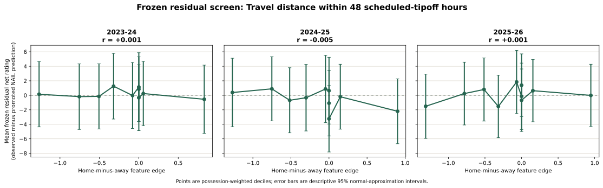

# Schedule Controls

*Last updated: 2026-08-24*

Schedule controls are game-level information known before tipoff. They are not
player traits and they are not lineup-composition features.

## Back-to-Back Contract

The initial control is calculated from the complete competitive canonical game
catalog, including games that are unavailable for modeling. Preseason,
All-Star, cancelled, and postponed entries are excluded. For a team-game, define

\[
B(g, T) = \mathbb{1}[\text{the same team played exactly one calendar day earlier}].
\]

Every stint and possession in game \(g\) receives the signed home-court value

\[
x_g^{\mathrm{B2B}} = B(g, \mathrm{home}) - B(g, \mathrm{away})
\in \{-1, 0, 1\}.
\]

The schedule mart is keyed by `game_id` and records `home_back_to_back`,
`away_back_to_back`, and `home_minus_away_back_to_back`. A game on the same
calendar day is not classified as a back-to-back.

## Modeling Boundary

For source season \(t\), a possession-weighted Ridge model estimates the
effect of \(x_g^{\mathrm{B2B}}\) after the season's player update. That
completed coefficient is used in season \(t+1\) to remove known schedule
pressure before the player RAPM fit, and is added back for frozen evaluation.
The target season's game dates are permitted because the schedule is known
before its outcomes; its target outcomes are never used to fit the control.

## Short-Rest Travel Candidate

The next candidate is not yet part of production NAIL. It is built from the
[Team-Game Travel Mart](team-game-travel.md): for each side, capped great-circle
miles from the preceding competitive-game venue are retained only when the two
scheduled UTC tipoffs are no more than 48 hours apart. The candidate contrast is

\[
x_g^{\mathrm{travel}} = T(g, \mathrm{home}) - T(g, \mathrm{away}).
\]

It was screened against frozen production residuals with HCA and B2B already
included. The result does **not** justify a recursive refit:

| Frozen target | Standardized residual weight | Weighted correlation |
| --- | ---: | ---: |
| 2023-24 | +0.061 | +0.001 |
| 2024-25 | -0.534 | -0.005 |
| 2025-26 | +0.139 | +0.001 |
| Pooled | -0.108 | -0.001 |

The signs are inconsistent and the correlations are effectively zero. The
screen therefore rejects this one-coordinate candidate before expensive
recursive fitting. The result does not establish that travel never matters; it
only says that raw great-circle miles gated at 48 scheduled-tipoff hours add no
stable residual signal beyond the current HCA and B2B controls.

Artifact: `artifacts/models/analysis/short_rest_travel_screen/short-rest-travel-screen-20260831T011021Z-dcc3123d`.

## Matchup Lab Scenarios

The Matchup Lab has no game date, so schedule conditions are optional scenario
overlays rather than inputs to its core player or lineup edge. The user may
choose a court state and independently mark either unit as being on a
back-to-back. The displayed score is

\[
\widehat{\mathrm{Edge}}_{\mathrm{scenario}}
= \widehat{\mathrm{Edge}}_{\mathrm{core}}
+ h\,c
+ b\left(\mathbb{1}[\mathrm{your\ B2B}]
- \mathbb{1}[\mathrm{opponent\ B2B}]\right),
\]

where \(c\in\{-1,0,1\}\) encodes opponent home, neutral court, or your-unit
home. The Lab uses possession-weighted completed-history reference values for
\(h\) and \(b\), rather than a volatile selected-season coefficient. In the
current v1.2.1.2 artifact those values are approximately \(+2.84\) points per
100 for home court and \(-1.52\) for a team on a B2B versus a rested opponent.

These scenario terms are displayed as separate ledger rows. They do not alter
player ratings, additive profiles, non-additive lineup edge, or the underlying
neutral-court GESTALT score. Realized-schedule evaluation and future game
prediction continue to use the actual source-season B2B coefficient appropriate
to their recursive training state.
