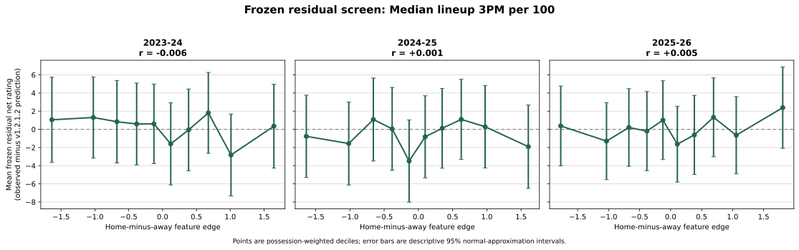
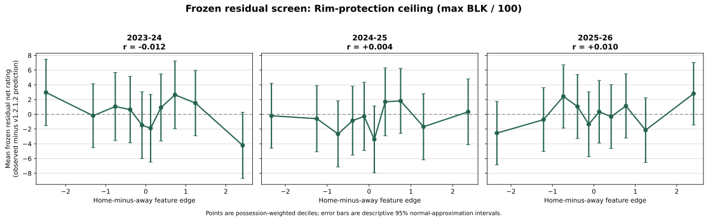
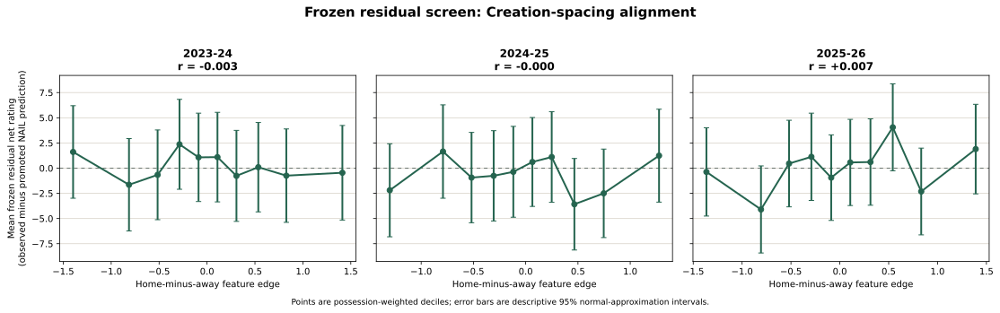
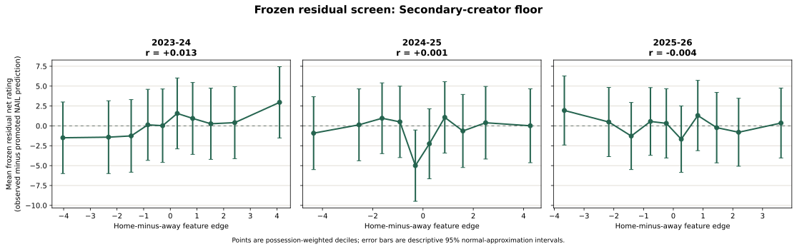
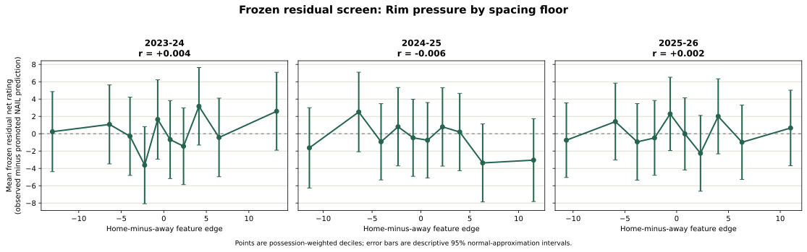
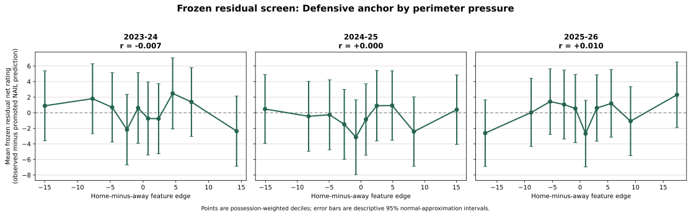
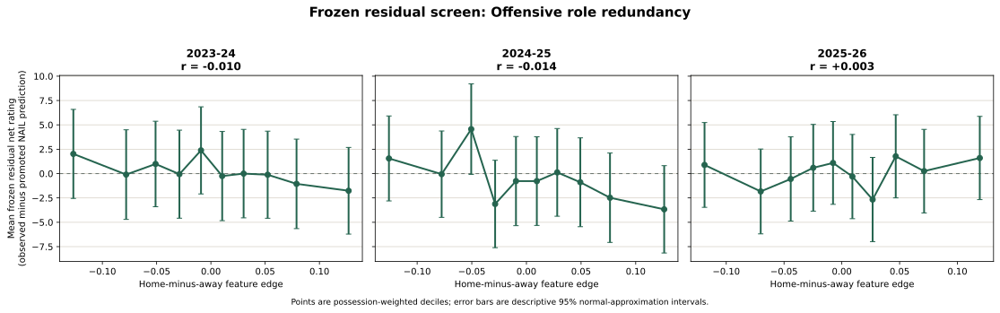
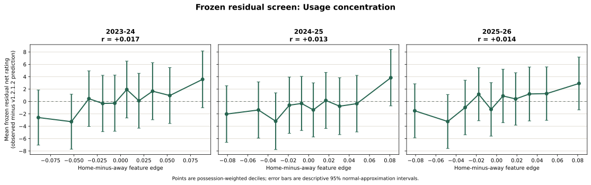
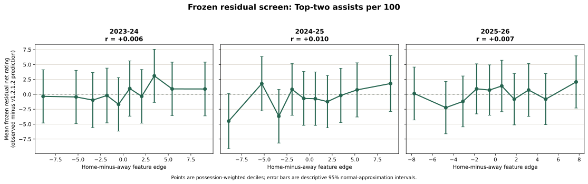
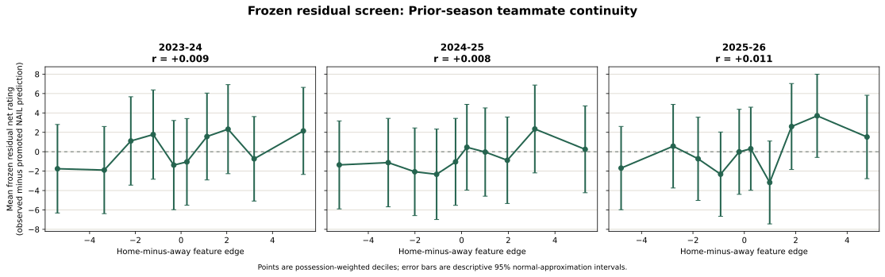

# Screen a Frozen Feature

Use this diagnostic before spending a full recursive training run on a proposed
lineup-context feature. It asks a narrow question: after the promoted frozen
NAIL-RAPM v1.2.1.3 prediction has accounted for player ratings, the retained
non-additive terms, home court, and back-to-back status, does the candidate
still align with the remaining stint-level residual?

## Run

```bash
uv run nba-screen-frozen-feature median_three_pm_per_100
```

The first registered candidate is the home-minus-away difference in the median
of each unit's five prior-season, shrinkage-adjusted `3PM / 100` values. With
five players, that is the third-ranked shooting profile, so it tests whether a
unit has a credible third shooter rather than simply one elite shooter.

## Contract

For target season `t`, the feature uses only player profiles available before
that season. The residual is:

\[
e_s = y_s - \widehat{y}^{\mathrm{NAIL\ v1.2.1.3}}_s.
\]

`y_s` is the observed home net rating for stint `s`; the prediction is replayed
from the persisted state through `t-1`. No target-season player, context, or
schedule parameter is refit. Target outcomes are used only to evaluate the
screen.

For a feature already present in the production context model, the diagnostic
uses a **leave-one-term-out** version of that same frozen prediction. It zeros
only that feature's home-minus-away context input before scoring, while holding
every other player, context, home-court, and back-to-back component fixed. That
makes production features valid positive controls: their own contribution is
left in the residual instead of being subtracted away by the full prediction.

Continuous candidates are divided into ten deterministic rank deciles. Binary
or otherwise low-cardinality candidates retain their natural value groups so a
one-hot feature is not artificially split across deciles. Each point is a
possession-weighted mean residual. The displayed 95% intervals are descriptive
normal approximations using effective stint sample size, not game-clustered
inference.

## Outputs

Each run writes an immutable artifact directory under
`artifacts/models/analysis/frozen_feature_screen/<feature>/<run-id>/`:

| Artifact | Purpose |
| --- | --- |
| `stint_residuals.parquet` | Frozen prediction, observed rating, residual, and candidate values for every regular-season stint. |
| `residual_bins.parquet` | Per-season and pooled bin means, descriptive intervals, and weighted residual correlations. |
| `metadata.json` | Candidate definition, promoted source-model run, seasons, and information-boundary contract. |

The command also renders the chart to
`docs/assets/images/frozen-feature-screens/<feature>-residual-screen.svg` by
default. A candidate advances to a full recursive training experiment only if
this screen shows a stable, basketball-plausible conditional pattern across the
three frozen seasons.

## Registering Candidates

Candidate definitions live in
`src/nba_lineup_model/modeling/frozen_feature_screen.py` as `FeatureCandidate`
entries. A new candidate provides a function mapping a five-player unit and its
frozen profile table to one scalar. The diagnostic forms the home-minus-away
contrast automatically, so every feature follows the same sign convention.

## Initial Result: Median Lineup 3PM / 100

The initial screen used the promoted v1.2.1.2 state and all three frozen
regular seasons. It covered 108,799 stints and 348,786 possessions. The
possession-weighted correlation between the median-shooting edge and the frozen
residual was effectively zero in every season:

| Target season | Weighted residual correlation |
| --- | ---: |
| 2023-24 | -0.0058 |
| 2024-25 | +0.0011 |
| 2025-26 | +0.0045 |
| Pooled | +0.0003 |

The residual deciles have no monotonic or stable conditional pattern, so median
lineup 3PM / 100 does **not** advance to a recursive model experiment.



## Candidate Result: Rim-Protection Ceiling

The rim-protection candidate is the maximum prior-season,
shrinkage-adjusted `BLK / 100` profile among a unit's five players. It tests a
strictly non-additive hypothesis: a lineup without even one credible rim
protector may underperform what the sum of individual player ratings predicts.
Low values therefore represent a lineup that lacks rim protection.

The candidate does not clear the frozen screen. Its possession-weighted
residual correlations are effectively zero and change sign across seasons:

| Target season | Weighted residual correlation |
| --- | ---: |
| 2023-24 | -0.0120 |
| 2024-25 | +0.0039 |
| 2025-26 | +0.0099 |
| Pooled | +0.0009 |

The deciles are non-monotonic, with no stable low-ceiling penalty after the
frozen NAIL-RAPM v1.2.1.2 prediction. Maximum shrunken `BLK / 100` therefore
does **not** advance to a recursive model experiment.



## Candidate Result: Creation-Spacing Alignment

Creation-spacing alignment weights each player's shrunken `3PM / 100` profile
by that player's share of the unit's prior-season usage events per 100. It is
therefore a genuine allocation feature: the same five shooting profiles can
produce different values when the usage distribution changes.

The screen does not support the candidate. Its weighted residual correlations
are indistinguishable from zero, and the direction of the endpoint decile
spread reverses across the three frozen seasons:

| Target season | Stints | Possessions | Weighted residual correlation | Lowest-to-highest decile spread |
| --- | ---: | ---: | ---: | ---: |
| 2023-24 | 34,022 | 112,801 | -0.0028 | -2.07 |
| 2024-25 | 34,859 | 113,100 | -0.0000 | +3.43 |
| 2025-26 | 39,918 | 122,886 | +0.0070 | +2.26 |
| Pooled | 108,799 | 348,786 | +0.0017 | +1.09 |

The large endpoint movements are not a stable relationship: the decile means
are noisy, non-monotonic, and their apparent direction changes by season.
Creation-spacing alignment therefore does **not** advance to a recursive
candidate fit.



Artifact:
`artifacts/models/analysis/frozen_feature_screen/creation_spacing_alignment/frozen-feature-screen-creation_spacing_alignment-20260830T195938Z-24613d9e`.

## Candidate Result: Secondary-Creator Floor

The secondary-creator floor is the second-highest prior-season, shrunken
`AST / 100` profile in a five-player unit. It tests whether the retained
top-two-assists term is specifically picking up the presence of a credible
second creator rather than the combined passing capacity of two players.

It does not clear the frozen screen. A modest positive pattern in 2023-24
vanishes in 2024-25 and reverses in 2025-26:

| Target season | Stints | Possessions | Weighted residual correlation | Lowest-to-highest decile spread |
| --- | ---: | ---: | ---: | ---: |
| 2023-24 | 34,022 | 112,801 | +0.0132 | +4.45 |
| 2024-25 | 34,859 | 113,100 | +0.0005 | +0.93 |
| 2025-26 | 39,918 | 122,886 | -0.0037 | -1.58 |
| Pooled | 108,799 | 348,786 | +0.0032 | +1.23 |

The fitted positive relationship in the first season is not repeatable. The
candidate therefore does **not** advance to a recursive model experiment.



Artifact:
`artifacts/models/analysis/frozen_feature_screen/secondary_creator_floor/frozen-feature-screen-secondary_creator_floor-20260830T202300Z-2d67c5e4`.

## Candidate Result: Rim Pressure By Spacing Floor

This feature multiplies a unit's total shrunken unassisted rim makes per 100 by
the average shrunken `3PM / 100` profile of its two weakest spacers. It is the
continuous version of the earlier Critical Spacing hypothesis: rim pressure
should be more useful when even the unit's weakest spacers provide gravity.

The frozen screen does not support the interaction. Both the correlations and
the endpoint decile direction change across seasons:

| Target season | Stints | Possessions | Weighted residual correlation | Lowest-to-highest decile spread |
| --- | ---: | ---: | ---: | ---: |
| 2023-24 | 34,022 | 112,801 | +0.0038 | +2.36 |
| 2024-25 | 34,859 | 113,100 | -0.0065 | -1.42 |
| 2025-26 | 39,918 | 122,886 | +0.0016 | +1.41 |
| Pooled | 108,799 | 348,786 | -0.0001 | +0.48 |

The candidate therefore does **not** advance to a recursive model experiment.



Artifact:
`artifacts/models/analysis/frozen_feature_screen/rim_pressure_by_spacing_floor/frozen-feature-screen-rim_pressure_by_spacing_floor-20260830T202922Z-0678e0aa`.

## Candidate Result: Defensive Anchor By Perimeter Pressure

This feature multiplies the highest prior-season, shrunken block rate in a unit
by the summed shrunken steal rates of the other four players. It tests whether
a credible rim protector becomes more useful when surrounded by perimeter
disruption, rather than asking whether blocks alone predict residual value.

The frozen screen is not stable:

| Target season | Stints | Possessions | Weighted residual correlation | Lowest-to-highest decile spread |
| --- | ---: | ---: | ---: | ---: |
| 2023-24 | 34,022 | 112,801 | -0.0067 | -3.26 |
| 2024-25 | 34,859 | 113,100 | +0.0004 | -0.08 |
| 2025-26 | 39,918 | 122,886 | +0.0099 | +4.92 |
| Pooled | 108,799 | 348,786 | +0.0021 | +0.49 |

The relationship changes direction across seasons, so the candidate does **not**
advance to a recursive model experiment.



Artifact:
`artifacts/models/analysis/frozen_feature_screen/defensive_anchor_by_perimeter_pressure/frozen-feature-screen-defensive_anchor_by_perimeter_pressure-20260830T203515Z-3b3a6ee0`.

## Candidate Result: Offensive Role Redundancy

For each player, this candidate forms a six-coordinate, source-season-scaled
role vector from usage events, assists, `3PA`, unassisted rim makes, offensive
rebounds, and free-throw attempts per 100 possessions. Each coordinate is
divided by its source-season possession-weighted 90th percentile across all
source-season players, then each player vector is normalized to unit length.
The feature is mean pairwise cosine similarity among the five normalized role
vectors. Higher values therefore represent more similar offensive roles, with a
pre-registered expected negative residual relationship.

It has the strongest pooled screen of the newly tested candidates, but does not
meet the stability gate because 2025-26 reverses direction:

| Target season | Stints | Possessions | Weighted residual correlation | Lowest-to-highest decile spread | Decile Spearman |
| --- | ---: | ---: | ---: | ---: | ---: |
| 2023-24 | 34,022 | 112,801 | -0.0096 | -3.78 | -0.71 |
| 2024-25 | 34,859 | 113,100 | -0.0144 | -5.22 | -0.68 |
| 2025-26 | 39,918 | 122,886 | +0.0027 | +0.71 | +0.33 |
| Pooled | 108,799 | 348,786 | -0.0069 | -3.10 | -0.62 |

The candidate is therefore **not** advanced to a recursive fit. This is a
useful negative result: a plausible role-similarity construction can look
promising in pooled data while failing the required forward-season stability
check.



Artifact:
`artifacts/models/analysis/frozen_feature_screen/offensive_role_redundancy/frozen-feature-screen-offensive_role_redundancy-20260830T204638Z-222eb12b`.

## Production Controls

The two retained production non-additive terms validate the screen's
leave-one-term-out control path. For each one, the frozen prediction retains
every other component but omits that term's own contribution. Both produce a
small but directionally stable positive residual relationship across all three
target seasons:

| Feature | 2023-24 | 2024-25 | 2025-26 | Pooled |
| --- | ---: | ---: | ---: | ---: |
| Usage concentration | +0.0166 | +0.0128 | +0.0142 | +0.0146 |
| Top-two assists / 100 | +0.0057 | +0.0096 | +0.0066 | +0.0073 |

The pooled usage-concentration deciles move from `-1.73` to `+2.84` residual
net-rating points from the lowest to highest feature edge. Top-two assists move
from `-1.34` to `+1.84`. Middle deciles remain noisy because stint outcomes are
noisy; these controls validate that the screen recovers a withheld production
term, not that it establishes a causal effect.





## Candidate Result: Prior-Season Teammate Continuity

This candidate measures historical relationships rather than individual
player profiles. For target season \(t\), let \(P_{ij,t-1}\) be the regular-season
possessions that players \(i\) and \(j\) shared on the same unit during the
immediately preceding season. For a five-player unit \(U\), define

\[
\mathrm{Continuity}(U,t)
=\frac{1}{10}\sum_{i<j,\,i,j\in U}\log\left(1+P_{ij,t-1}\right).
\]

All ten pairs receive equal weight. Pairs without prior shared possessions
contribute zero, so one new player reduces but does not erase the continuity
of an established four-player core. The screen uses no decay rate, minimum
exposure threshold, target-season shared possessions, or target-season player
profile information.

Unlike the earlier screens on this page, this run uses the promoted
NAIL-RAPM v1.2.1.3 residualized-lambda state as its frozen baseline. The
candidate has a small positive residual correlation in every season:

| Target season | Stints | Possessions | Weighted residual correlation | Lowest-to-highest decile spread |
| --- | ---: | ---: | ---: | ---: |
| 2023-24 | 34,022 | 112,801 | +0.0093 | +3.90 |
| 2024-25 | 34,859 | 113,100 | +0.0081 | +1.60 |
| 2025-26 | 39,918 | 122,886 | +0.0106 | +3.21 |
| Pooled | 108,799 | 348,786 | +0.0093 | +2.34 |

The decile relationship is not perfectly monotonic, but its direction is
consistent. Spearman correlations across the ten residual-bin means are
`+0.66`, `+0.78`, and `+0.54` by season, and `+0.83` pooled. Approximately
5-7% of evaluated side lineups have zero prior continuity, so the result is not
being inferred from a tiny all-new-lineup cohort.



**Screen decision: advance to a controlled recursive candidate fit.** The
signal was comparable in magnitude to the retained non-additive positive
controls and stable across the three frozen seasons. The subsequent full fit
found a highly stable positive coefficient but no material incremental frozen
lift, so the feature was not promoted. See the
[complete candidate result](../models/nail-teammate-continuity.md).

Artifacts:

- Screen: `artifacts/models/analysis/frozen_feature_screen/prior_teammate_continuity/frozen-feature-screen-prior_teammate_continuity-20260830T042640Z-911b48a2`
- Pair exposure: `prior_pair_exposures.parquet` inside the screen artifact
