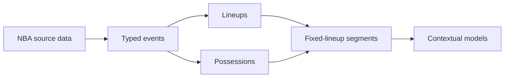

Possession-level modeling infrastructure

# NBA Lineup Model

A reproducible NBA play-by-play data spine for context-sensitive player and
lineup value. The immediate goal is trustworthy five-on-five possession samples;
the longer horizon is nonlinear lineup modeling with interpretable context.

  

    <strong>Direct source</strong>
    Byte-preserved NBA source responses
  

  

    <strong>Exact context</strong>
    Five players per team at every boundary
  

  

    <strong>Validated output</strong>
    Score, duration, and lineup invariants
  

## Workflows

  <a href="guides/build-game/">
    01
    <strong>Build one game</strong>
    Fetch, normalize, reconstruct, and persist six Parquet contracts.
  </a>
  <a href="guides/cross-season-audit/">
    02
    <strong>Audit across seasons</strong>
    Exercise reconstruction against regulation, playoff, and overtime feeds.
  </a>
  <a href="guides/fetch-season/">
    03
    <strong>Fetch a season</strong>
    Run resumable, bounded-concurrency acquisition from the game catalog.
  </a>
  <a href="guides/process-season/">
    04
    <strong>Process a season</strong>
    Reconstruct and quality-gate cached games through Prefect.
  </a>
  <a href="guides/compact-season/">
    05
    <strong>Compact a season</strong>
    Publish lossless, provenance-rich analytical Parquet datasets.
  </a>
  <a href="architecture/overview/">
    06
    <strong>Understand the pipeline</strong>
    Review ownership boundaries, decisions, and failure policy.
  </a>
  <a href="data/raw-responses/">
    07
    <strong>Inspect data contracts</strong>
    Trace raw source documents through modeling-ready segments.
  </a>

## Current system

- Fetch play-by-play and boxscore JSON directly from NBA CDN endpoints.
- Preserve raw response bytes with fetch metadata and SHA-256 digests.
- Discover historical season schedules directly into a canonical game catalog.
- Fetch complete seasons through a resumable local Prefect flow.
- Process cached seasons through validation-gated Prefect tasks.
- Compact quality-gated games into resumable season-level Parquet datasets.
- Normalize source actions into typed canonical events.
- Reconstruct event-level lineups and stable lineup stints.
- Reconstruct basketball possessions with explicit terminal reasons.
- Split possessions when substitutions change either lineup.
- Audit exact invariants across regular-season, playoff, and overtime games.

## Engineering stance

1. Preserve source information before deriving basketball semantics.
2. Keep identifiers and clocks typed without lossy coercion.
3. Treat feed fields as evidence, not unquestionable ground truth.
4. Surface anomalies through structured issues and audit reports.
5. Establish trustworthy samples before optimizing model complexity.

!!! note "Contract status"

    Processed schemas are explicit and tested, but remain experimental until
    modeling requirements and cross-season feed behavior are better understood.
