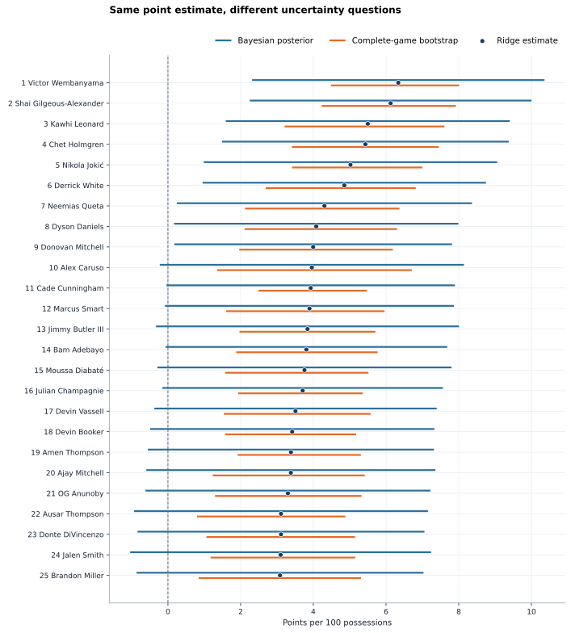
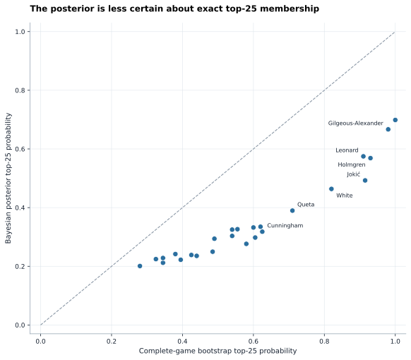

<p class="project-kicker">Bayesian model review / 2025-26</p>

# What Bayesian RAPM Adds to the Same Ridge Ranking

<p class="project-lead">
The conjugate Bayesian model deliberately reproduces the selected ridge RAPM
point estimates, then replaces a single leaderboard with joint uncertainty over
player effects, ranks, and held-out stint predictions.
</p>

<div class="signal-strip">
  <div><strong>39,918 stints</strong><span>same regular-season mart</span></div>
  <div><strong>4,000 draws</strong><span>exact joint posterior</span></div>
  <div>
    <strong>452 eligible</strong>
    <span>500-possession floor</span>
  </div>
</div>

!!! warning "Conditional model uncertainty"
    These credible intervals condition on the signed linear model, selected
    lambda, possession weights, and equal-segment allocation. They do not cover
    uncertainty about lambda selection, possession construction, omitted
    context, or whether the Gaussian likelihood is the right data-generating
    model.

## Same center, new distribution

The model uses the same signed player matrix and normalized possession weights
as ridge:

\[
y_i \mid \alpha, \beta, \sigma^2
\sim
\mathcal{N}\left(
\alpha + x_i^\mathsf{T}\beta,
\frac{\sigma^2}{\widetilde{w}_i}
\right).
\]

The player prior is

\[
\beta \mid \sigma^2
\sim
\mathcal{N}\left(
0,
\frac{\sigma^2}{n\lambda}I
\right),
\]

with a flat home-court intercept and
\(p(\sigma^2) \propto 1/\sigma^2\). Because this is conjugate Gaussian
regression, the posterior is exact: there is no MCMC convergence or
variational-approximation error.

The posterior location and ridge solution are the same linear solve. The small
differences below are numerical solver tolerance, not modeling disagreement.

| Check | Result |
| --- | ---: |
| Maximum player-coefficient difference | 2.21e-06 |
| Coefficient correlation | 1.000000000 |
| Eligible-rank correlation | 1.000000000 |
| Initial top-25 overlap | 25/25 |
| Maximum held-out point-prediction difference | 6.50e-06 |
| Ridge game-margin RMSE | 15.811 |
| Bayesian-mean game-margin RMSE | 15.811 |

This is therefore not a fourth competing leaderboard. It is the probabilistic
interpretation of the chosen ridge model.

## The initial top 25

Only **9 of 25** initial leaders have a 90% marginal
credible interval entirely above zero. Only **4**
have at least a 50% posterior probability of remaining top 25, compared with
**15** under the complete-game bootstrap.

| Rank | Player | RAPM | Bayesian 90% interval | P(positive) | Bayes top 25 | Bootstrap top 25 | Posterior rank 90% |
| ---: | --- | ---: | ---: | ---: | ---: | ---: | ---: |
| 1 | Victor Wembanyama | 6.34 | [2.32, 10.36] | 99.5% | 69.9% | 100% | 1-106 |
| 2 | Shai Gilgeous-Alexander | 6.13 | [2.25, 10.00] | 99.5% | 66.7% | 98% | 1-111 |
| 3 | Kawhi Leonard | 5.50 | [1.59, 9.41] | 99.0% | 57.5% | 91% | 1-144 |
| 4 | Chet Holmgren | 5.43 | [1.49, 9.38] | 98.8% | 56.9% | 93% | 1-140 |
| 5 | Nikola Jokić | 5.02 | [0.98, 9.06] | 98.0% | 49.3% | 91.5% | 2-167 |
| 6 | Derrick White | 4.85 | [0.95, 8.75] | 98.0% | 46.4% | 82% | 2-178 |
| 7 | Neemias Queta | 4.31 | [0.24, 8.37] | 95.9% | 39.0% | 71% | 2-213 |
| 8 | Dyson Daniels | 4.08 | [0.17, 7.99] | 95.7% | 33.5% | 62% | 3-230 |
| 9 | Donovan Mitchell | 4.00 | [0.17, 7.82] | 95.7% | 32.5% | 54% | 4-215 |
| 10 | Alex Caruso | 3.96 | [-0.23, 8.14] | 94.0% | 33.2% | 60% | 3-243 |
| 11 | Cade Cunningham | 3.93 | [-0.04, 7.90] | 94.8% | 31.8% | 62.5% | 3-222 |
| 12 | Marcus Smart | 3.89 | [-0.08, 7.87] | 94.6% | 30.3% | 54% | 4-232 |
| 13 | Jimmy Butler III | 3.84 | [-0.33, 8.01] | 93.5% | 32.6% | 55.5% | 3-240 |
| 14 | Bam Adebayo | 3.81 | [-0.07, 7.69] | 94.7% | 29.8% | 60.5% | 4-231 |
| 15 | Moussa Diabaté | 3.76 | [-0.29, 7.80] | 93.7% | 29.4% | 49% | 3-253 |
| 16 | Julian Champagnie | 3.71 | [-0.15, 7.57] | 94.3% | 27.7% | 58.0% | 4-244 |
| 17 | Devin Vassell | 3.51 | [-0.38, 7.39] | 93.1% | 25.0% | 48.5% | 5-258 |
| 18 | Devin Booker | 3.42 | [-0.49, 7.33] | 92.5% | 24.2% | 38% | 5-258 |
| 19 | Amen Thompson | 3.38 | [-0.55, 7.32] | 92.1% | 23.5% | 44% | 5-264 |
| 20 | Ajay Mitchell | 3.38 | [-0.60, 7.36] | 91.9% | 23.8% | 42.5% | 5-271 |
| 21 | OG Anunoby | 3.30 | [-0.62, 7.22] | 91.7% | 22.2% | 39.5% | 6-269 |
| 22 | Ausar Thompson | 3.11 | [-0.93, 7.16] | 89.7% | 22.4% | 32.5% | 6-285 |
| 23 | Donte DiVincenzo | 3.11 | [-0.84, 7.06] | 90.2% | 21.2% | 34.5% | 6-283 |
| 24 | Jalen Smith | 3.10 | [-1.04, 7.24] | 89.1% | 22.8% | 34.5% | 6-296 |
| 25 | Brandon Miller | 3.08 | [-0.86, 7.03] | 90.1% | 20.1% | 28.0% | 7-275 |

The rank columns come from joint draws, so they retain posterior covariance
between teammates and opponents. Marginal coefficient intervals alone cannot
answer a rank question.

## Two uncertainty questions

<figure class="case-study-figure" markdown>
  
  <figcaption>
    Paired 5th-to-95th percentile intervals around the same ridge point estimate.
  </figcaption>
</figure>

Across all 452 eligible players, the Bayesian
interval is **2.16 times** as wide as the complete-game
bootstrap interval at the median. This does not make one interval correct and
the other wrong:

- The bootstrap resamples complete games and refits ridge. It measures the
  sampling stability of the regularized estimation procedure.
- The Bayesian posterior conditions on this season's design and asks which
  latent coefficient vectors remain plausible under the likelihood and prior.
- Ridge can be stable under resampling while several correlated player effects
  remain weakly identified. Shrinkage reduces estimator variance without
  making the underlying parameters equally precise.

This distinction is visible in rank probabilities:

<figure class="case-study-figure" markdown>
  
  <figcaption>
    Points below the diagonal receive less top-25 support from the posterior
    than from game resampling.
  </figcaption>
</figure>

Victor Wembanyama and Shai Gilgeous-Alexander have the
strongest posterior top-25 support at
**69.9%** and
**66.7%**. The largest
top-25 probability difference is Nikola Jokić:
**49.3%** posterior versus
**91.5%** bootstrap. The
disagreement concerns rank precision, not the shared point estimate.

## Held-out predictive calibration

The posterior was separately fit on the original 1,044-game final training
window. Coverage below is measured on the untouched final 186 games and 5,789
stints.

| Nominal interval | Stint coverage | Possession-weighted coverage | Weighted mean width |
| ---: | ---: | ---: | ---: |
| 50% | 50.4% | 51.8% | 130.2 |
| 80% | 80.0% | 81.8% | 247.3 |
| 90% | 90.6% | 91.7% | 317.4 |
| 95% | 95.0% | 96.2% | 378.2 |

The 90% predictive interval covers
**90.6%** of held-out stints and
**91.7%** after possession
weighting. That is close to nominal, with modest conservatism under the weighted
view. These are intervals for noisy stint net rating, not game margin or a
player coefficient.

## What this baseline establishes

The Bayesian model adds three things the ridge leaderboard cannot provide:

1. uncertainty about coefficient sign and magnitude;
2. joint rank and top-N probabilities;
3. posterior predictive intervals with measurable held-out coverage.

It also clarifies the next modeling requirement. A hierarchical Bayesian RAPM
should estimate prior scales rather than inheriting one cross-validated lambda,
and it can partially pool by season, age, position, or draft information. That
is where PyMC becomes useful. The exact conjugate model remains the reference
implementation because any richer model should justify its additional
complexity against these closed-form results.

## Reproduce this page

```bash
uv run nba-train-bayesian-rapm 2025-26 \
  --source-run-id baseline-2025-26-20260727T230533Z-72eac627

uv run --group docs nba-build-bayesian-rapm-case-study 2025-26 \
  --bayesian-run-id bayesian-2025-26-20260729T043953Z-b50cc2f7 \
  --diagnostics-run-id diagnostics-2025-26-20260728T043406Z-32196bfa
```

| Provenance | Value |
| --- | --- |
| Bayesian run | `bayesian-2025-26-20260729T043953Z-b50cc2f7` |
| Source ridge run | `baseline-2025-26-20260727T230533Z-72eac627` |
| Diagnostics run | `diagnostics-2025-26-20260728T043406Z-32196bfa` |
| Bayesian manifest SHA-256 | `f396761e8104d71e44a6f0332c5fd9b0574d0aaf1f4b212ce876b37764a42930` |
| Diagnostics manifest SHA-256 | `f3d2eb563f69137284fb50d790a6a1ec12c70bccaa7ccb672584bc85ed16c91b` |
| Generator source SHA-256 | `ecda95cf4093830b1ce095710c51c784562f2becabe1c3c2badc5bdec343d617` |
| Selected lambda | `0.03` |
| Player population | 582 total / 452 eligible |

The ridge/Bayesian equivalence follows the standard Gaussian-prior
interpretation summarized by
[van Wieringen (2015)](https://arxiv.org/abs/1509.09169). Posterior and
posterior-predictive interpretation follows
[Gelman et al., *Bayesian Data Analysis*](https://sites.stat.columbia.edu/gelman/book/).
See the [Bayesian RAPM methodology](bayesian-rapm.md) for the full artifact
contract and the [original RAPM case study](2025-26-rapm-case-study.md)
for the broader stability diagnostics.
