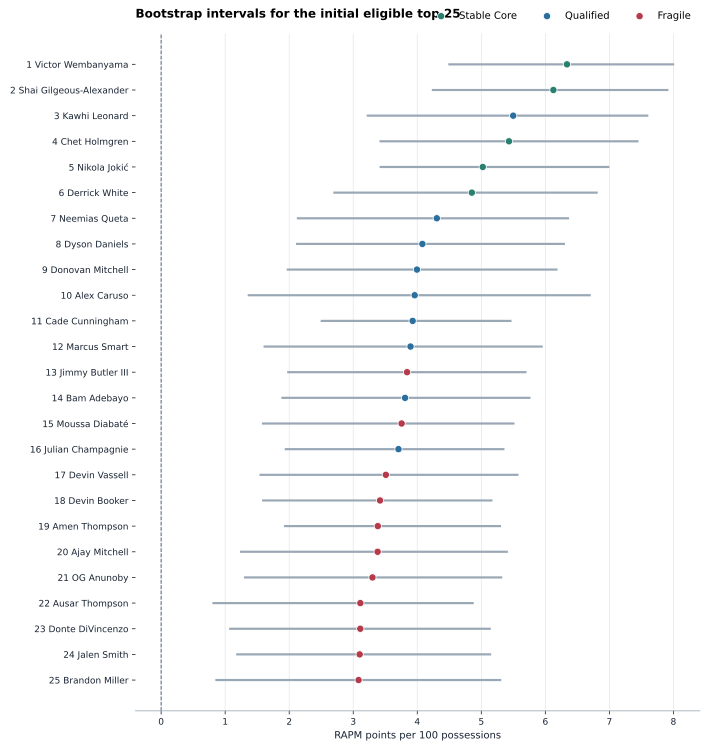
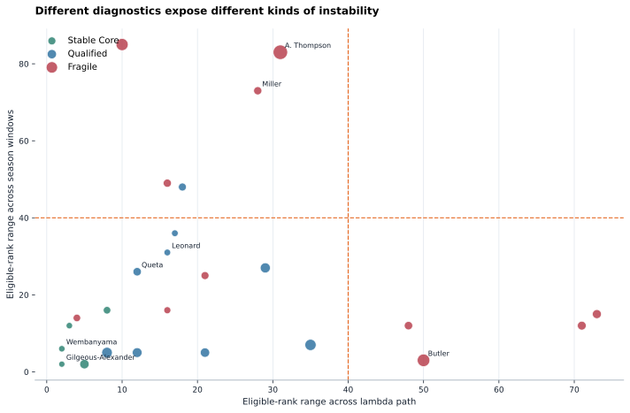

<p class="project-kicker">Model review / 2025-26</p>

# What a One-Season RAPM Can Establish

<p class="project-lead">
This case study starts with an untouched one-year RAPM ranking, then asks which
positions survive resampling, time, regularization, data-construction, influence,
and lineup-context checks.
</p>

<div class="signal-strip">
  <div><strong>1,230 games</strong><span>regular season</span></div>
  <div>
    <strong>200 bootstraps</strong>
    <span>complete-game resamples</span>
  </div>
  <div>
    <strong>452 eligible players</strong>
    <span>500-possession floor</span>
  </div>
</div>

!!! warning "Experimental, not promoted"
    The review bands below are editorial screening aids, not hypothesis tests,
    causal conclusions, or a replacement player metric. "Fragile" means the
    exact top-25 position is not robust in this one-season specification; it
    does not mean the player is poor or that the coefficient must be false.

## Starting point

The source model is a signed, one-number ridge RAPM fit to 39,918
regular-season stints. It selected lambda `0.03` through
expanding chronological validation and then refit all 1,230
games. The table below is the initial exposure-eligible top 25 before applying
any diagnostic screen.

| Rank | Player | Team | RAPM | Possessions | Raw on-court |
| ---: | --- | :---: | ---: | ---: | ---: |
| 1 | Victor Wembanyama | SAS | 6.34 | 3,896 | 17.53 |
| 2 | Shai Gilgeous-Alexander | OKC | 6.13 | 4,730 | 16.47 |
| 3 | Kawhi Leonard | LAC | 5.50 | 4,167 | 8.28 |
| 4 | Chet Holmgren | OKC | 5.43 | 4,129 | 16.40 |
| 5 | Nikola Jokić | DEN | 5.02 | 4,786 | 11.14 |
| 6 | Derrick White | BOS | 4.85 | 5,180 | 11.60 |
| 7 | Neemias Queta | BOS | 4.31 | 3,752 | 13.38 |
| 8 | Dyson Daniels | ATL | 4.08 | 5,317 | 6.26 |
| 9 | Donovan Mitchell | CLE | 4.00 | 4,925 | 7.70 |
| 10 | Alex Caruso | OKC | 3.96 | 2,125 | 18.92 |
| 11 | Cade Cunningham | DET | 3.93 | 4,490 | 11.09 |
| 12 | Marcus Smart | LAL | 3.89 | 3,607 | 6.85 |
| 13 | Jimmy Butler III | GSW | 3.84 | 2,449 | 7.76 |
| 14 | Bam Adebayo | MIA | 3.81 | 5,031 | 6.06 |
| 15 | Moussa Diabaté | CHA | 3.76 | 3,790 | 10.42 |
| 16 | Julian Champagnie | SAS | 3.71 | 4,745 | 11.87 |
| 17 | Devin Vassell | SAS | 3.51 | 4,258 | 11.72 |
| 18 | Devin Booker | PHX | 3.42 | 4,442 | 4.46 |
| 19 | Amen Thompson | HOU | 3.38 | 5,936 | 6.74 |
| 20 | Ajay Mitchell | OKC | 3.38 | 3,075 | 16.00 |
| 21 | OG Anunoby | NYK | 3.30 | 4,531 | 8.85 |
| 22 | Ausar Thompson | DET | 3.11 | 3,897 | 11.57 |
| 23 | Donte DiVincenzo | MIN | 3.11 | 5,223 | 6.05 |
| 24 | Jalen Smith | CHI | 3.10 | 2,316 | 4.27 |
| 25 | Brandon Miller | CHA | 3.08 | 3,968 | 9.15 |

## Review bands

The bands deliberately remain separate from RAPM. They summarize whether a
top-25 position survives several diagnostics; they do not alter coefficients.

| Band | Rule |
| --- | --- |
| Stable core | Bootstrap top-25 probability at least 75% and no structural warning |
| Qualified | Bootstrap top-25 probability at least 50% and at most one structural warning |
| Fragile | Below the qualified bootstrap threshold or carrying multiple structural warnings |

A structural warning is triggered by a chronological or lambda eligible-rank
range above 40, an
allocation-policy rank change above
20, an exact delete-game
coefficient change above 0.45, or
more than 80% of possessions beside
one teammate. These are transparent case-study thresholds chosen for review
readability, not estimated statistical cutoffs.

The screen retains **5** players in the stable core, qualifies
**9**, and marks **11** initial top-25 positions as
fragile.

| Rank | Player | Review | Boot top 25 | Chronology range | Lambda range | Allocation move | Delete-game move | Teammate share |
| ---: | --- | --- | ---: | ---: | ---: | ---: | ---: | ---: |
| 1 | Victor Wembanyama | Stable Core | 100% | 6 | 2 | 2 | 0.41 | 66.2% |
| 2 | Shai Gilgeous-Alexander | Stable Core | 98% | 2 | 2 | 1 | 0.33 | 57.3% |
| 3 | Kawhi Leonard | Qualified | 91% | 31 | 16 | 3 | 0.50 | 60.8% |
| 4 | Chet Holmgren | Stable Core | 93% | 12 | 3 | 2 | 0.34 | 60.6% |
| 5 | Nikola Jokić | Stable Core | 91.5% | 2 | 5 | 15 | 0.34 | 74.7% |
| 6 | Derrick White | Stable Core | 82% | 16 | 8 | 6 | 0.37 | 66.5% |
| 7 | Neemias Queta | Qualified | 71% | 26 | 12 | 10 | 0.36 | 82.4% |
| 8 | Dyson Daniels | Qualified | 62% | 36 | 17 | 3 | 0.34 | 77.7% |
| 9 | Donovan Mitchell | Qualified | 54% | 5 | 12 | 17 | 0.36 | 63.7% |
| 10 | Alex Caruso | Qualified | 60% | 5 | 21 | 15 | 0.43 | 60.1% |
| 11 | Cade Cunningham | Qualified | 62.5% | 5 | 8 | 22 | 0.31 | 65.4% |
| 12 | Marcus Smart | Qualified | 54% | 27 | 29 | 19 | 0.32 | 66.4% |
| 13 | Jimmy Butler III | Fragile | 55.5% | 3 | 50 | 35 | 0.38 | 55.9% |
| 14 | Bam Adebayo | Qualified | 60.5% | 48 | 18 | 8 | 0.44 | 60.4% |
| 15 | Moussa Diabaté | Fragile | 49% | 25 | 21 | 8 | 0.41 | 71.5% |
| 16 | Julian Champagnie | Qualified | 58.0% | 7 | 35 | 26 | 0.32 | 61.6% |
| 17 | Devin Vassell | Fragile | 48.5% | 49 | 16 | 9 | 0.37 | 60.7% |
| 18 | Devin Booker | Fragile | 38% | 12 | 48 | 10 | 0.43 | 63.7% |
| 19 | Amen Thompson | Fragile | 44% | 14 | 4 | 6 | 0.25 | 73.5% |
| 20 | Ajay Mitchell | Fragile | 42.5% | 12 | 71 | 12 | 0.42 | 51.6% |
| 21 | OG Anunoby | Fragile | 39.5% | 85 | 10 | 32 | 0.30 | 72.5% |
| 22 | Ausar Thompson | Fragile | 32.5% | 83 | 31 | 50 | 0.22 | 72.9% |
| 23 | Donte DiVincenzo | Fragile | 34.5% | 16 | 16 | 4 | 0.32 | 74.4% |
| 24 | Jalen Smith | Fragile | 34.5% | 15 | 73 | 13 | 0.38 | 53.0% |
| 25 | Brandon Miller | Fragile | 28.0% | 73 | 28 | 9 | 0.42 | 64.6% |

## Sampling stability

Each horizontal interval is the 5th to 95th percentile of a player's
coefficient across 200 complete-game bootstrap samples.
The dot is the original full-season RAPM estimate. Positive intervals support
positive one-season impact, but the top-25 probability is the stricter question
used by the review bands.

<figure class="case-study-figure" markdown>
  
  <figcaption>Coefficient uncertainty and review band for the initial eligible top 25.</figcaption>
</figure>

## Specification and time

The next view separates two different failure modes. Horizontal movement means
the rank depends on ridge strength; vertical movement means it changed across
expanding season windows. Circle size increases with the largest rank movement
under an alternate possession-allocation policy.

<figure class="case-study-figure" markdown>
  
  <figcaption>Dashed lines mark the case-study structural-warning thresholds.</figcaption>
</figure>

## Five diagnostic stories

### 1. Wembanyama and Gilgeous-Alexander: convergent evidence

Victor Wembanyama begins first at **6.34 RAPM** and remains
top 25 in **100%** of bootstrap samples.
His chronological, lambda, and allocation rank ranges are only
**6**,
**2**, and
**2**.
Shai Gilgeous-Alexander is similarly consistent:
**98%** top-25 retention with
rank movements of **2**,
**2**, and
**1**.
The diagnostics cannot prove either coefficient is causal, but they find no
material internal reason to reject these positions.

### 2. Kawhi Leonard: strong estimate, influential game

Kawhi Leonard ranks third at **5.50** and remains top 25 in
**91%** of bootstrap samples. Lambda and
allocation changes are modest, but deleting his most influential screened game
moves the coefficient by **0.50**
points, the largest effect among the reviewed leaders. The ranking remains
plausible, but its support is less diffuse than the point estimate alone
suggests, so the screen labels it qualified.

### 3. Neemias Queta: positive signal, entangled context

Neemias Queta is the most useful surprising result. His bootstrap interval is
entirely positive at **[2.12, 6.37]**
and he remains top 25 in **71%** of samples.
However, **82.4%** of his modeled
possessions are beside Derrick White. His raw on-court net
rating of **13.38** is adjusted down to
**4.31**. This is not evidence to discard him; it is evidence that
one season has limited leverage for separating his contribution from a
recurring successful context.

### 4. Jimmy Butler III: stable over time, unstable by specification

Jimmy Butler III barely moves chronologically, with a rank range of
**3**, but moves
**50** places across the lambda path
and **35** under
alternate possession allocation. His **55.5%**
bootstrap retention is not the main concern. The disagreement instead comes
from modeling choices, which is why a single bootstrap interval would have
missed the fragility.

### 5. Ausar Thompson and Brandon Miller: rank precision breaks down

Ausar Thompson and Brandon Miller begin 22nd and 25th, but retain a top-25
position in only **32.5%** and
**28.0%** of bootstrap samples. Their
chronological rank ranges reach
**83** and
**73**; Thompson also moves
**50**
places under allocation alternatives. Both bootstrap intervals remain
positive, so the evidence challenges their precise top-25 placement rather
than their positive estimated impact.

## Model-level checks

Nearby lambda values preserve broad ordering, while the ends of the tested path
change the membership of the leaderboard materially.

| Lambda | Coefficient correlation | Rank correlation | Top-25 overlap |
| ---: | ---: | ---: | ---: |
| 0.003 | 0.917 | 0.921 | 16/25 |
| 0.01 | 0.974 | 0.974 | 19/25 |
| 0.03 **selected** | 1.000 | 1.000 | 25/25 |
| 0.1 | 0.961 | 0.954 | 21/25 |
| 0.3 | 0.897 | 0.879 | 18/25 |

Possession-allocation policies tell a similar two-level story: held-out
game-margin performance is stable, but some individual ranks move sharply.
Each skill score is computed against the mean model under the same target
construction.

| Allocation policy | Test possessions | Game-margin RMSE | Skill vs mean |
| --- | ---: | ---: | ---: |
| `equal_segments` | 18,562 | 15.81 | 0.013 |
| `starting_lineup` | 18,562 | 15.87 | 0.012 |
| `terminal_lineup` | 18,562 | 15.80 | 0.013 |
| `boundary_split` | 18,562 | 15.83 | 0.015 |
| `exclude_multi_lineup` | 16,586 | 15.95 | 0.010 |

## Conclusion

The diagnostics narrow the initial ranking rather than simply approving or
rejecting it. Five players form a stable one-season core. Nine remain credible
with a specific qualification. Eleven top-25 positions are too sensitive to
sampling or specification to publish without prominent uncertainty.

The important distinction is between **coefficient sign**, **coefficient
magnitude**, and **rank precision**. Several fragile top-25 players still have
bootstrap intervals above zero. The tests are saying that the season supports
positive impact more strongly than it supports an exact leaderboard position.
Multi-season RAPM is the next direct test of whether these signals persist.

## Reproduce this page

```bash
uv run --group docs nba-build-rapm-case-study 2025-26 \
  --diagnostics-run-id diagnostics-2025-26-20260728T043406Z-32196bfa
```

| Provenance | Value |
| --- | --- |
| Diagnostics run | `diagnostics-2025-26-20260728T043406Z-32196bfa` |
| Source model run | `baseline-2025-26-20260727T230533Z-72eac627` |
| Diagnostics manifest SHA-256 | `f3d2eb563f69137284fb50d790a6a1ec12c70bccaa7ccb672584bc85ed16c91b` |
| Generator source SHA-256 | `cafe92b109cea921f43b62189843ce1354a2c468e399dcb00c2a514738b58b6f` |
| Player population | 582 total / 452 eligible |
| Bootstrap samples | 200 |

See the [RAPM training and diagnostics guide](../guides/train-rapm.md) for the
methodological references and complete artifact definitions.
