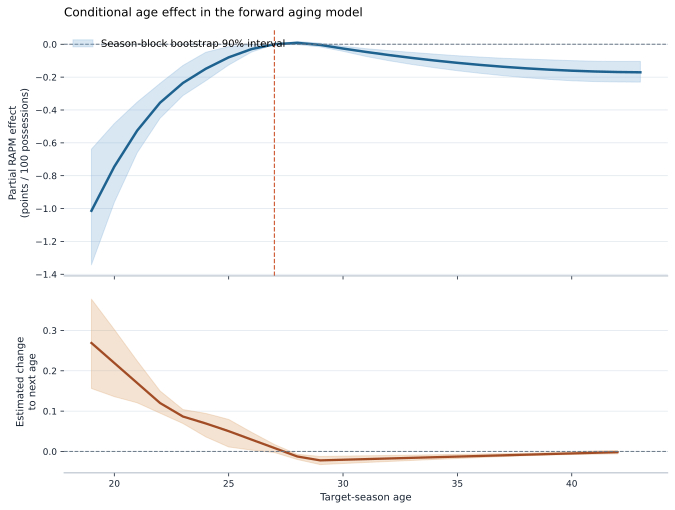
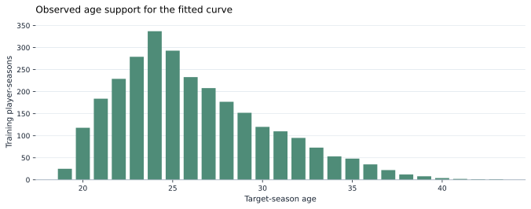

<p class="project-kicker">Player priors / forward filtering</p>

# RAPM Aging Model

<p class="project-lead">
The first player-history model predicts a target season's canonical RAPM from
information available before that season. It establishes the temporal contract
used later by prior-centered RAPM and neural player tokens.
</p>

## Estimand

For player \(i\) entering target season \(t\), the model estimates

\[
\mu_{i,t}
=
E\left[
  \widehat{\beta}^{\,0}_{i,t}
  \mid
  \widehat{\beta}^{\,0}_{i,t-1},
  a_{i,t},
  e_{i,t},
  n_{i,t-1}
\right],
\]

where:

- \(\widehat{\beta}^{\,0}\) is canonical zero-centered one-season RAPM;
- \(a\) is target-season age;
- \(e\) is NBA experience entering the target season;
- \(n\) is prior-season RAPM possession exposure.

The prediction \(\mu_{i,t}\) is a prior mean, not the final target-season RAPM
coefficient. [Prior-Centered RAPM](prior-rapm.md) is the first consumer of this
handoff.

## Initial feature model

The initial estimator is exposure-weighted ridge regression with:

- a quadratic B-spline expansion of target age;
- target NBA experience;
- prior RAPM;
- `log1p` prior RAPM possessions;
- explicit prior-season availability and rookie indicators.

Cold-start players retain `has_prior_season=false`. Their missing prior RAPM is
represented as zero only inside the fitted design; the published prior table
preserves the missing source value and includes the availability indicator.

The objective for training player-season rows \(j\) is

\[
\underset{\theta}{\operatorname{argmin}}
\quad
\sum_j
\widetilde{n}_j
\left(
  \widehat{\beta}^{\,0}_j - f_\theta(z_j)
\right)^2
+
N\lambda\lVert\theta\rVert_2^2,
\]

where \(\widetilde{n}_j\) is target RAPM exposure normalized to mean one and
\(N\lambda\) follows the project's sample-size-normalized ridge convention.

## Forward-only selection

Target seasons are the split unit. Suppose transition rows end in 2020-21
through 2025-26:

| Fold | Training targets | Validation target |
| --- | --- | --- |
| 0 | 2020-21 | 2021-22 |
| 1 | 2020-21 through 2021-22 | 2022-23 |
| 2 | 2020-21 through 2022-23 | 2023-24 |
| 3 | 2020-21 through 2023-24 | 2024-25 |
| Final | 2020-21 through 2024-25 | 2025-26 |

Regularization minimizes pooled exposure-weighted validation MSE. The age
spline, scaling parameters, and ridge coefficients are refitted inside every
fold. The latest target season is never used for preprocessing, selection, or
fitting.

Changing the latest season's RAPM outcomes therefore cannot change its
published priors. This is enforced by a regression test.

## Baselines and metrics

The untouched holdout compares:

| Model | Prediction |
| --- | --- |
| Zero | \(0\) |
| Training mean | Exposure-weighted mean training RAPM |
| Persistence | Prior RAPM for returning players, otherwise \(0\) |
| Aging ridge | Selected forward model |

RMSE, MAE, exposure-weighted RMSE and MAE, skill versus zero, and skill versus
persistence are reported for all players, exposure-eligible players, returning
players, and cold starts.

## 2025-26 Holdout

The first published run holds out 2025-26, trains on target seasons 2020-21
through 2024-25, and selects from the documented six-value ridge grid using
four expanding folds. It uses 2,819 training player-seasons and 582 holdout
players (462 returning and 120 cold starts). The selected normalized ridge
regularization is \(\lambda=1\).

| Cohort | Zero | Training mean | Persistence | Aging ridge | Aging skill vs. persistence |
| --- | ---: | ---: | ---: | ---: | ---: |
| All players | 1.959 | 1.922 | 2.013 | **1.766** | **23.0%** |
| Exposure eligible | 1.975 | 1.934 | 2.026 | **1.779** | **23.0%** |
| Returning | 1.989 | 1.933 | 2.049 | **1.782** | **24.4%** |
| Cold start | 1.712 | 1.828 | 1.712 | **1.643** | **7.9%** |

Values are target-RAPM exposure-weighted RMSE; skill is the reduction in
weighted MSE relative to persistence. The run is
`aging-2025-26-20260801T220356Z-4de5f001`, stored under
`artifacts/models/aging/2025-26/`. Its input panel covers 2019-20 through
2025-26 and is pinned by hash in the model manifest.

## Aging Curve Case Study

The fitted spline defines a shared, conditional age effect. To make that term
interpretable, the case study holds all non-age inputs fixed at an
exposure-weighted returning-player reference profile and reports

\[
g(a) - g(27),
\]

where \(g(a)\) is the model prediction when only target age changes. Because
the model has no age interactions, this difference is exactly the fitted age
spline contribution and does not depend on the particular valid reference
profile used for the calculation. It is not average player RAPM at age \(a\),
nor a causal biological effect of aging.

The published curve comes from
`aging-curve-2025-26-20260801T234016Z-eec32898`. It uses the 2,819
player-season rows from target seasons 2020-21 through 2024-25 that trained the
source aging model. The shaded bands are 5th to 95th percentiles from 250
target-season block bootstrap refits. The selected ridge penalty and spline
specification remain fixed in each refit, so the interval reflects training
season resampling, not hyperparameter-selection uncertainty.



The model estimates rapid positive movement for young players: the common age
term rises by +0.27 points per 100 possessions from age 19 to 20 and by +0.17
from 21 to 22. It is effectively flat around ages 27 through 29, then declines
by roughly 0.02 points per 100 possessions per year from ages 29 through 33.
At age 35 the estimated partial effect is -0.11 relative to age 27, with a
90% interval of [-0.16, -0.07].

| Age | Partial effect vs. 27 | 90% interval | Change to next age | Training player-seasons |
| ---: | ---: | ---: | ---: | ---: |
| 19 | -1.01 | [-1.34, -0.64] | +0.27 | 25 |
| 21 | -0.53 | [-0.66, -0.35] | +0.17 | 184 |
| 24 | -0.15 | [-0.22, -0.05] | +0.07 | 337 |
| 27 | 0.00 | [0.00, 0.00] | +0.01 | 208 |
| 28 | +0.01 | [0.00, +0.02] | -0.01 | 177 |
| 30 | -0.03 | [-0.04, -0.01] | -0.02 | 120 |
| 33 | -0.08 | [-0.12, -0.05] | -0.02 | 73 |
| 35 | -0.11 | [-0.16, -0.07] | -0.01 | 48 |
| 37 | -0.14 | [-0.19, -0.09] | -0.01 | 22 |
| 40 | -0.16 | [-0.22, -0.10] | 0.00 | 4 |



The chart intentionally shows the thin tails. Ages 40 through 43 have only
eight player-seasons combined, so the linear spline extension there should not
be used as a strong claim about late-career decline. The empirical result is
better read as a smoothed, exposure-weighted prior for the observed NBA
population.

Rebuild the report and images from the pinned aging run with:

```bash
uv run --group docs nba-build-aging-curve-case-study 2025-26 \
  --aging-run-id aging-2025-26-20260801T220356Z-4de5f001 \
  --bootstrap-samples 250 \
  --bootstrap-seed 20260801
```

The immutable report contains `curve.parquet`, source hashes, a complete age
table, and both SVGs under
`artifacts/reports/aging_curve/2025-26/`.

## Prior uncertainty

The model reports separate returning-player and cold-start error scales. Each
is the exposure-weighted RMSE from the selected model's expanding-fold
predictions:

\[
s_c
=
\sqrt{
\frac{
  \sum_{j\in c} n_j
  \left(
    \widehat{\beta}^{\,0}_j-\widehat{\mu}_j
  \right)^2
}{
  \sum_{j\in c} n_j
}
}.
\]

This is an out-of-time predictive error scale, not posterior parameter
uncertainty. A later prior-centered RAPM can use larger \(s_c\) to apply weaker
shrinkage.

## Leakage boundary

`player_priors.parquet` intentionally excludes:

- target RAPM;
- target RAPM exposure and seconds;
- target exposure eligibility;
- target-season box-score outcomes.

It contains only target identity/context, prior-season inputs, prior mean,
error scale, method, and the last target season used to train the model.

## Limitations

- Canonical RAPM is a noisy training label rather than latent player ability.
- A common age curve cannot represent every role or player archetype.
- The initial cold-start path uses age and experience but not yet draft or
  box-score information.
- The empirical error scale is cohort-level rather than player-specific.
- Missing an intervening season is treated as a cold start.

These limitations are deliberate. The first model establishes the temporal and
artifact contracts before adding box-score PM, draft priors, or a joint
hierarchical trajectory model.

## References

- Tashman, L. J. (2000). "Out-of-sample tests of forecasting accuracy: an
  analysis and review." *International Journal of Forecasting*, 16(4),
  437-450. [doi:10.1016/S0169-2070(00)00065-0](https://doi.org/10.1016/S0169-2070(00)00065-0)
- Hastie, T., Tibshirani, R., and Friedman, J. (2009).
  [*The Elements of Statistical Learning*](https://hastie.su.domains/ElemStatLearn/),
  second edition. See the spline, regularization, and model-assessment
  chapters.
- Sill, J. (2010). "Improved NBA Adjusted +/- Using Regularization and
  Out-of-Sample Testing." *MIT Sloan Sports Analytics Conference*.
