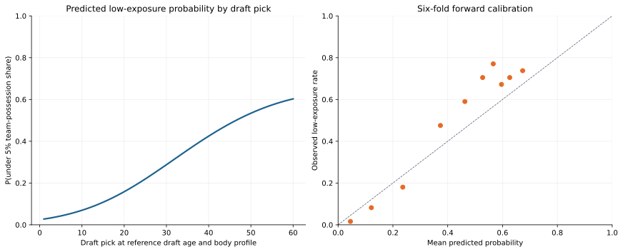

# Cold-Start Exposure Gate

This study separates two questions that were previously conflated in the
draft-informed cold-start prior: what rate should a player have if he earns
rotation exposure, and how likely is a first-NBA-season player to earn enough
exposure to avoid the pooled replacement group?

The [pooled replacement-token study](replacement-token.md) answers the first
question for the low-exposure pool. This page addresses the second question
for **first-NBA-season players only**. Returning players keep their lagged
RAPM prior; a low minute count in a returning season never activates this
gate.

## Model Contract

For historical first-NBA-season player \(i\), define realized regular-season
team-opportunity share as

\[
s_i = \sum_{j \in \mathrm{teams}(i)}
\frac{\mathrm{on\ court\ possessions}_{ij}}
     {\mathrm{team\ possession\ opportunities}_j}.
\]

The binary label is \(r_i = \mathbb{1}[s_i < 0.05]\), so a positive label
means the player fell in the low-exposure population used by the shared
replacement token. The logistic gate estimates

\[
\Pr(r_i=1\mid x_i) = \sigma\left(\beta_0 + x_i^\top\beta\right),
\]

where \(x_i\) contains centered linear and quadratic draft pick, draft-status
indicators (undrafted, pick above 60, or unknown), draft age, listed height,
listed body-mass index, and the draft-pick-by-draft-age interaction. Features
are standardized and the model uses L2-regularized logistic regression.

Draft age is reported season age adjusted back to the draft year. As with the
[draft RAPM prior](draft-prior.md), this is conditional on recording a first
NBA season: drafted players with no NBA appearance are absent. The gate is a
conditional rotation/exposure model, not a general draft-prospect model.

## 2025-26 Diagnostic

The current immutable run is
`artifacts/models/cold_start_exposure/2025-26/cold-start-exposure-2025-26-20260806T013228Z-6072bdd3/`.
It trains on 2,299 first-NBA-season players from 1996-97 through 2024-25 and
produces 100 preseason-only 2025-26 profiles. The target profile artifact
excludes target RAPM, possessions, realized exposure share, and the
replacement-candidate label.

The selected inverse L2 penalty was `C = 10.0`, based on six expanding
validation seasons from 2019-20 through 2024-25. The profile features are
meaningfully predictive:

| Model | Out-of-fold players | Log loss | Brier score | ROC AUC |
| --- | ---: | ---: | ---: | ---: |
| Draft-profile gate | 611 | **0.5415** | **0.1850** | **0.7889** |
| Constant historical candidate rate | 611 | 0.6930 | 0.2499 | 0.5000 |

The left panel gives the partial draft-pick relationship at the historical
reference draft age and body profile; the right panel is calibration over the
six forward folds. The fitted probability rises from 2.8% for pick 1 to 60.3%
for pick 60 at that reference profile. Rocco Zikarsky's low-exposure
probability is 71.7%, correcting the earlier draft RAPM-rate artifact where
the pick-age interaction made him appear unusually favorable.

The gate does not make a hard 5% probability decision. That would throw away
useful uncertainty. The [exposure-gated cold-start prior](exposure-gated-cold-start.md)
uses the probability continuously:

\[
\widehat R^{cold}_i =
p_i^{replacement}\,\widehat R^{replacement}
+(1-p_i^{replacement})\,\widehat R_i^{profile},
\]

It is evaluated with the full 2025-26 regular-season and playoff holdouts,
while this study remains independently inspectable for calibration.

## 2025-26 Cold-Start Rankings

These sortable rankings are **predicted rotation probability**, not player
quality or retrospective RAPM. A lower low-exposure probability means the
player is less likely to receive the replacement component in a future blended
prior. The complete 100-player table is `target_exposure_predictions.parquet`
in the immutable run.

### Top 25 Predicted Rotation Rankings

| Rank | Player | Pos. | Draft status | Pick | Draft age | P(low exposure) | P(rotation) |
| ---: | --- | --- | --- | ---: | ---: | ---: | ---: |
| 1 | Dylan Harper | G | Drafted 1-60 | 2 | 20 | 2.2% | 97.8% |
| 2 | Cooper Flagg | F | Drafted 1-60 | 1 | 19 | 2.4% | 97.6% |
| 3 | VJ Edgecombe | G | Drafted 1-60 | 3 | 20 | 2.5% | 97.5% |
| 4 | Kon Knueppel | G-F | Drafted 1-60 | 4 | 20 | 3.0% | 97.0% |
| 5 | Jeremiah Fears | G | Drafted 1-60 | 7 | 19 | 3.5% | 96.5% |
| 6 | Tre Johnson | G | Drafted 1-60 | 6 | 20 | 3.8% | 96.2% |
| 7 | Ace Bailey | F | Drafted 1-60 | 5 | 19 | 3.9% | 96.1% |
| 8 | Collin Murray-Boyles | F | Drafted 1-60 | 9 | 21 | 5.6% | 94.4% |
| 9 | Egor Demin | G | Drafted 1-60 | 8 | 20 | 5.6% | 94.4% |
| 10 | Cedric Coward | G | Drafted 1-60 | 11 | 22 | 6.9% | 93.1% |
| 11 | Khaman Maluach | C | Drafted 1-60 | 10 | 19 | 8.1% | 91.9% |
| 12 | Noa Essengue | F | Drafted 1-60 | 12 | 19 | 8.3% | 91.7% |
| 13 | Carter Bryant | F | Drafted 1-60 | 14 | 20 | 8.8% | 91.2% |
| 14 | Derik Queen | C | Drafted 1-60 | 13 | 21 | 9.3% | 90.7% |
| 15 | Walter Clayton Jr. | G | Drafted 1-60 | 18 | 23 | 12.0% | 88.0% |
| 16 | Nolan Traore | G | Drafted 1-60 | 19 | 20 | 12.5% | 87.5% |
| 17 | Yang Hansen | C | Drafted 1-60 | 16 | 21 | 14.8% | 85.2% |
| 18 | Kasparas Jakucionis | G | Drafted 1-60 | 20 | 20 | 14.8% | 85.2% |
| 19 | Joan Beringer | F | Drafted 1-60 | 17 | 19 | 15.2% | 84.8% |
| 20 | Drake Powell | G-F | Drafted 1-60 | 22 | 20 | 17.5% | 82.5% |
| 21 | Jase Richardson | G | Drafted 1-60 | 25 | 20 | 18.1% | 81.9% |
| 22 | Nique Clifford | G | Drafted 1-60 | 24 | 24 | 19.2% | 80.8% |
| 23 | Will Riley | F | Drafted 1-60 | 21 | 20 | 20.9% | 79.1% |
| 24 | Asa Newell | F | Drafted 1-60 | 23 | 20 | 23.6% | 76.4% |
| 25 | Ben Saraf | G | Drafted 1-60 | 26 | 20 | 24.4% | 75.6% |

## Artifacts

| File | Contents |
| --- | --- |
| `training_first_nba_season_exposure.parquet` | Historical first-year labels, exposure shares, and preseason features |
| `target_first_nba_season_profiles.parquet` | Outcome-free target-season player profiles |
| `cross_validation.parquet` | Six expanding-fold candidates and scores |
| `cross_validated_predictions.parquet` | One forward prediction per validation player |
| `calibration_deciles.parquet` | Out-of-fold calibration bins |
| `target_exposure_predictions.parquet` | 2025-26 cold-start probabilities and ranks |
| `model.joblib` | Final logistic gate fit through 2024-25 |
| `metadata.json` / `manifest.json` | Scope, temporal boundary, source hashes, and integrity records |
