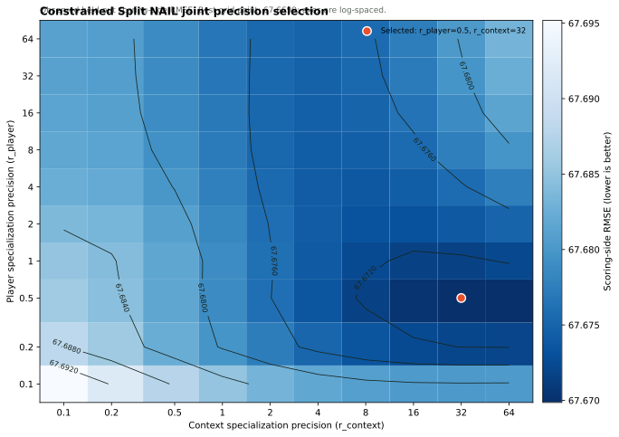

# Constrained Split NAIL

Constrained Split NAIL is a descriptive offense/defense allocation of the
published production NAIL-RAPM rating. It is not a replacement value model and
does not appear on the frozen net-margin leaderboard.

## Locked-total contract

For every player (i), production NAIL supplies a fixed total rating
(R_i^{\mathrm{NAIL}}). Constrained Split NAIL estimates only the difference
(s_i=O_i-D_i), then reconstructs:

\[
O_i=\frac{R_i^{\mathrm{NAIL}}+s_i}{2},
\qquad
D_i=\frac{R_i^{\mathrm{NAIL}}-s_i}{2}.
\]

Therefore the invariant is exact for every player:

\[
O_i+D_i=R_i^{\mathrm{NAIL}}.
\]

The same constraint applies to the base player state, each of the eight
additive-profile coefficients, both retained non-additive lineup terms,
back-to-back, and home court. The total scalar NAIL model is never refit.

## What is learned

Each observed stint becomes two possession-weighted scoring observations:

\[
y_H=100\frac{\mathrm{points}_H}{\mathrm{possessions}_H},
\qquad
y_A=100\frac{\mathrm{points}_A}{\mathrm{possessions}_A}.
\]

The constrained model learns the O-minus-D specialization coordinates against
those two targets with total NAIL coefficients fixed. A team can therefore have
an offensive rating, a defensive rating, and a locked total value. The
resulting margin prediction remains production NAIL by construction; only the
allocation between scoring and prevention changes.

## Forward selection

The source-season constrained state is applied to the following season. Player
and context specialization precision are selected jointly from
`0.1`, `0.2`, `0.5`, `1`, `2`, `4`, `8`, `16`, `32`, and `64`. Selection
minimizes possession-weighted out-of-sample scoring-side RMSE across 2019-20
through 2022-23:

\[
\operatorname{RMSE}_{\mathrm{side}}=
\sqrt{
\frac{\sum w_H(y_H-\hat y_H)^2+\sum w_A(y_A-\hat y_A)^2}
{\sum w_H+\sum w_A}
}.
\]

This is intentionally a side-scoring criterion, not the regular frozen
leaderboard. Once \(O_i+D_i\) is fixed, changing the split cannot improve net
margin prediction.

The grid has a hard boundary rule: a minimum at `0.1` or `64` on either axis
is not accepted as a selected specification. The grid must be expanded and
replayed before publishing the O/D allocation. Higher precision means a
stronger Ridge pull of that block's O-minus-D differences toward zero; locked
scalar coefficients remain unchanged.

These are individual-stint scoring targets, not full-game ratings. Short
stints produce noisy realized rates, so the absolute scale is much larger than
the net-margin RMSE on the frozen leaderboard. Every candidate evaluates the
identical 847,028 offensive possessions.

## Selected allocation

The first full joint sweep evaluated all 100 pairs across the four development
target seasons. It selected the interior point

\[
r_{\mathrm{player}}=0.5,\qquad r_{\mathrm{context}}=32,
\]

with pooled scoring-side RMSE of **67.6699** and MAE of **51.0724**. The next
closest RMSE cells were `(0.5, 64)` at 67.6699 and `(0.5, 16)` at 67.6703.
`(0.5, 32)` is retained because it is the grid minimum and neither coordinate
is an outer boundary.



The colored cells are the 100 evaluated configurations. Contours summarize
the same discrete result surface on log-spaced axes; they do not claim that
untested intermediate precisions were fit. The red marker is the selected
pair.

The completed 2025-26 allocation preserves the scalar production rating to
machine precision: the maximum absolute value of
\(O_i + D_i - R_i^{\mathrm{NAIL}}\) across 582 players is
\(8.9 \times 10^{-16}\).

## Additive profile allocation

Production NAIL already compiles its eight additive box-score profile features
into each player rating. Constrained Split NAIL holds that total contribution
fixed, but allocates it using the learned feature-side differences. The
allocation is centered at the same possession-weighted reference-player
coordinate used by published NAIL ratings, so it does not create a new league
baseline or change total value.

## Artifacts

Each run writes a self-contained artifact under
`artifacts/models/constrained_split_nail/<season>/`:

| Artifact | Contents |
| --- | --- |
| `player_ratings.parquet` | Locked total NAIL, O/D base, O/D additive profile, and exact sum check. |
| `feature_allocations.parquet` | Total and O/D coefficients for additive and non-additive terms. |
| `control_allocations.parquet` | Total and O/D allocations for B2B and home court. |
| `side_scoring_selection_by_season.parquet` | Per-season held-out scoring-side errors for every precision candidate. |
| `side_scoring_selection_summary.parquet` | Pooled precision-selection result. |
| `season_states.joblib` | Forward-complete specialization states. |

## Web companion cache

The public app receives Constrained Split NAIL through a compact sidecar cache,
not through a second prediction model. The cache is explicitly stamped with the
production NAIL artifact and run ID. At load time, the API rejects it unless
that identity matches the active scalar release and every covered player-season
satisfies (O_i + D_i = R_i^{\mathrm{NAIL}}) to machine precision.

```bash
uv run nba-build-constrained-split-cache
```

This materializes the complete historical player-season O/D allocation under
`artifacts/web/constrained_split_ratings/`. Completed-season Rankings and
player histories can therefore show offense and defense alongside scalar NAIL;
the Matchup Lab can show `offense vs. defense` plus `defense vs. offense`.
For observed five-man tables, the same side allocation is also applied to the
retained non-additive lineup terms against the opponents each unit actually
faced. The published `Off` and `Def` columns therefore sum to the complete
scalar `Edge`, including the non-additive lineup edge. They do not alter the
GESTALT score or any prediction.
The preseason 2026-27 preview intentionally has no O/D allocation until a
completed Split NAIL companion state is fitted for that scalar release.

## Reproducing the precision figure

```bash
uv run nba-audit-constrained-split-nail-precision \
  --run-dir artifacts/models/constrained_split_nail/2025-26/<run-id>
```

The renderer reads only `side_scoring_selection_summary.parquet` and the
selected coordinates in `metadata.json`; it does not refit any model state.
