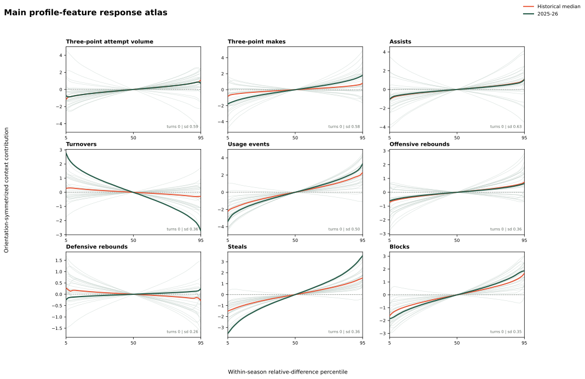
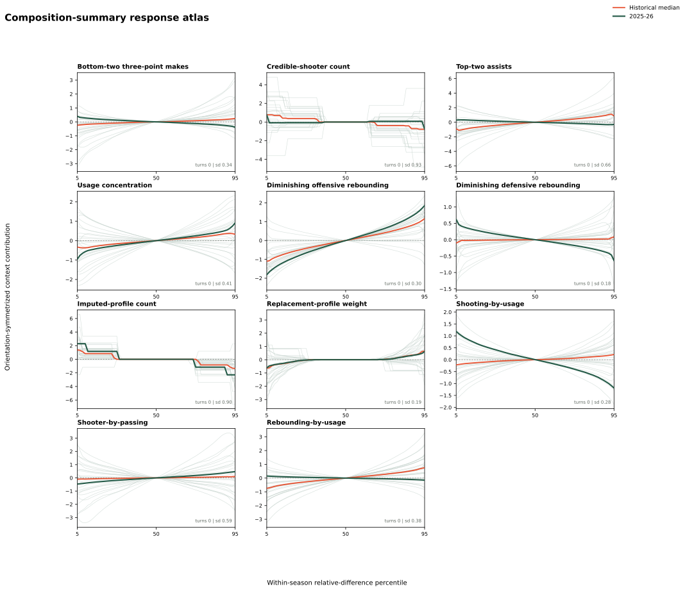
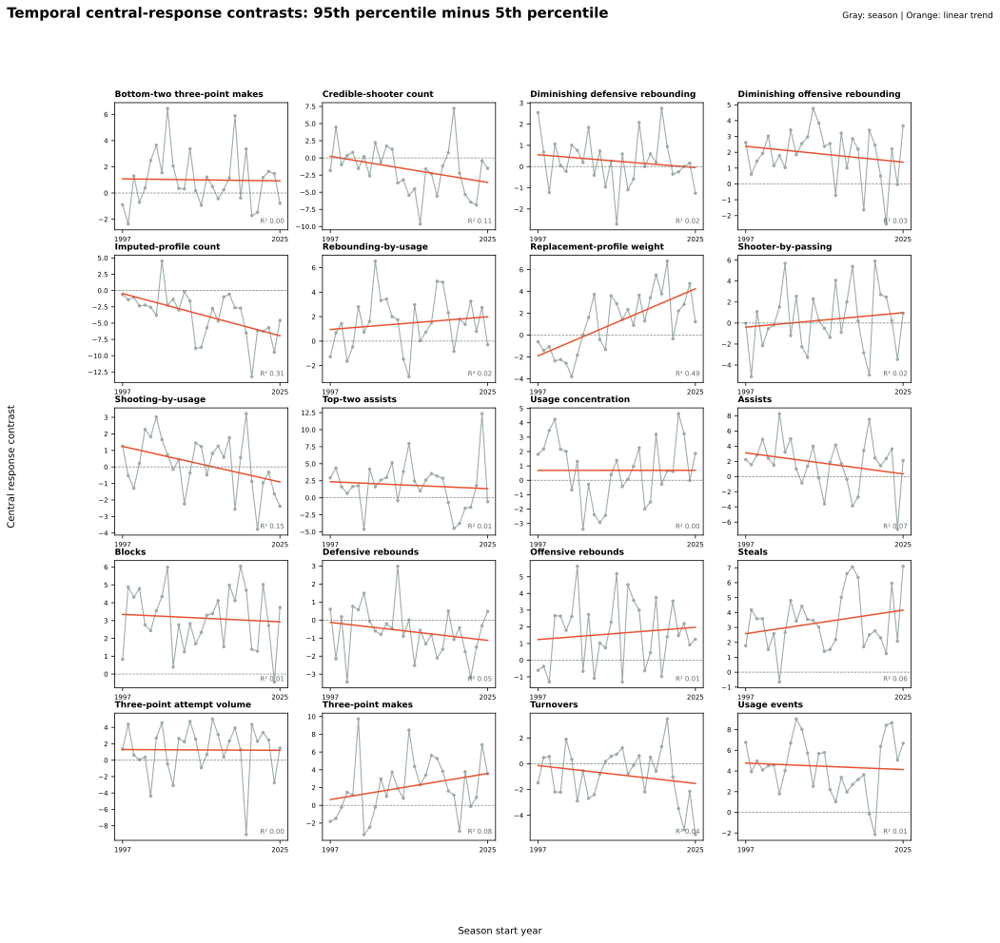

# Context Function Audit

This report reviews the response functions already fitted by Forward
Portable-Matchup Contextual RAPM. It does not train a candidate model or claim
that a visible curve is a causal basketball relationship.

For season \(s\), feature \(k\), and relative feature difference \(z\), the
audited total component is:

\[
r_{s,k}(z) = \frac{f_{s,k}(z)-f_{s,k}(-z)}{2}.
\]

This is the model's original orientation-symmetrized total contextual response,
before the season-specific reference field turns it into portable composition
and matchup-residual terms. It is therefore the appropriate object for
choosing a future function family.

## Review Protocol

Inspect the fitted response only inside its observed central support. A
function family is a candidate for a future refit only when its response is
smooth and stable across seasons and its shape has a defensible interpretation.
Engineered interactions face a higher bar: a visually irregular interaction is
not retained merely because it appeared in an earlier feature set.

The next modeling decision is deliberately editorial and prospective:

- retain a linear term when the atlas is stable and approximately straight;
- consider a low-complexity spline only for stable nonlinear responses;
- consider a monotone constrained response only with a defensible direction;
- re-linearize or remove unstable interactions before paying for a full refit.

<!-- context-function-audit:start -->

## Current Audit

Source artifact: `forward-portable-matchup-contextual-rapm-2025-26-20260808T165815Z-0d9d87f0`. The audit evaluates 29 saved seasonal states without refitting. Faint curves are individual seasons, orange is the historical median, and green is 2025-26.

The x-axis is each season's 5th-to-95th percentile of possession-weighted independent reference-unit differences. This makes curve shapes comparable across eras without treating raw feature scales as stationary.

### Temporal Direction Versus Scatter

Each point below is a season's signed central response contrast: the 95th-percentile response minus the 5th-percentile response. Orange is a least-squares time trend. A low R² means the annual movement is primarily scatter rather than a sustained directional evolution.

| Feature | Contrast trend / decade | Linear R² | Season SD | Observed contrast range |
| --- | ---: | ---: | ---: | --- |
| Bottom-two three-point makes | -0.05 | 0.00 | 2.08 | [-2.37, +6.46] |
| Credible-shooter count | -1.36 | 0.11 | 3.52 | [-9.64, +7.21] |
| Diminishing defensive rebounding | -0.22 | 0.02 | 1.17 | [-2.71, +2.74] |
| Diminishing offensive rebounding | -0.36 | 0.03 | 1.64 | [-2.54, +4.77] |
| Imputed-profile count | -2.31 | 0.31 | 3.52 | [-13.22, +4.53] |
| Rebounding-by-usage | +0.37 | 0.02 | 2.13 | [-2.90, +6.54] |
| Replacement-profile weight | +2.19 | 0.49 | 2.68 | [-3.80, +6.78] |
| Shooter-by-passing | +0.49 | 0.02 | 2.93 | [-5.11, +5.91] |
| Shooting-by-usage | -0.77 | 0.15 | 1.69 | [-3.77, +3.22] |
| Top-two assists | -0.37 | 0.01 | 3.48 | [-4.63, +12.34] |
| Usage concentration | +0.00 | 0.00 | 2.14 | [-3.41, +4.63] |
| Assists | -0.99 | 0.07 | 3.22 | [-6.95, +8.28] |
| Blocks | -0.15 | 0.01 | 1.68 | [-0.44, +6.04] |
| Defensive rebounds | -0.36 | 0.05 | 1.37 | [-3.43, +2.98] |
| Offensive rebounds | +0.26 | 0.01 | 1.98 | [-1.30, +5.63] |
| Steals | +0.56 | 0.06 | 1.92 | [-0.65, +7.10] |
| Three-point attempt volume | -0.03 | 0.00 | 3.09 | [-9.07, +5.04] |
| Three-point makes | +1.05 | 0.08 | 3.20 | [-3.29, +9.73] |
| Turnovers | -0.50 | 0.04 | 2.03 | [-5.49, +3.48] |
| Usage events | -0.22 | 0.01 | 2.66 | [-2.15, +9.04] |

### Stability Summary

`Median range` is the within-season 5th-to-95th response range. `Median curvature` is the largest departure from that season's endpoint chord. `Median turns` counts direction reversals across the central response interval. `Cross-season SD` is the median seasonal standard deviation at matched percentiles. These are screening diagnostics, not automatic feature-selection rules.

| Feature | Type | Median range | Median curvature | Median turns | Cross-season SD | Latest support |
| --- | --- | ---: | ---: | ---: | ---: | --- |
| Bottom-two three-point makes | composition summary | 1.22 | 0.11 | 0 | 0.34 | [-2.32, 2.31] |
| Credible-shooter count | composition summary | 2.23 | 0.47 | 0 | 0.93 | [-3.00, 3.00] |
| Diminishing defensive rebounding | composition summary | 0.77 | 0.17 | 0 | 0.18 | [-0.70, 0.71] |
| Diminishing offensive rebounding | composition summary | 2.54 | 0.22 | 0 | 0.30 | [-0.72, 0.74] |
| Imputed-profile count | composition summary | 2.74 | 0.80 | 0 | 0.90 | [-2.00, 2.00] |
| Rebounding-by-usage | composition summary | 1.64 | 0.13 | 0 | 0.38 | [-0.42, 0.42] |
| Replacement-profile weight | composition summary | 2.23 | 0.62 | 0 | 0.19 | [-1.00, 1.00] |
| Shooter-by-passing | composition summary | 2.16 | 0.25 | 0 | 0.59 | [-45.00, 45.51] |
| Shooting-by-usage | composition summary | 1.26 | 0.14 | 0 | 0.28 | [-1.15, 1.16] |
| Top-two assists | composition summary | 2.72 | 0.31 | 0 | 0.66 | [-7.14, 7.16] |
| Usage concentration | composition summary | 1.87 | 0.19 | 0 | 0.41 | [-0.08, 0.08] |
| Assists | profile rate | 2.45 | 0.26 | 0 | 0.63 | [-9.97, 9.97] |
| Blocks | profile rate | 3.30 | 0.29 | 0 | 0.35 | [-2.88, 2.91] |
| Defensive rebounds | profile rate | 0.93 | 0.12 | 0 | 0.26 | [-8.12, 8.14] |
| Offensive rebounds | profile rate | 1.47 | 0.19 | 0 | 0.36 | [-5.04, 5.14] |
| Steals | profile rate | 3.03 | 0.27 | 0 | 0.36 | [-2.34, 2.34] |
| Three-point attempt volume | profile rate | 2.72 | 0.23 | 0 | 0.59 | [-14.62, 14.67] |
| Three-point makes | profile rate | 2.47 | 0.30 | 0 | 0.58 | [-5.80, 5.84] |
| Turnovers | profile rate | 1.29 | 0.13 | 0 | 0.36 | [-4.60, 4.57] |
| Usage events | profile rate | 4.50 | 0.36 | 0 | 0.50 | [-26.73, 26.28] |

Immutable generated artifact: `artifacts/analysis/context_function_audit/2025-26/context-function-audit-2025-26-15Z-0d9d87f0`.

<!-- context-function-audit:end -->
