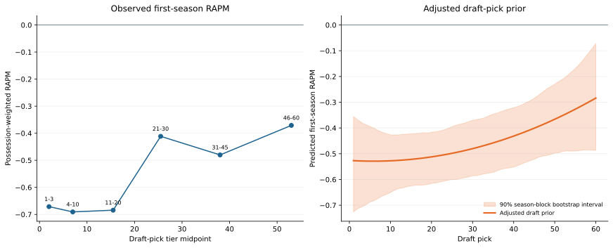

# Draft-Informed Cold Starts

This is an interpretable diagnostic for the cold-start problem: what can draft
information alone say about a player's first NBA season before any NBA
possession data exist? It is deliberately separate from the Frozen Preseason
Leaderboard until it proves incremental lineup-level value.

## Model Contract

For historical first-NBA-season player \(i\), let \(R_i\) be that season's
regular-only canonical RAPM. The fitted prior is

\[
\widehat{R}_i = \beta_0 + \beta_1 q_i + \beta_2 q_i^2
+ \gamma_U U_i + \gamma_L L_i + \gamma_M M_i
+ \delta_A A_i + \theta q_i(A_i-\widetilde A)
+ \delta_H H_i + \delta_B B_i,
\]

where \(q_i=(p_i-30.5)/29.5\) for overall draft pick \(p_i\in[1,60]\),
\(U_i,L_i,M_i\) flag undrafted, pick-above-60, and unknown-draft-record
statuses, \(A_i\) is estimated draft age, and \(\widetilde A\) is the
historical training-median draft age. \(H_i\) is listed height and \(B_i\) is
listed body-mass index. Features are standardized and the model is ridge
regression. The ridge `alpha` is `regularization * training_row_count`;
training weights are reconstructed on-court possessions normalized to mean 1.

Estimated draft age is the reported season age adjusted back to the draft year.
It is a draft-profile variable, not an assertion that every player entered the
NBA in the year he was drafted.

The rows are players whose first NBA season is marked `is_rookie` in the
player-season panel. This is a conditional sample: players drafted but never
recording an NBA season are absent. That survivor conditioning matters when
interpreting draft position and prevents this chart from being treated as a
general draft-value curve.

## 2025-26 Diagnostic

The current immutable run is
`artifacts/models/draft_prior/2025-26/draft-prior-2025-26-20260806T001505Z-0c6a670a/`.
It trains on 2,299 historical first-NBA-season players from 1996-97 through
2024-25 and scores 100 2025-26 first-NBA-season players. The target profile
artifact excludes both target RAPM and target possession count. The selected
regularization was `0.30`, based on six expanding validation seasons
(2019-20 through 2024-25).

| Regularization | Possession-weighted validation RMSE |
| ---: | ---: |
| 0.03 | 1.438 |
| 0.10 | 1.437 |
| **0.30** | **1.436** |
| 1.00 | 1.441 |
| 3.00 | 1.450 |
| 10.00 | 1.461 |

### Regularization Stability

The final `0.30` choice comes from the six most recent available validation
seasons, not a claim that one alpha is stable across NBA history. The following
pre-target snapshots each select alpha with their own six expanding folds. The
first snapshot needs 12 historical label seasons so that its inner validation
window still has a meaningful preceding training history.

| Training through | Validation window | Selected regularization | Weighted validation RMSE |
| --- | --- | ---: | ---: |
| 2007-08 | 2002-03 to 2007-08 | 10.00 | 1.455 |
| 2008-09 | 2003-04 to 2008-09 | 10.00 | 1.418 |
| 2009-10 | 2004-05 to 2009-10 | 10.00 | 1.419 |
| 2010-11 | 2005-06 to 2010-11 | 10.00 | 1.371 |
| 2011-12 | 2006-07 to 2011-12 | 10.00 | 1.450 |
| 2012-13 | 2007-08 to 2012-13 | 10.00 | 1.444 |
| 2013-14 | 2008-09 to 2013-14 | 10.00 | 1.398 |
| 2014-15 | 2009-10 to 2014-15 | 10.00 | 1.472 |
| 2015-16 | 2010-11 to 2015-16 | 0.03 | 1.511 |
| 2016-17 | 2011-12 to 2016-17 | 10.00 | 1.494 |
| 2017-18 | 2012-13 to 2017-18 | 10.00 | 1.526 |
| 2018-19 | 2013-14 to 2018-19 | 0.30 | 1.559 |
| 2019-20 | 2014-15 to 2019-20 | 0.30 | 1.473 |
| 2020-21 | 2015-16 to 2020-21 | 0.30 | 1.516 |
| 2021-22 | 2016-17 to 2021-22 | 1.00 | 1.403 |
| 2022-23 | 2017-18 to 2022-23 | 0.30 | 1.444 |
| 2023-24 | 2018-19 to 2023-24 | 0.30 | 1.392 |
| 2024-25 | 2019-20 to 2024-25 | **0.30** | **1.436** |

The shift is material in older snapshots but the recent selections mostly
concentrate at `0.30`, with one `1.00` exception. This supports the current
recent-window choice while making it clear that a future recursive model must
select regularization separately at every historical cutoff.

The result does **not** display the naive expectation that an earlier pick
monotonically implies stronger first-season RAPM. In the observed,
possession-weighted sample, picks 1-3 average `-0.67`, picks 21-30 average
`-0.41`, and picks 46-60 average `-0.37`. The adjusted pick-only partial
curve has the same direction, moving from `-0.53` at pick 1 to `-0.28` at pick
60 for a fixed reference profile.

This is a substantive diagnostic result, not a charting error. The analysis is
conditioned on players who reached the NBA data set, so later picks are a
selected group of successful survivors while every high pick is observed.
Older entry paths and static profile differences also matter. The model should
therefore **not** be added to a cold-start prior or frozen evaluation yet.
The next useful experiment is a proper out-of-season cohort evaluation against
the forward training mean and the current lagged-RAPM prior, with an explicit
playing-time/roster-selection treatment.

The shaded adjusted-curve band is a 90% season-block bootstrap interval. For
undrafted or draft-record categories, ranking bands use the historical
weighted residual spread instead, so those two uncertainty displays are not
directly comparable.

## Frozen Cold-Start Ablation

The first downstream test replaces the neutral `0.0` prior for only the 100
first-NBA-season 2025-26 players. It retains completed 2024-25 lagged RAPM for
462 returning players and zero for the other 20 no-immediate-prior players.
The draft model is the immutable study above, fit through 2024-25; neither the
historical RAPM sequence nor any 2025-26 player coefficient is refit.

| Model | Cohort | Possession RMSE | Game-margin RMSE | Team NetRtg RMSE | Pythagorean win RMSE |
| --- | --- | ---: | ---: | ---: | ---: |
| Frozen lagged RAPM | Regular season | 1.199000 | 14.8894 | 4.8538 | 10.7006 |
| Draft cold-start prior | Regular season | **1.198986** | **14.8590** | **4.8473** | **10.6718** |
| Frozen lagged RAPM | Playoffs | **1.192895** | **17.5409** | - | - |
| Draft cold-start prior | Playoffs | 1.192971 | 17.6339 | - | - |

The regular-season improvement is small but consistent across the listed
regular-season metrics. Playoff results worsen, so the ablation is recorded as
promising rather than promoted. The complete comparison is in the [Frozen
Preseason Leaderboard](preseason-leaderboard.md).

## 2025-26 First-NBA-Season Rankings

The following sortable table is a profile-only ranking, not a retrospective
2025-26 RAPM ranking. It begins in predicted order; select **Pick** to inspect
the class in draft order. The full-fidelity table, including uncertainty bands,
is `rookie_rankings.parquet` in the immutable run above.

### Top 100 Draft-Prior Rankings

| Rank | Player | Pos. | Draft status | Pick | Age | Predicted RAPM |
| ---: | --- | --- | --- | ---: | ---: | ---: |
| 1 | Rocco Zikarsky | C | Drafted 1-60 | 45 | 19 | -0.26 |
| 2 | Hunter Dickinson | C | Undrafted | - | 25 | -0.27 |
| 3 | Ryan Kalkbrenner | C | Drafted 1-60 | 34 | 24 | -0.27 |
| 4 | Lachlan Olbrich | C | Drafted 1-60 | 55 | 22 | -0.28 |
| 5 | Vladislav Goldin | C | Undrafted | - | 25 | -0.29 |
| 6 | Mohamed Diawara | F | Drafted 1-60 | 51 | 21 | -0.29 |
| 7 | Dylan Cardwell | C | Undrafted | - | 24 | -0.29 |
| 8 | Lawson Lovering | C | Undrafted | - | 23 | -0.30 |
| 9 | Maxime Raynaud | C | Drafted 1-60 | 42 | 23 | -0.30 |
| 10 | Amari Williams | F-C | Drafted 1-60 | 46 | 24 | -0.33 |
| 11 | Josh Oduro | C | Undrafted | - | 25 | -0.33 |
| 12 | Norchad Omier | F | Undrafted | - | 24 | -0.33 |
| 13 | CJ Huntley | F | Undrafted | - | 24 | -0.33 |
| 14 | Grant Nelson | F | Undrafted | - | 24 | -0.35 |
| 15 | Moussa Cisse | C | Undrafted | - | 23 | -0.35 |
| 16 | Julian Reese | F | Undrafted | - | 23 | -0.35 |
| 17 | Yanic Konan Niederhäuser | C | Drafted 1-60 | 30 | 23 | -0.35 |
| 18 | Blake Hinson | F | Undrafted | - | 26 | -0.36 |
| 19 | Johni Broome | F | Drafted 1-60 | 35 | 23 | -0.36 |
| 20 | Tristan Enaruna | F | Undrafted | - | 25 | -0.39 |
| 21 | Chaney Johnson | G-F | Undrafted | - | 24 | -0.39 |
| 22 | Andersson Garcia | F | Undrafted | - | 25 | -0.39 |
| 23 | Jayson Kent | F | Undrafted | - | 24 | -0.39 |
| 24 | Alex Antetokounmpo | F | Undrafted | - | 24 | -0.39 |
| 25 | Danny Wolf | F | Drafted 1-60 | 27 | 22 | -0.39 |
| 26 | Jahmyl Telfort | G | Undrafted | - | 25 | -0.39 |
| 27 | Tyler Burton | F | Undrafted | - | 26 | -0.40 |
| 28 | Payton Sandfort | F | Undrafted | - | 23 | -0.40 |
| 29 | Toby Okani | F | Undrafted | - | 24 | -0.40 |
| 30 | Myron Gardner | F | Undrafted | - | 25 | -0.40 |
| 31 | Jahmai Mashack | G | Drafted 1-60 | 59 | 23 | -0.41 |
| 32 | Brooks Barnhizer | G | Drafted 1-60 | 44 | 24 | -0.41 |
| 33 | Alex Morales | G | Undrafted | - | 28 | -0.42 |
| 34 | Micah Peavy | G-F | Drafted 1-60 | 40 | 24 | -0.42 |
| 35 | Kadary Richmond | G | Undrafted | - | 24 | -0.43 |
| 36 | John Poulakidas | G | Undrafted | - | 23 | -0.43 |
| 37 | Will Richard | G | Drafted 1-60 | 56 | 23 | -0.43 |
| 38 | David Jones Garcia | G | Undrafted | - | 24 | -0.43 |
| 39 | Chris Mañon | G | Undrafted | - | 24 | -0.43 |
| 40 | Cormac Ryan | G | Undrafted | - | 27 | -0.43 |
| 41 | Caleb Love | G | Undrafted | - | 24 | -0.43 |
| 42 | Kobe Sanders | G | Drafted 1-60 | 50 | 24 | -0.44 |
| 43 | Koby Brea | G | Drafted 1-60 | 41 | 23 | -0.44 |
| 44 | Sion James | G | Drafted 1-60 | 33 | 23 | -0.44 |
| 45 | Lucas Williamson | G | Undrafted | - | 27 | -0.44 |
| 46 | Malachi Smith | G | Undrafted | - | 26 | -0.44 |
| 47 | Jamir Watkins | F | Drafted 1-60 | 43 | 24 | -0.44 |
| 48 | Adou Thiero | G | Drafted 1-60 | 36 | 22 | -0.44 |
| 49 | Adama Bal | G | Undrafted | - | 22 | -0.45 |
| 50 | Chris Youngblood | G | Undrafted | - | 24 | -0.45 |
| 51 | Keshon Gilbert | G | Undrafted | - | 23 | -0.45 |
| 52 | Rasheer Fleming | F | Drafted 1-60 | 31 | 21 | -0.45 |
| 53 | Max Shulga | G | Drafted 1-60 | 57 | 24 | -0.46 |
| 54 | Tyrese Proctor | G | Drafted 1-60 | 49 | 22 | -0.46 |
| 55 | Chaz Lanier | G | Drafted 1-60 | 37 | 24 | -0.46 |
| 56 | Javonte Cooke | G | Undrafted | - | 26 | -0.47 |
| 57 | Yang Hansen | C | Drafted 1-60 | 16 | 21 | -0.47 |
| 58 | Alijah Martin | G | Drafted 1-60 | 39 | 24 | -0.47 |
| 59 | Nique Clifford | G | Drafted 1-60 | 24 | 24 | -0.47 |
| 60 | Kam Jones | G | Drafted 1-60 | 38 | 24 | -0.47 |
| 61 | Curtis Jones | G | Undrafted | - | 24 | -0.47 |
| 62 | Miles Kelly | G | Undrafted | - | 23 | -0.47 |
| 63 | Hayden Gray | G | Undrafted | - | 23 | -0.47 |
| 64 | Hunter Sallis | G | Undrafted | - | 23 | -0.49 |
| 65 | Bez Mbeng | G | Undrafted | - | 23 | -0.49 |
| 66 | Darius Brown II | G | Undrafted | - | 26 | -0.49 |
| 67 | Sean Pedulla | G | Undrafted | - | 23 | -0.49 |
| 68 | John Tonje | G | Drafted 1-60 | 53 | 25 | -0.49 |
| 69 | Walter Clayton Jr. | G | Drafted 1-60 | 18 | 23 | -0.50 |
| 70 | Chucky Hepburn | G | Undrafted | - | 23 | -0.51 |
| 71 | Javon Small | G | Drafted 1-60 | 48 | 23 | -0.51 |
| 72 | Noah Penda | G-F | Drafted 1-60 | 32 | 21 | -0.51 |
| 73 | Mark Sears | G | Undrafted | - | 24 | -0.52 |
| 74 | Taelon Peter | G | Drafted 1-60 | 54 | 24 | -0.53 |
| 75 | LJ Cryer | G | Undrafted | - | 24 | -0.53 |
| 76 | Ryan Nembhard | G | Undrafted | - | 23 | -0.54 |
| 77 | Derik Queen | C | Drafted 1-60 | 13 | 21 | -0.55 |
| 78 | Cedric Coward | G | Drafted 1-60 | 11 | 22 | -0.56 |
| 79 | Liam McNeeley | F | Drafted 1-60 | 29 | 20 | -0.59 |
| 80 | Collin Murray-Boyles | F | Drafted 1-60 | 9 | 21 | -0.60 |
| 81 | Asa Newell | F | Drafted 1-60 | 23 | 20 | -0.61 |
| 82 | Hugo González | G | Drafted 1-60 | 28 | 20 | -0.63 |
| 83 | Ben Saraf | G | Drafted 1-60 | 26 | 20 | -0.66 |
| 84 | Will Riley | F | Drafted 1-60 | 21 | 20 | -0.72 |
| 85 | Drake Powell | G-F | Drafted 1-60 | 22 | 20 | -0.72 |
| 86 | Kasparas Jakučionis | G | Drafted 1-60 | 20 | 20 | -0.73 |
| 87 | Carter Bryant | F | Drafted 1-60 | 14 | 20 | -0.74 |
| 88 | Joan Beringer | F | Drafted 1-60 | 17 | 19 | -0.74 |
| 89 | Jase Richardson | G | Drafted 1-60 | 25 | 20 | -0.75 |
| 90 | Khaman Maluach | C | Drafted 1-60 | 10 | 19 | -0.77 |
| 91 | Nolan Traore | G | Drafted 1-60 | 19 | 20 | -0.79 |
| 92 | Egor Dëmin | G | Drafted 1-60 | 8 | 20 | -0.81 |
| 93 | Kon Knueppel | G-F | Drafted 1-60 | 4 | 20 | -0.83 |
| 94 | Dylan Harper | G | Drafted 1-60 | 2 | 20 | -0.85 |
| 95 | Tre Johnson | G | Drafted 1-60 | 6 | 20 | -0.87 |
| 96 | Noa Essengue | F | Drafted 1-60 | 12 | 19 | -0.90 |
| 97 | VJ Edgecombe | G | Drafted 1-60 | 3 | 20 | -0.90 |
| 98 | Ace Bailey | F | Drafted 1-60 | 5 | 19 | -0.96 |
| 99 | Cooper Flagg | F | Drafted 1-60 | 1 | 19 | -1.00 |
| 100 | Jeremiah Fears | G | Drafted 1-60 | 7 | 19 | -1.02 |
