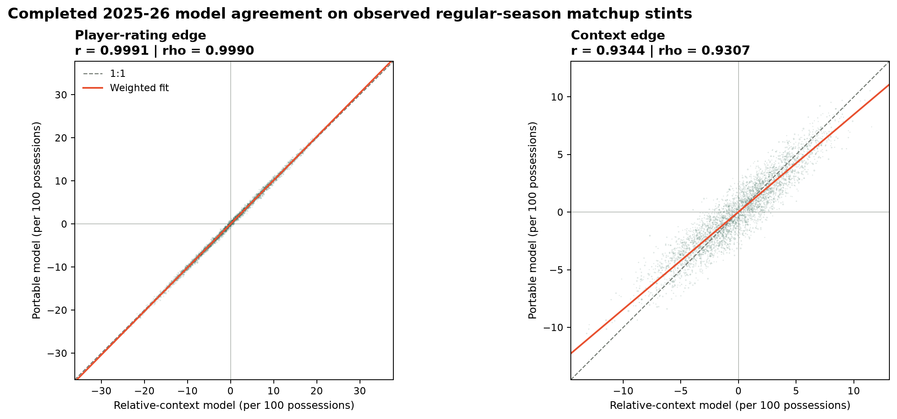
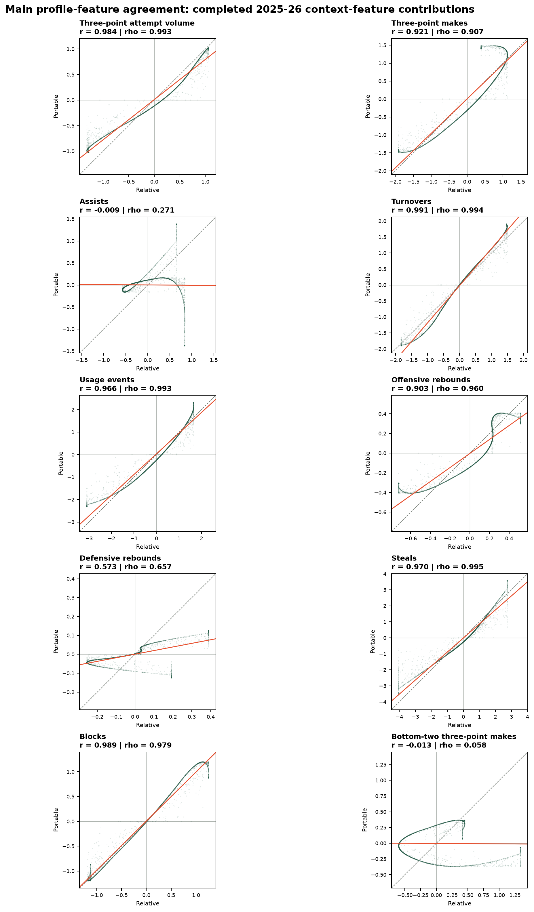
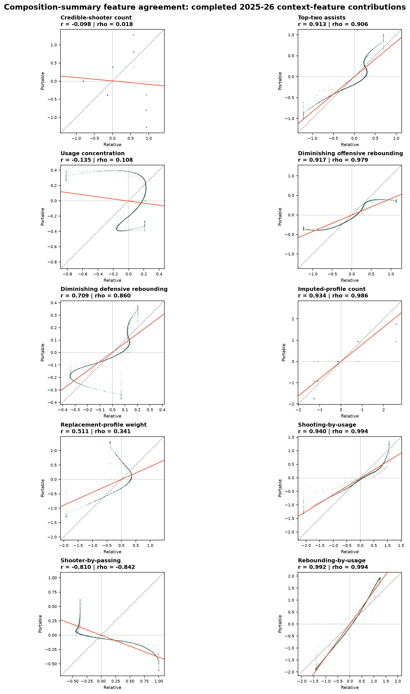

# Forward Bounded Hierarchical Portable-Matchup Contextual RAPM

This candidate applies the bounded contextual-function strategy to the
portable decomposition used by the Lineup Lab:

\[
C(A,B)=h(x(A))-h(x(B))+q(x(A),x(B)).
\]

It retains the identifiable portable composition scores \(h\) and the
opponent-specific matchup residual \(q\), while constraining both to the
central support observed in each completed season.

## Bounded Support

For every side-level profile feature, the completed season supplies
possession-weighted 5th and 95th percentile bounds. Both lineup profiles are
capped to those bounds before calculating the relative matchup features. Each
relative feature is then capped symmetrically at its possession-weighted 95th
percentile absolute magnitude:

\[
x_j(U)\leftarrow
\operatorname{clip}\left(x_j(U),\ell_{j,s},u_{j,s}\right),
\qquad
\Delta_j(A,B)\leftarrow
\operatorname{clip}\left(
x_j(A)-x_j(B),-c_{j,s},c_{j,s}
\right).
\]

The symmetric matchup cap is essential: it retains
\(C(A,B)=-C(B,A)\) exactly. The same clipping occurs when the model is used
as the next season's contextual offset, during the projected temporal prior,
and in the reference-anchored \(h/q\) decomposition.

## Seasonal Recursion

The estimator re-runs from 1996-97 through 2025-26. Every completed season
fits a bounded P-spline context state with level, curvature, and temporal
function penalties. Its player state and contextual function become inputs to
the following season only. Consequently the frozen 2025-26 evaluation uses
the completed 2024-25 bounded state; the 2025-26 fit is retained solely for a
subsequent forecast.

## Frozen Result

The completed frozen 2025-26 evaluation records a regular eligible-game margin
RMSE of **14.5953**, a full-game margin RMSE of **14.9224**, and a Pythagorean
win-total RMSE of **9.4360**. This improves materially on the unconstrained
portable decomposition, but does not surpass the unbounded hierarchical
portable model on the current frozen metrics. Its benefit is a consistent
inference contract: the model itself caps out-of-support inputs, rather than
leaving visualizations to handle extrapolation separately.

Artifact:
`forward-bounded-hierarchical-portable-matchup-contextual-rapm-2025-26-20260809T215819Z-4deb25f0`.
The complete comparison is maintained in the [Frozen Preseason
Leaderboard](preseason-leaderboard.md).

Use [the training guide](../guides/train-forward-bounded-hierarchical-portable-matchup-contextual-rapm.md)
to reproduce the run.

Use [the agreement-audit guide](../guides/build-portable-relative-context-agreement-audit.md)
to reproduce the comparison below.

<!-- portable-relative-context-agreement:start -->
## Relative-Context Agreement Audit

This is a possession-weighted agreement audit on the **observed 2025-26 regular-season matchup stints**. It is not a frozen predictive comparison: both completed 2025-26 fits score the same lineups with their own player coefficients, profiles, and context functions.

The portable model's net context edge is \(C(A,B)=h(A)-h(B)+q(A,B)\). The relative-context reference's net context edge is \(g(x(A)-x(B))\). Thus the table tests whether the two separately trained decompositions agree on the same realized lineup field; it does not establish that either estimate is correct.

Each dot is one observed stint. The axes use each model's net edge in points per 100 possessions; dot area is capped square-root stint possessions. The plot uses a deterministic 10% sample, while the gray dashed line, orange possession-weighted least-squares fit, and table all use the full stint field.

| Component | Weighted Pearson | Weighted Spearman | RMSE | MAE |
| --- | ---: | ---: | ---: | ---: |
| Net player rating edge | 0.9991 | 0.9990 | 0.390 | 0.310 |
| Net context edge | 0.9344 | 0.9307 | 1.278 | 1.019 |
| Predicted net rating | 0.9935 | 0.9931 | 1.256 | 1.004 |

### Feature-Level Agreement

Both contextual functions are additive over the same 20 original features. For each feature, this audit compares the portable model's total feature contribution, which is its composition contribution plus its matchup residual, with the relative model's contribution to \(g(x(A)-x(B))\). Each model's 20 contributions sum exactly to its net context edge. This is therefore an attribution-agreement diagnostic, not a comparison of the portable-only composition term \(h(A)-h(B)\), for which the relative model has no analog.

| Feature | Weighted Pearson | Weighted Spearman | RMSE | MAE |
| --- | ---: | ---: | ---: | ---: |
| Rebounding-by-usage | 0.9918 | 0.9941 | 0.374 | 0.323 |
| Turnovers | 0.9913 | 0.9939 | 0.229 | 0.186 |
| Blocks | 0.9887 | 0.9789 | 0.123 | 0.084 |
| Three-point attempt volume | 0.9840 | 0.9928 | 0.209 | 0.171 |
| Steals | 0.9698 | 0.9949 | 0.423 | 0.300 |
| Usage events | 0.9664 | 0.9932 | 0.358 | 0.270 |
| Shooting-by-usage | 0.9400 | 0.9937 | 0.347 | 0.242 |
| Imputed-profile count | 0.9345 | 0.9863 | 0.373 | 0.251 |
| Three-point makes | 0.9212 | 0.9071 | 0.387 | 0.306 |
| Diminishing offensive rebounding | 0.9168 | 0.9794 | 0.359 | 0.245 |
| Top-two assists | 0.9125 | 0.9065 | 0.201 | 0.178 |
| Offensive rebounds | 0.9027 | 0.9597 | 0.157 | 0.129 |
| Diminishing defensive rebounding | 0.7095 | 0.8601 | 0.136 | 0.100 |
| Defensive rebounds | 0.5733 | 0.6573 | 0.139 | 0.098 |
| Replacement-profile weight | 0.5109 | 0.3411 | 0.544 | 0.420 |
| Assists | -0.0091 | 0.2709 | 0.660 | 0.490 |
| Bottom-two three-point makes | -0.0135 | 0.0578 | 0.592 | 0.463 |
| Credible-shooter count | -0.0984 | 0.0185 | 0.880 | 0.684 |
| Usage concentration | -0.1345 | 0.1085 | 0.401 | 0.297 |
| Shooter-by-passing | -0.8096 | -0.8423 | 0.709 | 0.602 |

The atlases use the same deterministic 10% stint sample for dots, but every reported metric and orange fit uses the full possession-weighted stint field. The gray dashed line marks exact contribution agreement.

The audit includes 39,918 stints representing 122,886.0 possessions. RMSE and MAE are in net-rating points per 100 possessions. Artifact: `artifacts/analysis/portable_relative_context_agreement/2025-26/portable-relative-context-agreement-2025-26-20260810T000651Z-b715895a`. Source runs: portable `forward-bounded-hierarchical-portable-matchup-contextual-rapm-2025-26-20260809T215819Z-4deb25f0`; relative `forward-bounded-hierarchical-pspline-contextual-rapm-2025-26-20260809T152421Z-658f4071`.
<!-- portable-relative-context-agreement:end -->
