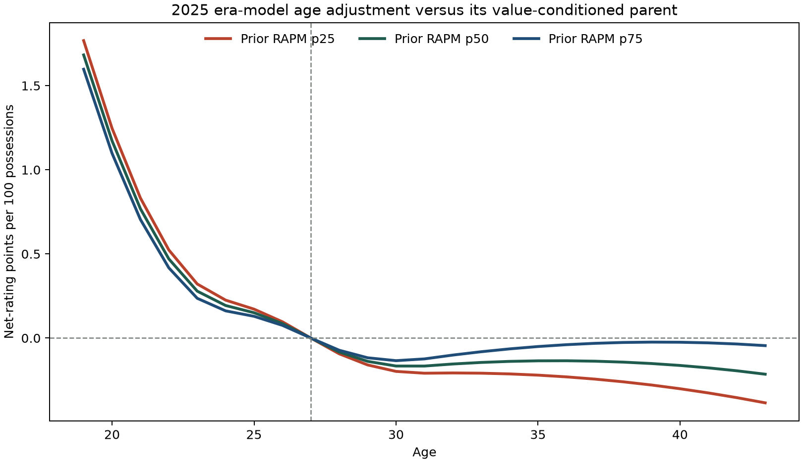

# Era-Conditioned Aging HPM

**HIPSTER PM with Era-Conditioned Aging** asks whether a single population
aging curve is too restrictive across a 30-year historical panel. It retains
the centered value-conditioned prior and adds a ridge-penalized interaction
between target season era and the age-spline basis:

\[
f_t(a)=B(a)\gamma+e_tB(a)\delta,
\qquad
e_t=\frac{\operatorname{startYear}(t)-2010}{10}.
\]

The model can therefore learn gradual era movement in the population age
trajectory without using outcomes from the season it is forecasting. It does
not claim that all individual players age according to the displayed curve;
the curve is a conditional prior, subsequently updated by lineup data.

The full pre-season prior still combines the exposure-gated cold-start branch,
possession-weighted centering, and bounded hierarchical portable-matchup
contextual state:

\[
C(A,B)=h(x(A))-h(x(B))+q(x(A),x(B)).
\]

## Frozen 2025-26 Evaluation

The completed run is
`forward-centered-era-conditioned-aging-bounded-hierarchical-portable-matchup-contextual-rapm-2025-26-20260810T154501Z-76a5fad1`.
Its terminal aging fit selected regularization `0.10`; the annual metadata
records `aging_era_conditioned = true` for every applicable fit.

| Metric | Value-Conditioned Aging HPM | Era-Conditioned Aging HPM |
| --- | ---: | ---: |
| Regular possession RMSE | **1.198763** | 1.198799 |
| Regular eligible game-margin RMSE | **14.3469** | 14.4398 |
| Full-game margin RMSE | **14.6242** | 14.7481 |
| Full-game winner accuracy | **68.37%** | 67.97% |
| Team NetRtg RMSE | **3.7568** | 3.9402 |
| Pythagorean wins RMSE | **8.0346** | 8.3940 |

The added flexibility did not improve the frozen target in this first
specification. The candidate is retained as a useful negative result and as
the first run to publish the new annual rating and curve-grid contract. It
does not replace the website model.

The immutable artifact contains annual player rating trajectories and
age-by-era reference grids under the [forward model artifact contract](../data/forward-model-artifacts.md).

See [the training guide](../guides/train-forward-centered-era-conditioned-aging-bounded-hierarchical-portable-matchup-contextual-rapm.md)
for the exact forward-only procedure.

<!-- era-conditioned-aging-audit:start -->
## Why Era Conditioning Did Not Help

The figure compares the two terminal population age curves. Each line is the
era-conditioned curve minus its value-conditioned parent, after both curves
are anchored at their own reference age. Positive values favor the era model's
age effect. This is not a longitudinal estimate that NBA 19-year-olds improved
by the displayed amount: it is the difference between two 2025 model
specifications, with their own recursive coefficient histories and reference
profiles. The largest visible divergence is +1.77 at age 19 for the prior p25 profile.

The cohort table is a diagnostic rather than a leaderboard metric. It compares
each frozen 2025-26 prior with that model's completed 2025-26 coefficient for
returning players, weighted by their realized on-court possessions. It tests
whether the additional age flexibility reduced the subsequent rating update for
older players. It does not use target-season outcomes to construct either prior.

| Model | Cohort | Players | Possessions | Prior-error MAE | Prior-error RMSE | Mean prior | Mean completed rating |
| --- | --- | ---: | ---: | ---: | ---: | ---: | ---: |
| Value-Conditioned Aging HPM | Age 30+ | 114 | 266,699 | 1.213 | 1.559 | -0.036 | -0.039 |
| Era-Conditioned Aging HPM | Age 30+ | 114 | 266,699 | 1.232 | 1.578 | -0.445 | -0.325 |
| Value-Conditioned Aging HPM | Age 34+ | 40 | 95,850 | 1.180 | 1.624 | -0.426 | -0.266 |
| Era-Conditioned Aging HPM | Age 34+ | 40 | 95,850 | 1.224 | 1.631 | -0.613 | -0.411 |
| Value-Conditioned Aging HPM | Age 36+ | 25 | 55,503 | 1.083 | 1.449 | -0.654 | -0.883 |
| Era-Conditioned Aging HPM | Age 36+ | 25 | 55,503 | 1.109 | 1.428 | -0.606 | -0.861 |

The extra flexibility is concentrated at the early-career boundary: at age 19, the median-prior partial age effect is +1.68 points higher under era conditioning. That is a large model-specification shift, not evidence of a causal improvement in 19-year-old talent, and it is not the veteran-specific correction this ablation was intended to test.

For returning players age 30+, prior RMSE rose from 1.559 to 1.578; for age 34+, it rose from 1.624 to 1.631. Age 36+ is the only cohort with a small RMSE reduction (1.449 to 1.428), but its MAE still rises (1.083 to 1.109). The evidence therefore does not support retaining the extra era interaction.

Audit artifact: `artifacts/analysis/era_conditioned_aging/2025-26/era-conditioned-aging-audit-2025-26-20260810T164106Z-e34b69f6`. It retains the plotted curve comparison and cohort calculations.
<!-- era-conditioned-aging-audit:end -->
