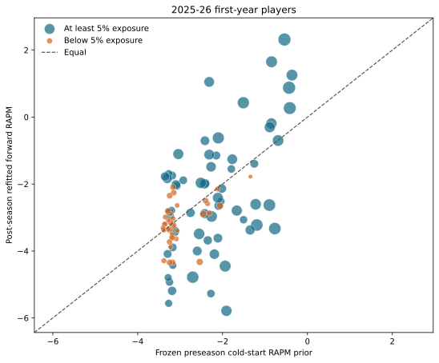

# Forward Cold-Start Validation

This study tests the first-year branch of the forward exposure-gated RAPM model. It compares every 2025-26 rookie's frozen preseason prior to the coefficient from the completed 2025-26 forward RAPM refit.

The outcome is not an independent ground-truth player value. It is the model's post-season, regular-only estimate and remains noisy for low-exposure players. That is why the report presents possession-weighted metrics and the realized exposure split alongside the raw correlation.

## Definition

For rookie \(i\), the frozen preseason prediction is \(\widehat R_i^{pre}\) and the post-season forward-RAPM refit is \(\widehat R_i^{post}\). The table reports the error \(\widehat R_i^{post} - \widehat R_i^{pre}\). Possession-weighted statistics use each player's on-court possessions as \(w_i\).

## 2025-26 Metrics

| Cohort | Players | On-court possessions | Pearson | Weighted Pearson | Spearman | Weighted Spearman | MAE | Weighted MAE | RMSE | Weighted RMSE |
| --- | ---: | ---: | ---: | ---: | ---: | ---: | ---: | ---: | ---: | ---: |
| All first-year players | 100 | 128,980 | 0.567 | 0.570 | 0.458 | 0.391 | 0.967 | 1.416 | 1.268 | 1.673 |
| Drafted 1-60 | 55 | 109,463 | 0.523 | 0.579 | 0.400 | 0.447 | 1.165 | 1.469 | 1.482 | 1.730 |
| Undrafted | 45 | 19,517 | 0.161 | 0.241 | 0.085 | 0.076 | 0.725 | 1.116 | 0.943 | 1.303 |
| Realized low exposure (<5%) | 37 | 4,731 | 0.491 | 0.279 | 0.378 | 0.313 | 0.440 | 0.524 | 0.588 | 0.704 |
| Realized rotation exposure (>=5%) | 63 | 124,249 | 0.528 | 0.562 | 0.426 | 0.443 | 1.277 | 1.450 | 1.533 | 1.699 |

## Prior Versus Refit

Each point is a first-year player. Point area scales with on-court possessions; orange points finished below 5% of team possession opportunities.

## Rookie Detail

The table is sortable by every column. `Prior rank` orders the pre-season forecast; `Refit rank` orders the completed regular-season coefficient.

| Prior rank | Prior | Refit rank | Refit RAPM | Adjustment | Player | Team | Pos. | Draft status | Pick | Possessions | Exposure | Low exposure |
| ---: | ---: | ---: | ---: | ---: | --- | --- | --- | --- | ---: | ---: | ---: | --- |
| 1 | -0.36 | 3 | +1.25 | +1.62 | Dylan Harper | SAS | G | Drafted 1-60 | 2 | 3,207 | 39.0% | No |
| 2 | -0.42 | 7 | +0.27 | +0.68 | Cooper Flagg | DAL | F | Drafted 1-60 | 1 | 4,943 | 58.7% | No |
| 3 | -0.43 | 5 | +0.88 | +1.31 | VJ Edgecombe | PHI | G | Drafted 1-60 | 3 | 5,402 | 65.5% | No |
| 4 | -0.54 | 1 | +2.32 | +2.86 | Kon Knueppel | CHA | G-F | Drafted 1-60 | 4 | 5,207 | 65.3% | No |
| 5 | -0.69 | 11 | -0.70 | -0.01 | Tre Johnson | WAS | G | Drafted 1-60 | 6 | 3,076 | 36.8% | No |
| 6 | -0.77 | 67 | -3.33 | -2.56 | Ace Bailey | UTA | F | Drafted 1-60 | 5 | 4,235 | 50.0% | No |
| 7 | -0.85 | 2 | +1.65 | +2.50 | Cedric Coward | MEM | G | Drafted 1-60 | 11 | 3,386 | 40.8% | No |
| 8 | -0.85 | 8 | -0.19 | +0.66 | Collin Murray-Boyles | TOR | F | Drafted 1-60 | 9 | 2,519 | 31.1% | No |
| 9 | -0.89 | 9 | -0.30 | +0.59 | Egor Dëmin | BKN | G | Drafted 1-60 | 8 | 2,649 | 33.2% | No |
| 10 | -0.90 | 41 | -2.63 | -1.73 | Jeremiah Fears | NOP | G | Drafted 1-60 | 7 | 4,446 | 53.6% | No |
| 11 | -1.19 | 63 | -3.22 | -2.03 | Derik Queen | NOP | C | Drafted 1-60 | 13 | 4,280 | 51.6% | No |
| 12 | -1.22 | 40 | -2.61 | -1.39 | Walter Clayton Jr. | UTA | G | Drafted 1-60 | 18 | 2,971 | 35.4% | No |
| 13 | -1.25 | 17 | -1.39 | -0.14 | Khaman Maluach | PHX | C | Drafted 1-60 | 10 | 804 | 10.0% | No |
| 14 | -1.34 | 23 | -1.78 | -0.43 | Noa Essengue | CHI | F | Drafted 1-60 | 12 | 14 | 0.2% | Yes |
| 15 | -1.35 | 71 | -3.37 | -2.02 | Carter Bryant | SAS | F | Drafted 1-60 | 14 | 1,682 | 20.5% | No |
| 16 | -1.50 | 58 | -3.07 | -1.56 | Yang Hansen | POR | C | Drafted 1-60 | 16 | 626 | 7.5% | No |
| 17 | -1.51 | 6 | +0.43 | +1.94 | Nique Clifford | SAC | G | Drafted 1-60 | 24 | 3,873 | 47.4% | No |
| 18 | -1.67 | 46 | -2.79 | -1.13 | Nolan Traore | BKN | G | Drafted 1-60 | 19 | 2,490 | 31.2% | No |
| 19 | -1.77 | 16 | -1.26 | +0.51 | Kasparas Jakučionis | MIA | G | Drafted 1-60 | 20 | 2,054 | 24.2% | No |
| 20 | -1.79 | 19 | -1.55 | +0.24 | Joan Beringer | MIN | F | Drafted 1-60 | 17 | 671 | 8.1% | No |
| 21 | -1.91 | 100 | -5.79 | -3.88 | Drake Powell | BKN | G-F | Drafted 1-60 | 22 | 2,655 | 33.3% | No |
| 22 | -1.94 | 93 | -4.45 | -2.51 | Will Riley | WAS | F | Drafted 1-60 | 21 | 3,434 | 41.1% | No |
| 23 | -2.02 | 32 | -2.13 | -0.12 | Jase Richardson | ORL | G | Drafted 1-60 | 25 | 1,198 | 14.5% | No |
| 24 | -2.04 | 38 | -2.52 | -0.48 | Chaz Lanier | DET | G | Drafted 1-60 | 37 | 537 | 6.6% | No |
| 25 | -2.06 | 44 | -2.65 | -0.59 | Alijah Martin | TOR | G | Drafted 1-60 | 39 | 283 | 3.5% | Yes |
| 26 | -2.09 | 43 | -2.65 | -0.55 | Asa Newell | ATL | F | Drafted 1-60 | 23 | 1,067 | 12.8% | No |
| 27 | -2.10 | 10 | -0.62 | +1.48 | Sion James | CHA | G | Drafted 1-60 | 33 | 3,705 | 46.5% | No |
| 28 | -2.11 | 79 | -3.62 | -1.51 | Kam Jones | IND | G | Drafted 1-60 | 38 | 1,308 | 15.7% | No |
| 29 | -2.11 | 36 | -2.41 | -0.30 | Danny Wolf | BKN | F | Drafted 1-60 | 27 | 2,363 | 29.7% | No |
| 30 | -2.12 | 33 | -2.15 | -0.03 | John Tonje | BOS | G | Drafted 1-60 | 53 | 88 | 1.1% | Yes |
| 31 | -2.15 | 15 | -1.15 | +1.00 | Yanic Konan Niederhäuser | LAC | C | Drafted 1-60 | 30 | 848 | 10.7% | No |
| 32 | -2.19 | 87 | -4.09 | -1.90 | Ben Saraf | BKN | G | Drafted 1-60 | 26 | 1,874 | 23.5% | No |
| 33 | -2.26 | 55 | -2.97 | -0.71 | Ryan Kalkbrenner | CHA | C | Drafted 1-60 | 34 | 3,028 | 38.0% | No |
| 34 | -2.27 | 18 | -1.49 | +0.79 | Micah Peavy | NOP | G-F | Drafted 1-60 | 40 | 1,910 | 23.0% | No |
| 35 | -2.28 | 98 | -5.27 | -3.00 | Brooks Barnhizer | OKC | G | Drafted 1-60 | 44 | 703 | 8.5% | No |
| 36 | -2.31 | 50 | -2.87 | -0.56 | Johni Broome | PHI | F | Drafted 1-60 | 35 | 111 | 1.3% | Yes |
| 37 | -2.31 | 14 | -1.12 | +1.19 | Jamir Watkins | WAS | F | Drafted 1-60 | 43 | 2,170 | 26.0% | No |
| 38 | -2.32 | 4 | +1.05 | +3.37 | Hugo González | BOS | G | Drafted 1-60 | 28 | 2,133 | 27.4% | No |
| 39 | -2.35 | 81 | -3.68 | -1.33 | Taelon Peter | IND | G | Drafted 1-60 | 54 | 1,050 | 12.6% | No |
| 40 | -2.35 | 39 | -2.59 | -0.23 | Max Shulga | BOS | G | Drafted 1-60 | 57 | 75 | 1.0% | Yes |
| 41 | -2.40 | 27 | -1.98 | +0.42 | Liam McNeeley | CHA | F | Drafted 1-60 | 29 | 729 | 9.1% | No |
| 42 | -2.40 | 37 | -2.50 | -0.10 | Koby Brea | PHX | G | Drafted 1-60 | 41 | 160 | 2.0% | Yes |
| 43 | -2.42 | 12 | -0.71 | +1.71 | Rasheer Fleming | PHX | F | Drafted 1-60 | 31 | 1,316 | 16.4% | No |
| 44 | -2.42 | 52 | -2.88 | -0.47 | Noah Penda | ORL | G-F | Drafted 1-60 | 32 | 1,550 | 18.8% | No |
| 45 | -2.43 | 28 | -2.00 | +0.43 | Javon Small | MEM | G | Drafted 1-60 | 48 | 1,758 | 21.2% | No |
| 46 | -2.45 | 53 | -2.90 | -0.44 | Adou Thiero | LAL | G | Drafted 1-60 | 36 | 301 | 3.7% | Yes |
| 47 | -2.51 | 26 | -1.97 | +0.55 | Kobe Sanders | LAC | G | Drafted 1-60 | 50 | 2,741 | 34.5% | No |
| 48 | -2.54 | 89 | -4.33 | -1.79 | Amari Williams | BOS | F-C | Drafted 1-60 | 46 | 297 | 3.8% | Yes |
| 49 | -2.55 | 75 | -3.49 | -0.94 | Will Richard | GSW | G | Drafted 1-60 | 56 | 2,861 | 35.0% | No |
| 50 | -2.60 | 85 | -4.00 | -1.40 | Jahmai Mashack | MEM | G | Drafted 1-60 | 59 | 1,427 | 17.2% | No |
| 51 | -2.70 | 94 | -4.78 | -2.08 | Maxime Raynaud | SAC | C | Drafted 1-60 | 42 | 4,072 | 49.9% | No |
| 52 | -2.75 | 49 | -2.86 | -0.11 | Tyrese Proctor | CLE | G | Drafted 1-60 | 49 | 1,115 | 13.5% | No |
| 53 | -2.93 | 25 | -1.89 | +1.04 | Lachlan Olbrich | CHI | C | Drafted 1-60 | 55 | 732 | 8.7% | No |
| 54 | -3.04 | 13 | -1.10 | +1.94 | Ryan Nembhard | DAL | G | Undrafted |  | 2,426 | 28.8% | No |
| 55 | -3.06 | 73 | -3.39 | -0.33 | Chucky Hepburn | TOR | G | Undrafted |  | 26 | 0.3% | Yes |
| 56 | -3.07 | 42 | -2.64 | +0.43 | Mark Sears | MIL | G | Undrafted |  | 52 | 0.7% | Yes |
| 57 | -3.07 | 30 | -2.06 | +1.02 | LJ Cryer | GSW | G | Undrafted |  | 582 | 7.1% | No |
| 58 | -3.09 | 80 | -3.64 | -0.55 | Sean Pedulla | LAC | G | Undrafted |  | 60 | 0.8% | Yes |
| 59 | -3.10 | 29 | -2.01 | +1.08 | Mohamed Diawara | NYK | F | Drafted 1-60 | 51 | 1,259 | 15.8% | No |
| 60 | -3.12 | 65 | -3.23 | -0.11 | Darius Brown II | CLE | G | Undrafted |  | 4 | 0.1% | Yes |
| 61 | -3.14 | 74 | -3.41 | -0.27 | Caleb Love | POR | G | Undrafted |  | 2,118 | 25.5% | No |
| 62 | -3.15 | 34 | -2.26 | +0.89 | Curtis Jones | DEN | G | Undrafted |  | 180 | 2.2% | Yes |
| 63 | -3.17 | 31 | -2.10 | +1.07 | David Jones Garcia | SAS | G | Undrafted |  | 150 | 1.8% | Yes |
| 64 | -3.17 | 57 | -3.04 | +0.13 | Chris Mañon | LAL | G | Undrafted |  | 91 | 1.1% | Yes |
| 65 | -3.17 | 92 | -4.43 | -1.26 | Lucas Williamson | MEM | G | Undrafted |  | 493 | 5.9% | No |
| 66 | -3.17 | 84 | -3.89 | -0.72 | Malachi Smith | BKN | G | Undrafted |  | 742 | 9.3% | No |
| 67 | -3.18 | 64 | -3.23 | -0.05 | Chris Youngblood | OKC | G | Undrafted |  | 372 | 4.5% | Yes |
| 68 | -3.18 | 90 | -4.34 | -1.16 | Keshon Gilbert | WAS | G | Undrafted |  | 150 | 1.8% | Yes |
| 69 | -3.19 | 77 | -3.60 | -0.41 | Miles Kelly | DAL | G | Undrafted |  | 287 | 3.4% | Yes |
| 70 | -3.19 | 76 | -3.51 | -0.32 | Hayden Gray | UTA | G | Undrafted |  | 54 | 0.6% | Yes |
| 71 | -3.19 | 21 | -1.75 | +1.44 | Myron Gardner | MIA | F | Undrafted |  | 889 | 10.5% | No |
| 72 | -3.19 | 78 | -3.60 | -0.41 | Hunter Sallis | PHI | G | Undrafted |  | 55 | 0.7% | Yes |
| 73 | -3.19 | 97 | -5.19 | -2.00 | Bez Mbeng | UTA | G | Undrafted |  | 1,083 | 12.8% | No |
| 74 | -3.20 | 45 | -2.79 | +0.41 | Cormac Ryan | MIL | G | Undrafted |  | 537 | 6.7% | No |
| 75 | -3.23 | 83 | -3.88 | -0.66 | Norchad Omier | LAC | F | Undrafted |  | 46 | 0.6% | Yes |
| 76 | -3.23 | 51 | -2.88 | +0.35 | Alex Morales | ORL | G | Undrafted |  | 46 | 0.6% | Yes |
| 77 | -3.23 | 60 | -3.14 | +0.09 | Kadary Richmond | WAS | G | Undrafted |  | 149 | 1.8% | Yes |
| 78 | -3.23 | 54 | -2.96 | +0.27 | John Poulakidas | DAL | G | Undrafted |  | 546 | 6.5% | No |
| 79 | -3.25 | 91 | -4.34 | -1.10 | Javonte Cooke | POR | G | Undrafted |  | 198 | 2.4% | Yes |
| 80 | -3.25 | 35 | -2.35 | +0.90 | Tristan Enaruna | CLE | F | Undrafted |  | 170 | 2.1% | Yes |
| 81 | -3.25 | 48 | -2.84 | +0.41 | Chaney Johnson | BKN | G-F | Undrafted |  | 719 | 9.0% | No |
| 82 | -3.25 | 70 | -3.36 | -0.12 | Andersson Garcia | UTA | F | Undrafted |  | 359 | 4.2% | Yes |
| 83 | -3.25 | 69 | -3.36 | -0.11 | Jahmyl Telfort | LAC | G | Undrafted |  | 63 | 0.8% | Yes |
| 84 | -3.25 | 96 | -4.93 | -1.68 | Tyler Burton | MEM | F | Undrafted |  | 646 | 7.8% | No |
| 85 | -3.25 | 82 | -3.73 | -0.48 | Payton Sandfort | OKC | F | Undrafted |  | 133 | 1.6% | Yes |
| 86 | -3.27 | 20 | -1.69 | +1.57 | Blake Hinson | UTA | F | Undrafted |  | 607 | 7.2% | No |
| 87 | -3.27 | 99 | -5.56 | -2.29 | Adama Bal | MEM | G | Undrafted |  | 524 | 6.3% | No |
| 88 | -3.28 | 68 | -3.35 | -0.07 | Jayson Kent | POR | F | Undrafted |  | 43 | 0.5% | Yes |
| 89 | -3.28 | 59 | -3.08 | +0.20 | Alex Antetokounmpo | MIL | F | Undrafted |  | 43 | 0.5% | Yes |
| 90 | -3.28 | 95 | -4.79 | -1.51 | Toby Okani | MEM | F | Undrafted |  | 477 | 5.7% | No |
| 91 | -3.29 | 47 | -2.80 | +0.48 | Josh Oduro | NOP | C | Undrafted |  | 186 | 2.2% | Yes |
| 92 | -3.29 | 86 | -4.09 | -0.79 | Julian Reese | WAS | F | Undrafted |  | 840 | 10.1% | No |
| 93 | -3.30 | 24 | -1.83 | +1.47 | Dylan Cardwell | SAC | C | Undrafted |  | 1,851 | 22.7% | No |
| 94 | -3.35 | 56 | -2.99 | +0.36 | CJ Huntley | PHX | F | Undrafted |  | 82 | 1.0% | Yes |
| 95 | -3.35 | 22 | -1.77 | +1.58 | Moussa Cisse | DAL | C | Undrafted |  | 1,109 | 13.2% | No |
| 96 | -3.36 | 62 | -3.20 | +0.16 | Vladislav Goldin | MIA | C | Undrafted |  | 57 | 0.7% | Yes |
| 97 | -3.36 | 61 | -3.20 | +0.16 | Lawson Lovering | MEM | C | Undrafted |  | 110 | 1.3% | Yes |
| 98 | -3.38 | 88 | -4.29 | -0.91 | Hunter Dickinson | NOP | C | Undrafted |  | 95 | 1.1% | Yes |
| 99 | -3.38 | 72 | -3.37 | +0.01 | Grant Nelson | BKN | F | Undrafted |  | 68 | 0.9% | Yes |
| 100 | -3.40 | 66 | -3.31 | +0.09 | Rocco Zikarsky | MIN | C | Drafted 1-60 | 45 | 72 | 0.9% | Yes |
