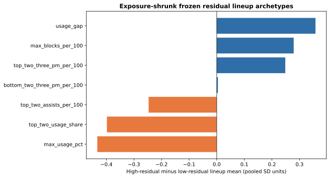

# Frozen Lineup Residual Archetypes

Last updated: 2026-09-08

This audit looks backward from the three frozen production replays to identify
which *observed five-man units* most consistently beat or missed their frozen
NAIL prediction. It is a hypothesis generator for future non-additive context
features, not a model-selection result and not causal attribution to the five
players.

## Contract

For each target-season stint, the prediction is the production NAIL state that
was available before that season began. The oriented residual for a unit is

\[
r_s = y_s - \widehat{y}^{\mathrm{frozen}}_s,
\]

where the sign is reversed for the away unit. Positive values therefore mean
that the unit outperformed its frozen prediction against the opponents it
actually faced.

Stints are then grouped by target season, team, and the unordered set of five
player IDs. Only realized regular-season units with at least 250 possessions
are eligible. This deliberately makes the audit retrospective: realized
lineup deployment determines which units can be studied. It does **not** make
the residual itself non-frozen.

Lineup means are noisy, so the observed possession-weighted mean \(\bar r_u\)
is shrunk toward the pooled stint residual mean \(\bar r\):

\[
\widetilde r_u = \bar r + w_u(\bar r_u - \bar r),
\qquad
w_u = \frac{n_u}{n_u + \sigma^2 / \tau^2}.
\]

Here \(n_u\) is unit possessions, \(\sigma^2\) is the weighted stint-residual
variance, and \(\tau^2\) is the estimated between-unit variance after removing
average sampling noise. This is an empirical-Bayes shrinkage heuristic, not a
new NAIL parameter. Units are assigned to deciles **within each season** using
\(\widetilde r_u\).

Player-profile inputs remain predictive: each target season uses the same
strictly lagged, padded profile contract as production NAIL. Target-season box
scores are never used to define a unit's profile.

## Coverage

| Target season | Eligible five-man units | Eligible possessions | Mean shrinkage weight |
| --- | ---: | ---: | ---: |
| 2023-24 | 69 | 38,348 | 0.745 |
| 2024-25 | 60 | 28,857 | 0.736 |
| 2025-26 | 58 | 26,093 | 0.718 |
| **Pooled** | **187** | **93,297** | **0.734** |

The top and bottom deciles contain only about six units per season. Results
must therefore repeat across seasons before becoming a candidate feature.

## Profile Contrasts

The chart compares the profile means of the highest and lowest shrunk-residual
deciles. Values are expressed in the pooled standard deviation of the stated
lineup summary; positive means the high-residual group is larger.



| Profile summary | 2023-24 | 2024-25 | 2025-26 | Pooled |
| --- | ---: | ---: | ---: | ---: |
| Maximum conventional USG% | -0.31 | -0.73 | -0.31 | **-0.43** |
| Top-two usage share | -0.22 | -0.46 | -0.55 | **-0.40** |
| Top-one minus top-two USG% | +1.33 | +0.66 | -0.60 | +0.36 |
| Maximum blocks per 100 | +0.02 | +0.22 | +0.75 | +0.28 |
| Mean top-two 3PM per 100 | +0.44 | -0.52 | +0.65 | +0.25 |
| Top-two assists per 100 | -0.85 | +0.90 | -0.57 | -0.25 |
| Mean bottom-two 3PM per 100 | +0.32 | -0.75 | +0.36 | +0.00 |

The two usage-concentration summaries have the same sign in every season:
high-residual units are less dominated by their top usage players. That is a
useful descriptive pattern, but it overlaps the production usage-concentration
term and cannot by itself establish incremental signal. The other contrasts are
not stable: for example, top-two shooting and assists reverse direction across
the three seasons. They should not advance to a full frozen refit without a
separate, declared feature contract and screen.

## Decision Rule

Use this audit to propose a small number of basketball-coherent candidates.
Each candidate must then follow the existing sequence:

1. Define the strictly lagged feature and its sign expectation.
2. Run the frozen residual screen, including all three target seasons.
3. Require a coherent decile pattern and a stable directional result before a
   recursive refit.
4. Put every full candidate on the three-season frozen leaderboard, regardless
   of whether it is promoted.

The audit is not evidence that a discovered profile should be added to NAIL;
it is evidence about where to look next.

## Reproduce

```bash
uv run python -m nba_lineup_model.modeling.lineup_residual_archetype_audit \
  --minimum-possessions 250
```

Artifact:
`artifacts/models/analysis/lineup_residual_archetypes/lineup-residual-archetypes-20260908T170331Z-989239a0`.
