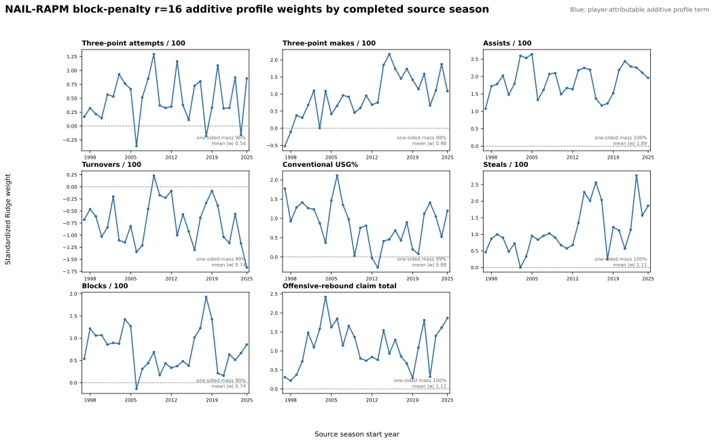
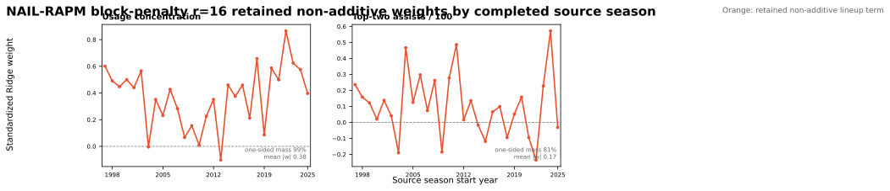

# NAIL Context Block-Penalty Study

This study tests whether NAIL-RAPM should regularize its eight additive profile
terms and two non-additive lineup terms at different strengths. Everything else
is fixed to the production
[NAIL-RAPM v1.2.1.3 contract](nail-rapm-v1213-residualized-lambda.md), including
the residualized player-lambda selection, aging and cold-start priors,
Medvedovsky profile padding, B2B control, fit ordering, and frozen evaluator.

## Candidate Contract

The context Ridge objective is

\[
\sum_k w_k\left(y_k-X_{k,A}\beta_A-X_{k,N}\beta_N\right)^2
+ \alpha_A\lVert\beta_A\rVert_2^2
+ \alpha_N\lVert\beta_N\rVert_2^2,
\]

where \(X_A\) contains the eight additive profile coordinates and \(X_N\)
contains `top_two_assists` and `usage_concentration`. The additive penalty is
fixed at \(\alpha_A=10{,}000\), while

\[
\alpha_N=r\alpha_A,
\qquad
r\in\{0.25,0.5,1,2,4,8,16\}.
\]

A structural additive-only control omits both non-additive coefficients. The
development window is 2019-20 through 2022-23. The registered selection rule
chooses the largest ratio within one paired-season standard error of the lowest
equal-season full-game MSE; it selected \(r=16\).

## Development Result

| Ratio | Full-game RMSE | Winner accuracy | Team NetRtg RMSE | Pythagorean-win RMSE |
| ---: | ---: | ---: | ---: | ---: |
| 1 | 13.5048 | 64.27% | 2.8675 | 6.6076 |
| 4 | 13.5017 | 64.20% | 2.8613 | 6.5875 |
| 8 | 13.5005 | 64.23% | 2.8582 | 6.5742 |
| **16** | **13.5002** | **64.32%** | **2.8563** | **6.5616** |
| Additive only | 13.5160 | 64.15% | 2.9125 | 6.6852 |

## Locked Frozen Result

Both rows below use the corrected evaluator over the same 625,615 regular
possessions, 3,511 regular games, and 39,967 playoff possessions. Lower is
better except winner accuracy.

| Metric | Production shared penalty | Candidate \(r=16\) |
| --- | ---: | ---: |
| Regular possession RMSE | 1.198147 | **1.198144** |
| Regular possession MAE | **1.141455** | 1.141478 |
| Regular eligible-game RMSE | **14.0051** | 14.0134 |
| Regular full-game RMSE | **14.2166** | 14.2327 |
| Winner accuracy | **68.30%** | **68.30%** |
| Team NetRtg RMSE | **3.2351** | 3.2735 |
| Pythagorean-win RMSE | **6.9423** | 7.0265 |
| Playoff possession RMSE | 1.192728 | **1.192719** |
| Playoff eligible-game RMSE | 16.5782 | **16.5595** |

The candidate's tiny possession and playoff gains do not offset its losses on
regular game and team outcomes. The shared `10,000` penalty remains the
production contract. The candidate is not added to the production leaderboard
or model tree.

## Coefficient Histories

The completed 1996-97 through 2025-26 fit provides the required annual review.
Blue panels are additive profile terms; orange panels are genuinely
non-additive lineup terms.

The stronger penalty does not erase the retained non-additive signals.
`top_two_assists` has 99% one-sided coefficient mass and
`usage_concentration` has 81%. This supports retaining both features while
rejecting the larger penalty on frozen predictive grounds.

## Artifacts

- Completed r=16 fit: `artifacts/models/forward_nail_rapm_v1213_block_penalty_r16/2025-26/forward-nail-rapm-v1213-block-penalty-r16-2025-26-20260828T213200Z-5630f328`
- Frozen candidate replay: `artifacts/models/nail_v1213_block_penalty_locked_backtest/frozen_multiseason_backtest/2023-24_to_2025-26/frozen_multiseason_backtest-2023-24-to-2025-26-20260828T213732Z-3ab0b3fc`
- Corrected production replay: `artifacts/models/nail_v1213_block_penalty_locked_incumbent_backtest/frozen_multiseason_backtest/2023-24_to_2025-26/frozen_multiseason_backtest-2023-24-to-2025-26-20260828T214328Z-0ac35125`
- Coefficient review: `artifacts/models/analysis/nail_v1213_block_penalty_r16_review/nail-v1213-promotion-review-20260828T214530Z-f59a9881`

See the [reproduction guide](../guides/tune-nail-context-block-penalty.md).
