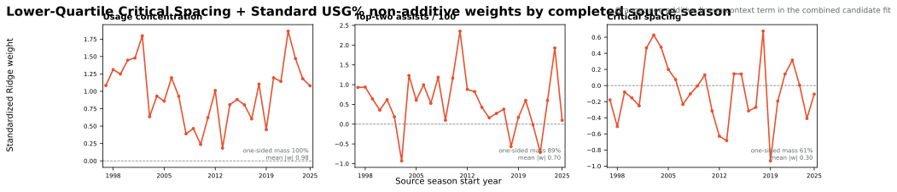

# NAIL Quartile Critical Spacing Plus Standard USG%

**Status: experimental, not promoted.** This candidate jointly changes the
Critical Spacing threshold and its usage coordinate relative to the production
[NAIL-RAPM v1.2.1](nail-rapm-v121-pruned-nonadditive.md).

## Contract

For each source-season player-profile pool \(P_t\), let \(q_t\) be the lower
quartile of shrunk three-point makes per 100 possessions:

\[
q_t = Q_{0.25}\left(\{\mathrm{3PM100}_{i,t}: i \in P_t\}\right).
\]

For five-man unit \(U\), Critical Spacing is the non-additive threshold event

\[
\mathrm{CriticalSpacing}_t(U) =
\mathbb{1}\!\left[
  \sum_{i \in U}\mathbb{1}[\mathrm{3PM100}_{i,t} < q_t] \geq 2
\right].
\]

Thus, the feature activates when at least two players are below the
prior-season lower-quartile shooting threshold. It does not credit or penalize
one low-threat player by itself. Across the frozen 2023-24 through 2025-26
regular-season samples, it activated for **26.0%** of lineup sides on average
(22.9%, 24.5%, and 30.6% by season).

The candidate also replaces the internal usage-events rate with conventional
box-score usage percentage:

\[
\mathrm{USG\%}_i = 100\,
\frac{\mathrm{FGA}_i + 0.44\,\mathrm{FTA}_i + \mathrm{TOV}_i}
{\mathrm{TeamPossessions}_i}.
\]

It then retains the same two non-additive terms as v1.2.1:
`usage_concentration` and `top_two_assists`. All player profiles, threshold
values, and context coefficients obey the forward information boundary.

## Frozen Three-Season Results

The recursive model was fit from 1996-97 through 2025-26. The strict replay
predicts 2023-24, 2024-25, and 2025-26 using only the relevant preseason
player-prior state and the immediately preceding completed context state.

| Model | Poss. RMSE | Eligible game RMSE | Full-game RMSE | Winner accuracy | Team NetRtg RMSE | Pythagorean-win RMSE | Playoff eligible-game RMSE |
| --- | ---: | ---: | ---: | ---: | ---: | ---: | ---: |
| **NAIL-RAPM v1.2.1** | **1.197952** | **14.024550** | **14.252137** | **68.24%** | **3.270613** | **7.035098** | **16.594200** |
| Quartile Critical Spacing + standard USG% | 1.197954 | 14.030448 | 14.258396 | 68.10% | 3.278702 | 7.045978 | 16.614526 |

The new candidate is effectively tied at the possession level, but it is worse
on every primary pooled game-level metric. Its full-game RMSE increases by
`0.0063`, winner accuracy falls by `0.14` percentage points, and playoff
eligible-game RMSE increases by `0.0203`. It modestly improves possession MAE
and Pythagorean-win rank correlation, but neither offsets the losses in the
primary scorecard.

## Coefficient Diagnostics

The chart shows the full non-additive contract, so the new term can be
evaluated together with possible displacement of the two retained terms.

| Feature | Median standardized weight | Dominant directional mass | Interpretation |
| --- | ---: | ---: | --- |
| Usage concentration | +1.01 | 100.0% positive | Stable retained signal |
| Top-two assists | +0.60 | 89.1% positive | Stable retained signal |
| Critical Spacing | -0.10 | 61.2% negative | Expected sign, but weak and inconsistent |

The quartile threshold is more targeted than the previous lower-tercile
candidate, but its coefficient is too unstable and it does not improve the
frozen scorecard. The standard-USG% coordinate also does not recover an edge.

## Decision

Do **not** promote this candidate. NAIL-RAPM v1.2.1 remains the production
model. This result narrows the spacing hypothesis: a two-or-more low-threat
event is directionally plausible, but this particular lower-quartile and
standard-USG% formulation does not provide sufficient incremental predictive
value.

## Artifacts

- Recursive candidate: `artifacts/models/forward_nail_rapm_critical_spacing_quartile_standard_usage/2025-26/forward-nail-critical-spacing-quartile-standard-usage-2025-26-20260824T052154Z-9e32f2d8`
- Frozen replay: `artifacts/models/nail_critical_spacing_quartile_standard_usage_frozen_backtest/frozen_multiseason_backtest/2023-24_to_2025-26/frozen_multiseason_backtest-2023-24-to-2025-26-20260824T053055Z-d8a33cc7`
- Coefficient audit: `artifacts/models/analysis/nail_critical_spacing_quartile_standard_usage_weight_audit/nail-critical-spacing-quartile-standard-usage-weight-audit-20260824T053116Z-1d5bbe2c`

## Reproduction

See [Train NAIL Quartile Critical Spacing Plus Standard USG%](../guides/train-nail-critical-spacing-quartile-standard-usage.md).
