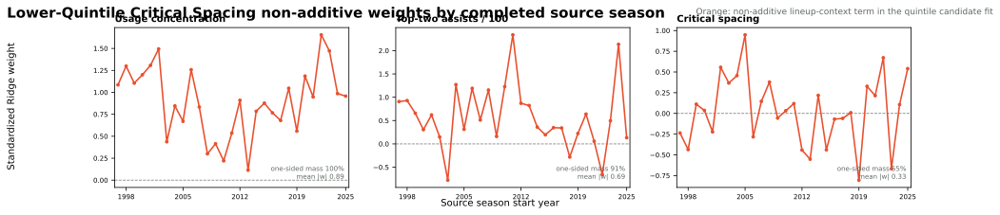

# NAIL Lower-Quintile Critical-Spacing Candidate

**Status: rejected experimental variant.** This candidate uses the exact
[NAIL-RAPM v1.2.1](nail-rapm-v121-pruned-nonadditive.md) contract plus one
Critical Spacing indicator. It changes only the cutoff from the lower tercile
to the lower quintile.

## Hypothesis

The lower-tercile test may have included too many merely below-average
shooters. This stricter candidate identifies only the bottom 20% of the
forward-safe, season-state shrunk `three_pm_per_100` profile distribution. A
unit activates the term when at least two of its five players fall strictly
below that cutoff:

\[
q_t = Q_{1/5}\left(\{\mathrm{3PM100}_{i,t}:i\in P_t\}\right),
\qquad
\mathrm{CriticalSpacing}_t(U)=
\mathbb{1}\!\left[\sum_{i\in U}
\mathbb{1}[\mathrm{3PM100}_{i,t}<q_t]\ge2\right].
\]

Every profile and threshold is constructed from information available before
the target season. The player prior, additive profile, retained
`usage_concentration` and `top_two_assists` terms, and Ridge regularization are
unchanged from v1.2.1.

## Frozen Results

The recursive candidate was fit through 2025-26 and evaluated on the three
strict frozen regular-season and playoff holdouts. The stricter cutoff does not
improve the incumbent and is modestly worse on the primary aggregate metrics.

| Model | Poss. RMSE | Eligible game RMSE | Full-game RMSE | Winner accuracy | Team NetRtg RMSE | Pythagorean-win RMSE | Playoff eligible-game RMSE |
| --- | ---: | ---: | ---: | ---: | ---: | ---: | ---: |
| **NAIL-RAPM v1.2.1** | **1.197952** | **14.024550** | **14.252137** | **68.24%** | **3.270613** | **7.035098** | **16.594200** |
| Lower-quintile Critical Spacing | 1.197960 | 14.041824 | 14.272532 | 68.10% | 3.298537 | 7.090747 | 16.627064 |

This was stopped before paired bootstrap because the point estimates are
uniformly inferior to v1.2.1 on the primary regular-season and playoff
aggregates. It is therefore not a promotion candidate.

## Full Non-Additive Audit

The diagnostic includes all three non-additive terms, not only the test
candidate. That makes it possible to distinguish a genuinely incremental term
from one that merely displaces a retained coefficient.

The new Critical Spacing coefficient is not directionally credible under the
agreed total one-sided-mass criterion. It has positive mass `5.24` and negative
mass `4.27`, so only **55.1%** lies on its dominant positive side, despite the
hypothesis expecting a negative spacing penalty. Its median standardized weight
is `+0.04`, mean absolute magnitude is `0.33`, and range is `-0.81` to `+0.95`.

The candidate also does **not** explain its failure through displacement of the
retained terms: matched source-season weights remain highly aligned with
v1.2.1. `usage_concentration` has Pearson correlation `0.9941` and mean
absolute change `0.0303`; `top_two_assists` has correlation `0.9881` and mean
absolute change `0.0710`. The lower-quintile term is simply too selective and
too unstable to add useful residual predictive signal.

## Decision

Do not promote. The tercile candidate had a more coherent negative direction
but no meaningful aggregate lift; the quintile candidate is both less stable
and predictively worse. Future spacing work should test a richer, forward-safe
non-additive formulation rather than additional hard quantile cutoffs.

## Reproducibility

- Recursive fit: `artifacts/models/forward_nail_rapm_critical_spacing_quintile/2025-26/forward-nail-critical-spacing-quintile-2025-26-20260823T233944Z-ffce4c9e`
- Frozen replay: `artifacts/models/nail_critical_spacing_quintile_frozen_backtest/frozen_multiseason_backtest/2023-24_to_2025-26/frozen_multiseason_backtest-2023-24-to-2025-26-20260823T234533Z-9470b3b9`
- Coefficient audit: `artifacts/models/analysis/nail_critical_spacing_quintile_weight_audit/nail-critical-spacing-quintile-weight-audit-20260823T234558Z-a241fd1b`
