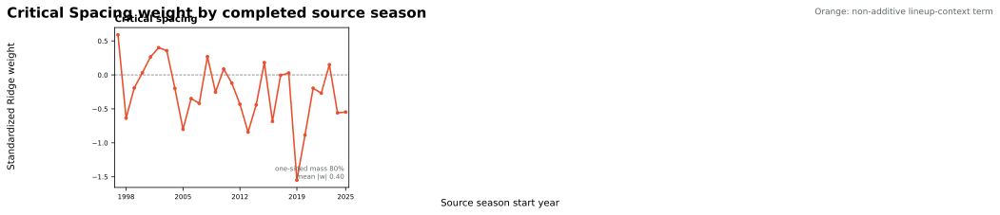

# NAIL Critical-Spacing Candidate

**Status: experimental.** This is a controlled one-feature extension of
[NAIL-RAPM v1.2.1](nail-rapm-v121-pruned-nonadditive.md), not a released model.

## Hypothesis

A lineup can contain a large aggregate shooting total while still having
multiple players whom a defense can help off. `critical_spacing` tests the
discrete version of that idea: a unit may become materially harder to space
once it has at least two low-threat shooters. This is structurally different
from summing player shooting rates, which is additive and already belongs in
the player-attributable profile layer.

For season-state profile pool \(P_t\), define its lower-tercile shrunk shooting
cutoff as

\[
q_t = Q_{1/3}\left(\{\mathrm{3PM100}_{i,t}:i\in P_t\}\right).
\]

For a unit \(U\), the feature is

\[
\mathrm{CriticalSpacing}_t(U)=
\mathbb{1}\!\left[\sum_{i\in U}
\mathbb{1}[\mathrm{3PM100}_{i,t}<q_t]\ge2\right].
\]

The strict inequality prevents players exactly at the seasonal cutoff from
being classified as low threat. `3PM100` is the existing shrunk player-profile
rate, and both the profile and threshold come only from information available
before the target season. The lineup-context Ridge fit then estimates the
coefficient jointly with the eight additive profile totals, `top_two_assists`,
and `usage_concentration`.

## Why This Differs From the Retired Shooter Count

The earlier `credible_shooter_count` supplied a broad linear count with a
fixed absolute cutoff. It was not directionally stable enough to retain in
v1.2.1. Critical Spacing instead tests one narrowly specified threshold event:
two or more players below an era-specific, shrunk shooting baseline. It may
still fail. The separation is intentional so the frozen comparison answers a
single, interpretable question.

## Evaluation Plan

The candidate is fit recursively across the historical panel and evaluated on
the frozen 2023-24, 2024-25, and 2025-26 regular seasons against v1.2.1. The
same paired game-block bootstrap non-promotion gate applies: the upper 95%
bound for full-game RMSE harm must not exceed 0.5% of the incumbent RMSE in the
pooled result or any target season.

## Frozen Results

The recursive fit completed through 2025-26 and the strict frozen replay
forecast 2023-24 through 2025-26 using each target season's preseason
information set. The candidate is evaluated directly against v1.2.1.

| Model | Poss. RMSE | Eligible game RMSE | Full-game RMSE | Winner accuracy | Team NetRtg RMSE | Pythagorean-win RMSE | Playoff eligible-game RMSE |
| --- | ---: | ---: | ---: | ---: | ---: | ---: | ---: |
| **NAIL-RAPM v1.2.1** | **1.197952** | 14.024550 | **14.252137** | 68.24% | **3.270613** | **7.035098** | 16.594200 |
| Critical Spacing candidate | 1.197954 | **14.024052** | 14.253192 | **68.47%** | 3.280515 | 7.060052 | **16.589610** |

The candidate changes pooled full-game RMSE by `+0.0011` (candidate minus
v1.2.1), effectively no aggregate movement. Its point estimates improve in
2023-24 and 2024-25 but worsen by `+0.0176` in 2025-26. The pooled paired
10,000-draw game-block bootstrap interval is `[-0.0059, +0.0080]`; it passes
the predeclared no-material-harm threshold of `+0.0713`, but does not establish
a meaningful advantage.

| Scope | Full-game RMSE difference | Paired 95% interval | Gate |
| --- | ---: | ---: | --- |
| Pooled | +0.0011 | [-0.0059, +0.0080] | Pass |
| 2023-24 | -0.0078 | [-0.0168, +0.0014] | Pass |
| 2024-25 | -0.0083 | [-0.0157, -0.0008] | Pass |
| 2025-26 | +0.0176 | [+0.0003, +0.0348] | Pass |

## Coefficient Stability

Across 29 completed source-season states, the standardized critical-spacing
coefficient is negative in 19 seasons and positive in 10. Its median is
`-0.20`, mean absolute magnitude is `0.40`, and range is `-1.55` to `+0.59`.
The broad sign reversal is not consistent with a stable, portable spacing
penalty under this definition.

## Decision

Do **not** promote the candidate. It clears the non-promotion gate, so the
feature is not demonstrated to be materially harmful, but it neither produces
a meaningful pooled improvement nor clears the historical directional-stability
standard used to retain v1.2.1's two non-additive terms. The website and
production bundle remain on v1.2.1.

## Artifacts

- Recursive candidate: `artifacts/models/forward_nail_rapm_critical_spacing/2025-26/forward-nail-critical-spacing-2025-26-20260823T223333Z-f9430d81`
- Frozen replay: `artifacts/models/nail_critical_spacing_frozen_backtest/frozen_multiseason_backtest/2023-24_to_2025-26/frozen_multiseason_backtest-2023-24-to-2025-26-20260823T224105Z-a201166a`
- Paired bootstrap: `artifacts/models/nail_critical_spacing_bootstrap/2023-24_to_2025-26/nail-critical-spacing-bootstrap-20260823T224136Z-c1b037d5`
- Coefficient audit: `artifacts/models/analysis/nail_critical_spacing_weight_audit/`

## Reproduction

See [Train the NAIL Critical-Spacing Candidate](../guides/train-nail-critical-spacing.md).
