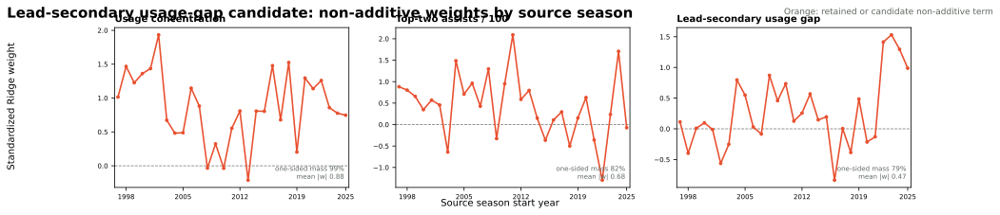

# NAIL Lead-Secondary Usage Gap Candidate

This candidate holds the production NAIL-RAPM v1.2.1.3 contract fixed and
adds one source-season non-additive coordinate:

\[
g(U)=\max_{i\in U}\operatorname{USG\%}_i
-\operatorname{second\_max}_{i\in U}\operatorname{USG\%}_i.
\]

Here, \(U\) is a five-man unit and each player profile is shrinkage-adjusted
from the immediately preceding completed regular season. The context model sees
the home-minus-away edge \(g(H)-g(A)\). A positive value means the home unit
has a clearer lead handler relative to its second option than the away unit.

The original hypothesis predicted a negative effect, framing a large gap as a
lack of secondary creation. The frozen results reject that framing. After the
incumbent player and context terms are held fixed, the coordinate is positively
associated with residual net rating. This page therefore calls it **lead-handler
allocation**, not a secondary-handler deficiency.

## Screening And Confounding Audit

The frozen residual screen was positive in each target season. To test whether
it was merely a superstar proxy, a possession-weighted regression added the
home-minus-away maximum frozen player-prior edge. The usage-gap effect remained
positive after that adjustment.

| Target season | Unadjusted usage-gap weight / SD | Conditional usage-gap weight / SD | Predictor correlation |
| --- | ---: | ---: | ---: |
| 2023-24 | +1.33 | +1.27 | +0.12 |
| 2024-25 | +0.87 | +0.80 | +0.16 |
| 2025-26 | +0.91 | +0.70 | +0.31 |
| Pooled | +1.03 | +0.94 | +0.20 |

The feature is related to superstar imbalance but not reducible to it. The
audit reuses the immutable frozen residuals and does not refit any ratings.

## Three-Season Frozen Replay

The candidate and production were both replayed on the same 625,615 regular-
season possessions and 3,511 games from 2023-24 through 2025-26. Lower is
better except skill and winner accuracy.

| Model | Possession RMSE | Possession MAE | Eligible game RMSE | Full-game RMSE | Winner accuracy | Team NetRtg RMSE | Pythagorean-win RMSE |
| --- | ---: | ---: | ---: | ---: | ---: | ---: | ---: |
| Production NAIL-RAPM v1.2.1.3 | 1.198147 | 1.141455 | 14.0051 | 14.2166 | **68.30%** | 3.2351 | 6.9423 |
| Lead-secondary usage-gap candidate | **1.198139** | **1.141431** | **13.9971** | **14.2041** | 67.87% | **3.2284** | **6.9251** |

The pooled gain is small. It is driven primarily by 2023-24: full-game RMSE
improves by `-0.0632` there, but moves `+0.0098` and `+0.0122` in 2024-25 and
2025-26. It passes the established frozen-bootstrap non-material-harm gate and
ranks first on the regular-season frozen leaderboard under its median-rank
rule. The site bundle remains on v1.2.1.3 until the promoted release is
materialized.

## Paired Bootstrap Gate

The game-stratified, 10,000-draw paired bootstrap passed the established
no-material-harm gate in the pooled sample and every target season. The gate
requires the upper endpoint of candidate-minus-incumbent full-game RMSE to be
no more than `0.5%` of the incumbent RMSE.

| Scope | Candidate minus incumbent full-game RMSE | 95% CI | Probability candidate is better |
| --- | ---: | ---: | ---: |
| Pooled | -0.0125 | [-0.0344, +0.0093] | 86.9% |
| 2023-24 | -0.0632 | [-0.1068, -0.0204] | 99.9% |
| 2024-25 | +0.0098 | [-0.0293, +0.0501] | 30.9% |
| 2025-26 | +0.0122 | [-0.0180, +0.0430] | 21.1% |

## Coefficient History

The candidate term is positive in 20 of 29 source seasons and has `78.8%`
one-sided directional mass. It is weaker and less stable than the two retained
production terms, but it is not a one-season artifact.

## Artifacts

- Frozen screen: `artifacts/models/analysis/frozen_feature_screen/lead_secondary_usage_gap/frozen-feature-screen-lead_secondary_usage_gap-20260830T210743Z-2be1ccce`
- Superstar conditioning audit: `artifacts/models/analysis/lead_secondary_usage_gap_conditioning/lead-secondary-usage-gap-conditioning-20260830T211716Z-6ba81f6c`
- Recursive model: `artifacts/models/forward_nail_rapm_lead_secondary_usage_gap/2025-26/forward-nail-rapm-lead-secondary-usage-gap-2025-26-20260830T221049Z-80abb416`
- Frozen replay: `artifacts/models/nail_lead_secondary_usage_gap_frozen_backtest/frozen_multiseason_backtest/2023-24_to_2025-26/frozen_multiseason_backtest-2023-24-to-2025-26-20260830T221928Z-5378d46f`
- Bootstrap gate: `artifacts/models/nail_lead_secondary_usage_gap_bootstrap/2023-24_to_2025-26/nail-lead-secondary-usage-gap-bootstrap-20260830T222123Z-8c43b10b`
- Coefficient audit: `artifacts/models/analysis/nail_lead_secondary_usage_gap_weight_audit/nail-lead-secondary-usage-gap-weight-audit-20260830T222244Z-c8021061`
