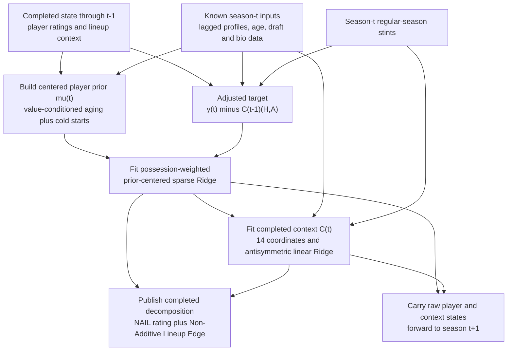

# NAIL-RAPM v1.0

**NAIL-RAPM** means **Non-Additive Interactions in Lineups RAPM**. Version 1.0
is the original canonical model behind the NBA GESTALT website and the control
for later profile-padding work in the
[Three-Season Frozen Leaderboard](three-season-frozen-backtest.md).

NAIL-RAPM has two jobs:

1. estimate a regularized player value that can be carried forward from one
   season to the next; and
2. model the part of lineup performance associated with the combination of
   player profiles, including six features that cannot be assigned to players
   by simple addition.

The model is intentionally linear after feature construction. Its player
layer is prior-centered sparse Ridge, and its lineup layer is standardized
linear Ridge. The non-additivity comes from the construction of the lineup
features, not from splines, a neural network, or a nonlinear estimator.

!!! note "Profile-padding successor"
    [NAIL-RAPM v1.1](nail-rapm-v11-profile-padding.md) replaces the universal
    300-possession profile padding with statistic-specific constants. The
    architecture and feature contract on this page otherwise remain unchanged.

## Model at a Glance

| Component | NAIL-RAPM v1.0 contract |
| --- | --- |
| Training history | One regular-season fit at a time, 1996-97 through the target season |
| Stint target | Home-team net rating per 100 possessions |
| Stint weight | Possessions in the stint |
| Player design | Five home players at `+1`; five away players at `-1` |
| Returning-player prior | Centered, value-conditioned aging prior built from completed earlier seasons |
| First-year prior | Exposure-gated blend of a draft-profile estimate and replacement level |
| Player estimator | Prior-centered sparse Ridge with a season-specific published lambda |
| Profile inputs | Lagged, possession-normalized box-score profiles with 300 pseudo-possessions of league-average shrinkage |
| Lineup estimator | Antisymmetric standardized linear Ridge on 14 home-minus-away coordinates |
| Context penalty | `alpha = 10,000` |
| Additive coordinates | 8, compiled exactly into published player ratings after fitting |
| Non-additive coordinates | 6, retained as the Non-Additive Lineup Edge |
| Splines or clipping | None |
| Historical playoffs in training | No; playoffs are evaluated separately |
| Website state | Retrospective completed-season fit, clearly distinct from a frozen preseason forecast |

## Notation

For season \(t\) and stint \(s\):

- \(H_s\) is the five-player home unit and \(A_s\) is the five-player away unit.
- \(y_{s,t}\) is the observed home net rating per 100 possessions.
- \(w_{s,t}\) is the stint's possession count.
- \(x_{s,i}=+1\) when player \(i\) is in \(H_s\), \(-1\) when the player is in
  \(A_s\), and \(0\) otherwise.
- \(\mu_{i,t}\) is the preseason player prior.
- \(r^{\text{raw}}_{i,t}\) is the completed player RAPM coefficient before
  compiling additive profile terms.
- \(\phi_t(U)\) is the 14-coordinate profile of unit \(U\), built without using
  season-\(t\) outcomes when it is used in a frozen season-\(t\) forecast.
- \(C_t(H,A)\) is the completed season-\(t\) lineup-context model.

## Recursive Training Flow

The completed state from season \(t-1\) supplies both the player prior and the
lineup-context offset for season \(t\). The newly fitted season-\(t\) player and
context states are then available only to season \(t+1\).



This diagram contains both a **frozen prediction path** and a **completed
retrospective path**. Before season \(t\), only \(\mu_t\), \(C_{t-1}\), and
lagged profiles are available. The completed \(r^{\text{raw}}_t\) and \(C_t\)
exist only after season \(t\) has been observed.

## Step 1: Build the Player Prior

### Returning Players

For a returning player, NAIL-RAPM predicts the next rating from completed
prior-season states using a regularized aging model. The model includes a
smooth age basis, experience and prior-exposure controls, draft and physical
profile controls, and an age-by-prior-value interaction:

\[
\mu^{\text{return}}_{i,t}
= f_t(\operatorname{age}_{i,t},\operatorname{experience}_{i,t},
      r_{i,t-1},\operatorname{exposure}_{i,t-1},\ldots)
+ \beta_{\text{age-value}}
  (\operatorname{age}_{i,t}-27)r_{i,t-1}.
\]

The age-by-value term allows the population aging curve to differ for a
high-value player and a replacement-level player. Every aging fit uses only
completed transitions that precede the season receiving the prior. See
[Value-Conditioned Aging HPM](forward-centered-value-conditioned-aging-bounded-hierarchical-portable-matchup-contextual-rapm.md)
for the development and validation of this prior family.

### First-Year Players

A player without an NBA RAPM history receives a continuous exposure-gated
cold-start prior:

\[
\mu^{\text{cold}}_{i,t}
= p^{\text{low}}_{i,t}R^{\text{replacement}}_t
+ (1-p^{\text{low}}_{i,t})\widehat R^{\text{draft}}_{i,t}.
\]

Here \(p^{\text{low}}_{i,t}\) is the estimated probability that the player will
finish below 5% of team possession opportunities,
\(R^{\text{replacement}}_t\) is the forward historical low-exposure token, and
\(\widehat R^{\text{draft}}_{i,t}\) is the draft-and-biographical profile
estimate. This is a blend, not a hard rookie classification. The full contract
is documented in [Exposure-Gated Cold Starts](exposure-gated-cold-start.md).

### Centering

The assembled prior vector is shifted to a possession-weighted mean of zero
using prior-season exposure:

\[
\mu_{i,t} \leftarrow \mu_{i,t}
- \frac{\sum_i p_{i,t-1}\mu_{i,t}}{\sum_i p_{i,t-1}}.
\]

This fixes the otherwise arbitrary player-level zero point without changing a
five-versus-five lineup margin.

## Step 2: Remove Carried Lineup Context

The season-\(t-1\) context model is evaluated on the lagged profiles available
for season \(t\). Its prediction is removed before the season-\(t\) player fit:

\[
\widetilde y_{s,t}
= y_{s,t}-C_{t-1}(H_s,A_s).
\]

This is what makes context part of the recursive state. If a lineup pattern was
already recognized before season \(t\), the player update is not asked to absorb
that same expected lineup effect again. The carried context is zero until a
completed earlier-season context state exists.

## Step 3: Fit Prior-Centered RAPM

The sparse design matrix has one column per player active in that season. NAIL
fits the player vector around the preseason prior:

\[
\underset{b_t,r_t}{\operatorname{argmin}}
\quad
\frac{1}{n_t}\sum_s
\frac{w_{s,t}}{\overline w_t}
\left(\widetilde y_{s,t}-b_t-\sum_i x_{s,i}r_{i,t}\right)^2
+ \lambda_t\lVert r_t-\mu_t\rVert_2^2.
\]

\(b_t\) is the home-court intercept. The implementation fits the equivalent
residual problem \(\widetilde y-X\mu\), then adds \(\mu\) back to the fitted
coefficient update:

\[
r^{\text{raw}}_{i,t}=\mu_{i,t}+\Delta r_{i,t}.
\]

Stints are weighted by possessions. The season-specific \(\lambda_t\) values
come from the published forward exposure-gated RAPM schedule; the NAIL replay
does not retune lambda against a target-season holdout.

## Step 4: Build Lagged Player Profiles

The context layer uses player-season box-score profiles rather than player
identities. Rates are calculated per 100 possessions and shrunk toward the
contemporaneous league rate with 300 pseudo-possessions:

\[
z_{i,f,t}
= 100\frac{c_{i,f,t-1}+300\,\overline z_{f,t-1}/100}
{p_{i,t-1}+300}.
\]

\(c_{i,f,t-1}\) is the completed prior-season count for feature \(f\), and
\(p_{i,t-1}\) is the player's prior-season possession exposure. Usage events
are defined as
\(\operatorname{FGA}+0.44\operatorname{FTA}+\operatorname{TOV}\).
Rookie and missing profiles use forward historical cohort or replacement
profiles. The retired `imputed_count` and `replacement_weight` diagnostics do
not enter the NAIL v1.0 context model.

## Step 5: Fit the Lineup Residual

After fitting player RAPM, the remaining home-perspective residual is

\[
e_{s,t}=y_{s,t}-b_t-
\left(\sum_{i\in H_s}r^{\text{raw}}_{i,t}
-\sum_{j\in A_s}r^{\text{raw}}_{j,t}\right).
\]

For each side, the model creates a 14-coordinate unit vector \(\phi_t(U)\), then
forms the home-minus-away difference

\[
d_{s,t}=\phi_t(H_s)-\phi_t(A_s).
\]

The training table is augmented with both \((d,e,w)\) and \((-d,-e,w)\). After
standardizing the columns, a no-intercept Ridge model is fit:

\[
\widehat\theta_t
=\underset{\theta}{\operatorname{argmin}}
\sum_s w_{s,t}(e_{s,t}-\widetilde d_{s,t}^{\mathsf T}\theta)^2
+10{,}000\lVert\theta\rVert_2^2.
\]

The sign augmentation enforces exact side-swap symmetry:

\[
C_t(H,A)=-C_t(A,H).
\]

NAIL v1.0 has no spline basis, curvature penalty, temporal coefficient penalty,
or support clipping. Its context function is linear in the 14 constructed
coordinates.

## The 14-Coordinate Feature Contract

### Eight Additive Coordinates

For these coordinates, the unit value is exactly the sum of five player
profiles. They can therefore be compiled back into players after fitting.

| Coordinate | Unit construction |
| --- | --- |
| 3PA per 100 | Sum of player 3PA rates |
| 3PM per 100 | Sum of player 3PM rates |
| Assists per 100 | Sum of player assist rates |
| Turnovers per 100 | Sum of player turnover rates |
| Usage events per 100 | Sum of player FGA + 0.44 FTA + TOV rates |
| Steals per 100 | Sum of player steal rates |
| Blocks per 100 | Sum of player block rates |
| Offensive rebound claim total | Sum of player offensive rebound percentages |

### Six Non-Additive Coordinates

These depend on the ordered distribution or interaction of all five player
profiles. There is no exact player-wise sum that reconstructs them.

| Coordinate | Unit construction | Intended lineup question |
| --- | --- | --- |
| Bottom-two 3PM | Sum of the two lowest player 3PM/100 rates | How weak are the two least credible spacing slots? |
| Credible shooter count | Count with at least 2.0 3PM/100 | How many players must be respected as shooters? |
| Top-two assists | Sum of the two highest assist rates | How much creation is supplied by the leading passers? |
| Usage concentration | Top-two usage divided by total five-player usage | How concentrated is offensive demand? |
| Shooting-by-usage | Bottom-two 3PM multiplied by usage concentration | Does concentrated creation coexist with weak spacing? |
| Shooter-by-passing | Credible shooter count multiplied by top-two assists | Does creation coexist with enough shooting outlets? |

The regression remains linear in each row of this table. The nonlinearity is
inside the deterministic map from five player profiles to a unit coordinate.
The model contains within-unit interactions, but it does not contain a direct
cross-side feature such as a home shooting value multiplied by an opponent
defensive value.

## Step 6: Compile Additive Context into Player Ratings

Let \(\mathcal A\) denote the eight additive coordinates and let
\(\beta_{f,t}\) be the context coefficient in original, unstandardized units.
For player \(i\), define

\[
\delta^{\text{profile}}_{i,t}
=\sum_{f\in\mathcal A}\beta_{f,t}z_{i,f,t}.
\]

Because every additive unit coordinate is a player sum,

\[
C^{\text{add}}_t(H,A)
=\sum_{i\in H}\delta^{\text{profile}}_{i,t}
-\sum_{j\in A}\delta^{\text{profile}}_{j,t}.
\]

The published completed-season player rating is therefore

\[
R^{\text{NAIL}}_{i,t}
=\underbrace{\mu_{i,t}}_{\text{prior}}
+\underbrace{\Delta r_{i,t}}_{\text{season update}}
+\underbrace{\delta^{\text{profile}}_{i,t}}_{\text{additive profile}}.
\]

The profile adjustment is centered within season for presentation. That shift
does not change a five-player margin. This is an exact reparameterization, not
an additional prediction and not a second use of the same coefficient. The
[Additive Compilation Audit](linear-hpm-x3-compilation-audit.md) reconstructs
the original model to floating-point precision and documents the no-double-
counting identity.

The remaining context is

\[
C^{\text{nonadd}}_t(H,A)
= C_t(H,A)-C^{\text{add}}_t(H,A).
\]

That quantity is the **Non-Additive Lineup Edge**. It belongs to the unit, not
to an individual player. A player's exposure-weighted average lineup edge may
be shown descriptively, but it is not added to the player rating.

## Website Score

The website uses completed-season artifacts for retrospective exploration. On
a neutral court, its displayed lineup score is

\[
\operatorname{Edge}_t(H,A)
=\sum_{i\in H}R^{\text{NAIL}}_{i,t}
-\sum_{j\in A}R^{\text{NAIL}}_{j,t}
+C^{\text{nonadd}}_t(H,A).
\]

The ledger labels the first difference **Additive** and the last term
**Non-Additive**. Their sum is the displayed edge. For this linear model, the
non-additive side score can be reference-centered into separate unit ratings,
but there is no additional opponent-specific matchup residual: the exact
cross-side \(q(H,A)\) term is zero.

This completed-season website rating is not the same object as a frozen
preseason prediction. A frozen forecast for season \(t\) uses the player prior
\(\mu_t\), the completed context \(C_{t-1}\), lagged profiles, and the realized
lineup allocation only. It does not use season-\(t\) scores or a season-\(t\)
player refit. The [Frozen vs Completed NALE Stability](nail-context-stability.md)
study measures how much the non-additive state changes across that boundary.

## Frozen Evaluation

The three-season replay freezes a separate model before 2023-24, 2024-25, and
2025-26. It pools 584,970 eligible regular-season possessions from 3,284 games
and 39,967 playoff possessions from 238 games. Target-season lineup allocation
is an oracle input; target outcomes never enter a frozen forecast.

NAIL-RAPM v1.0 ranks first on pooled regular-season possession RMSE,
possession MAE, possession skill, eligible game-margin RMSE, eligible
game-margin skill, full-game RMSE, and winner accuracy. Team NetRtg and
Pythagorean-win RMSE rank third. See the
[Three-Season Frozen Leaderboard](three-season-frozen-backtest.md) for the
current sortable comparison and metric definitions.

The model-selection ablation that established the final feature contract
removed two profile-quality diagnostics from the predecessor:

- `imputed_count`: players in a unit whose lagged profile was imputed; and
- `replacement_weight`: total replacement-profile blending in the unit.

The full-game change was unresolved: the paired 95% interval for ablated minus
full was \([-0.0207,+0.0182]\), with a 55.42% bootstrap probability of
improvement. Possession MAE was reliably but trivially worse by \(0.000038\).
The diagnostics were retired because that minute gain did not justify treating
data quality as basketball context.

## Artifacts and Reproduction

The public website release is built from the immutable completed 2025-26 run:

`artifacts/models/forward_hpm_x3_linear_ridge_without_uncertainty/2025-26/forward-hpm-x3-linear-ridge-without-uncertainty-2025-26-20260816T142321Z-78268dad`

| Artifact | Purpose |
| --- | --- |
| `historical_player_coefficients.parquet` | Raw completed player RAPM, prior, season update, and selected lambda by season |
| `player_season_ratings.parquet` | Published NAIL decomposition and player history used by the website |
| `season_player_priors.parquet` | Frozen player-prior vectors for every seasonal step |
| `season_context_models.joblib` | Completed standardized linear context model for each season |
| `target_player_profiles.parquet` | Lagged player profiles used at the target boundary |
| `season_context_metadata.parquet` | Feature contract, penalties, intercept, and training counts |
| `season_player_prior_metadata.parquet` | Aging and cold-start construction metadata |
| `cohort_metrics.parquet` | Frozen target-season regular and playoff possession metrics |
| `possession_predictions.parquet` | Row-level frozen predictions and outcomes |
| `manifest.json` | File hashes and immutable artifact inventory |

Train the completed recursive state with:

```bash
uv run nba-train-hpm-x3-linear-ridge-without-uncertainty \
  --through-season 2025-26
```

Run the three-season frozen evaluator with:

```bash
uv run nba-evaluate-hpm-x3-linear-ridge-without-uncertainty
```

The command names retain the pre-NAIL internal model identifier so existing
artifacts and automation remain reproducible. See the
[training guide](../guides/train-hpm-x3-linear-ridge-without-uncertainty.md)
for logging and output paths.

## Interpretation Limits

- NAIL player ratings are conditional estimates, not isolated causal effects.
- The completed website state is retrospective; it should not be presented as
  a preseason forecast.
- Realized lineup allocation is supplied to frozen evaluation, so the model
  does not forecast injuries, rotations, trades, or playing time.
- The six non-additive coordinates are hand-designed hypotheses. Their bundle
  improves the frozen model, but individual feature coefficients should not be
  interpreted as causal mechanisms.
- NAIL v1.0 has no direct cross-side interaction term and no nonlinear response
  curve after feature construction.
- Historical playoff games are not included in this model's recursive training
  state, although playoff possessions and games are scored separately.
