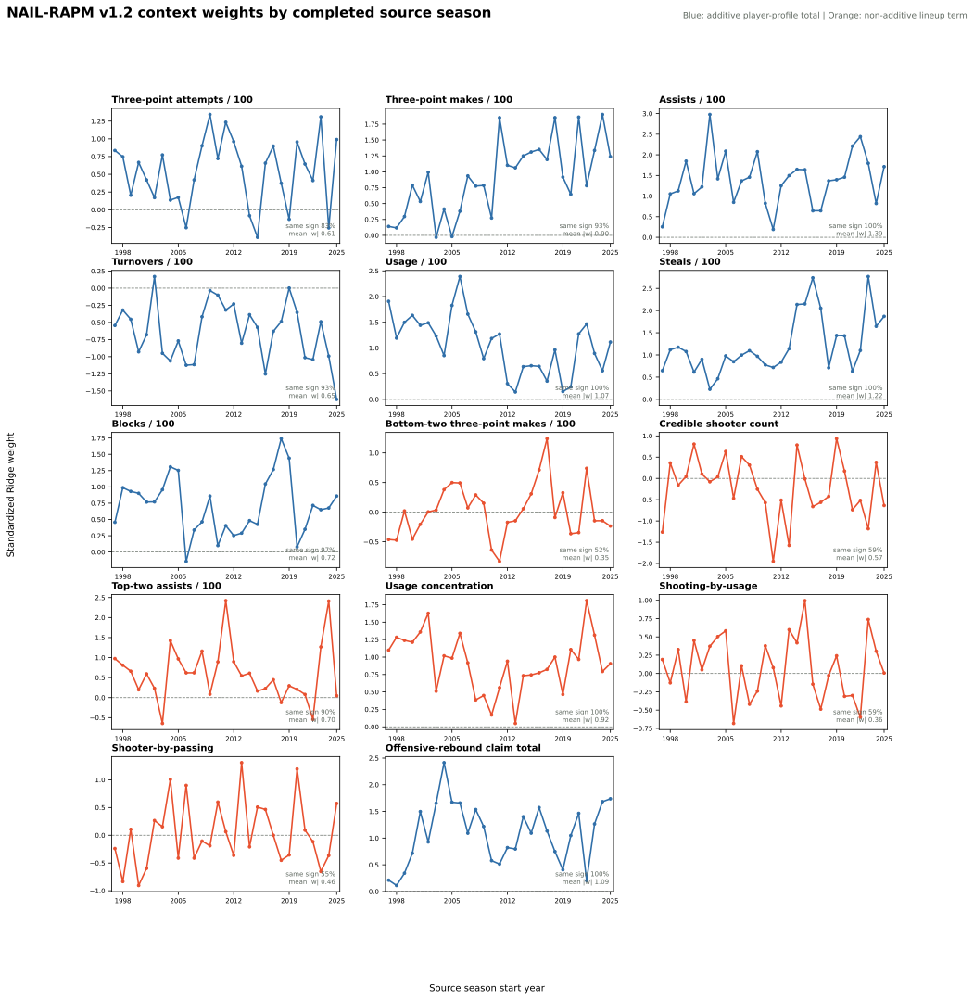

# NAIL-RAPM v1.2: Gap-Returner Priors

NAIL-RAPM v1.2 is a controlled update for established players who
miss one or more complete seasons. The v1.1 returner contract only recognized a
player who appeared in the immediately preceding season. A player with a gap
therefore fell through to a cold/replacement prior even when the model had a
substantial observed history for that player.

The motivating example was Kawhi Leonard: after missing 2021-22, his 2022-23
model state used a replacement profile instead of carrying forward his observed
2020-21 state. This candidate changes that gap behavior only. All v1.1
regularization, player-prior, cold-start, additive-profile, and non-additive
lineup-context contracts remain otherwise fixed.

## Forward Contract

Let \(R_{i,s}^{\mathrm{obs}}\) be the player's most recent completed observed
rating in season \(s\), and let \(g\) be the number of complete unobserved
seasons before target \(t\). For a one-season gap, the recursive state is

\[
\widetilde R_{i,s+1}=f_{s+1}(R_{i,s}^{\mathrm{obs}}, X_{i,s+1}),
\qquad
\mu_{i,t}=f_t(\widetilde R_{i,s+1}, X_{i,t}),
\]

where \(f_q\) is the existing value-conditioned aging prior fit using seasons
strictly before \(q\), and \(X_{i,q}\) contains the player's known biological
and draft fields at that age. Longer absences simply apply one annual transition
per intervening season. The target-season estimate is a **prior**, not an
unobserved RAPM update.

The candidate does not manufacture missing-season estimates in published player
history. It persists those internal projected states separately for auditability.
A future UI can render a dashed bridge across the absent years rather than
presenting them as observed ratings.

## Profile Contract

The context model still requires a lagged player profile. For an immediate
returner, v1.1 uses the prior season's stat-specifically padded profile. For a
gap returner, v1.2 uses the last observed padded profile instead of a
replacement profile. It records `profile_source_season` and
`profile_gap_seasons` in the generated profile artifact.

This first candidate deliberately does not impose an additional reliability
decay on stale profile possessions. Each annual aging transition already applies
the learned value shrinkage to the player prior. Separating profile-decay tuning
from the missing-season state correction keeps the experiment interpretable.

## Context Coefficient Trajectories

The production v1.2 context fit has fourteen coordinates: eight additive
player-profile totals and six non-additive lineup-composition terms. The
panel below extracts each standardized Ridge coefficient from every completed
source-season fit. A point is the conditional effect of a one-standard-
deviation home-minus-away feature differential, holding the other thirteen
coordinates fixed. It is not a player rating or a causal estimate.

Blue traces are additive player-profile totals that can be compiled into a
player's NAIL rating. Orange traces are non-additive lineup terms that remain
at the five-man-unit level. This provides the appropriate historical baseline
for later v1.3 and dynamic-state coefficient audits.

## Unchanged Cases

The following behavior is intentionally identical to v1.1:

| Player case | v1.2 behavior |
| --- | --- |
| Appeared in source season | Existing one-season aging prior and source-season profile |
| Rookie or no previous observed state | Existing exposure-gated cold-start and replacement/cohort profile |
| Established player with 1+ missed seasons | New annual aging bridge and last-observed padded profile |

## Frozen Promotion Gate

The candidate will be evaluated without refitting on 2023-24, 2024-25, and
2025-26. The incumbent is NAIL-RAPM v1.1 with stat-specific profile padding.
The primary decision metric is full-game margin RMSE, evaluated with 10,000
paired game-block bootstrap draws stratified within frozen season.

Let \(d=\mathrm{RMSE}_{\mathrm{v1.2}}-\mathrm{RMSE}_{\mathrm{v1.1}}\). v1.2
is eligible for promotion only if the upper endpoint of the paired 95% interval
for \(d\) is no greater than \(0.5\%\) of v1.1's RMSE in the pooled sample and
in each individual frozen season. That is a non-promotion gate: an outcome that
is statistically compatible with a small practical loss can still be retained
for its clearer returner interpretation; material deterioration cannot.

## Frozen Results

The completed v1.1 and v1.2 states forecast the same 2023-24 through 2025-26
seasons, with no target-season refit. v1.2 improves every pooled error metric
shown below. Its only tradeoff is a 0.37 percentage-point decline in raw
game-winner accuracy; the bootstrap interval contains zero for that metric.

| Model | Poss. RMSE | Poss. MAE | Eligible game RMSE | Full-game RMSE | Winner accuracy | Team NetRtg RMSE | Pythagorean-win RMSE | Playoff eligible-game RMSE |
| --- | ---: | ---: | ---: | ---: | ---: | ---: | ---: | ---: |
| NAIL-RAPM v1.1 | 1.197979 | 1.141391 | 14.0864 | 14.3236 | **68.53%** | 3.3898 | 7.2757 | 16.6267 |
| **NAIL-RAPM v1.2** | **1.197958** | **1.141344** | **14.0414** | **14.2660** | 68.16% | **3.2908** | **7.0899** | **16.6148** |

The direct paired test uses full-game RMSE. Differences are v1.2 minus v1.1,
so negative values favor the gap-returner update.

| Scope | RMSE difference | Paired 95% interval | Gate threshold | Gate |
| --- | ---: | ---: | ---: | --- |
| Pooled | -0.0576 | [-0.0845, -0.0313] | +0.0716 | Pass |
| 2023-24 | -0.0014 | [-0.0488, +0.0466] | +0.0697 | Pass |
| 2024-25 | -0.1098 | [-0.1610, -0.0615] | +0.0727 | Pass |
| 2025-26 | -0.0595 | [-0.0992, -0.0193] | +0.0723 | Pass |

The 2023-24 point improvement is near zero, but its upper interval remains
inside the predefined practical-harm boundary. The other two seasons and the
pooled estimate show a reliable improvement.

## Decision

Promote the branch as **NAIL-RAPM v1.2**. It clears the agreed non-promotion
gate in the pooled and each frozen season, improves the primary full-game
metric, and restores a forward-safe interpretation for returning players with
gaps in their observed histories.

## Artifacts

- Recursive candidate: `artifacts/models/forward_nail_rapm_v12_gap_returner_priors/2025-26/forward-nail-rapm-v12-gap-returner-priors-2025-26-20260821T140232Z-da227de3`
- Frozen replay: `artifacts/models/nail_gap_returner_frozen_backtest/frozen_multiseason_backtest/2023-24_to_2025-26/frozen_multiseason_backtest-2023-24-to-2025-26-20260821T141549Z-b96d8a74`
- Bootstrap gate: `artifacts/models/nail_gap_returner_bootstrap/2023-24_to_2025-26/nail-gap-returner-bootstrap-20260821T141615Z-c5a3d781`
- Context coefficient audit: `artifacts/models/analysis/nail_v12_context_weight_audit/nail-v12-context-weight-audit-20260822T164418Z-99d6a7b8`

Reproduction commands are in [Train NAIL Gap-Returner Priors](../guides/train-nail-gap-returners.md).
