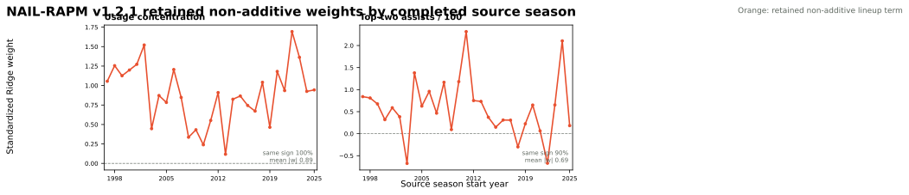
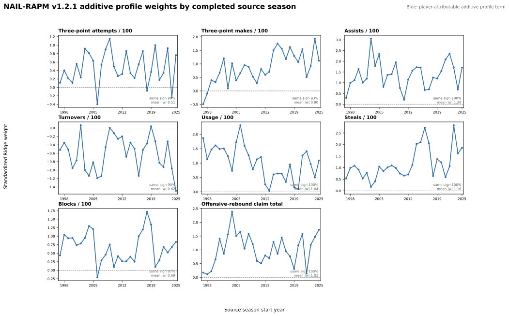

# NAIL-RAPM v1.2.1: Pruned Non-Additive Context

NAIL-RAPM v1.2.1 is a controlled ablation of the production
[v1.2 gap-returner model](nail-rapm-v12-gap-returners.md). It retains all
eight additive profile totals, the value-conditioned aging prior,
exposure-gated cold starts, gap-returner bridge, stat-specific profile
padding, and Ridge regularization. It removes four of v1.2's six non-additive
lineup-context terms.

## Feature Contract

| v1.2 non-additive term | v1.2.1 |
| --- | --- |
| Usage concentration | Retained |
| Top-two assists | Retained |
| Bottom-two three-point makes | Removed |
| Credible shooter count | Removed |
| Shooting-by-usage | Removed |
| Shooter-by-passing | Removed |

The selection is based on the v1.2 coefficient audit: usage concentration has
the same positive sign in every completed source season, while top-two assists
is positive in 89.7%. The four removed terms are directionally unresolved over
the historical panel. This is a feature-selection hypothesis, not a claim that
the removed concepts are unimportant in basketball.

## Retained-Term Trajectories

Each panel below is a standardized Ridge coefficient from one completed source
season. It estimates the conditional change in a home-minus-away stint rating
for a one-standard-deviation increase in that five-man feature, holding the
eight additive profile totals and the other retained non-additive term fixed.
These are lineup-context coefficients, not player ratings or causal effects.

There are 29 fitted source-season states because the first historical season
has no prior context state. `usage_concentration` is positive in all 29, with a
median standardized coefficient of +0.91 and mean absolute coefficient of
0.89. `top_two_assists` is positive in 26 of 29 (89.7%), with median +0.59 and
mean absolute coefficient 0.69. The chart also makes the remaining uncertainty
visible: top-two assists has a wider historical range (-0.67 to +2.32), so its
retention rests on strong directional consistency rather than a claim of a
time-invariant effect size.

## Additive Profile Trajectories

The eight additive player-profile totals are unchanged from v1.2 and remain
eligible for exact player-level attribution. Their fitted weights are not,
however, mechanically identical: the Ridge model refits all ten retained
coordinates jointly after the four non-additive terms are removed. The chart
therefore shows the v1.2.1 weights themselves rather than reusing v1.2's
fourteen-term fit.

Across the 232 matched feature-season coefficients, the v1.2 and v1.2.1
additive weights have Pearson correlation 0.967 and mean absolute change 0.126
standardized units. The largest changes are in three-point attempts and makes,
which is expected because the removed terms explicitly involved shooting. The
remaining additive contract is therefore broadly stable, but not identical.

## Frozen Results

The recursive fit uses all 30 completed seasons. The strict three-season
replay forecasts 2023-24, 2024-25, and 2025-26 from each season's preseason
information set. v1.2 is the direct incumbent.

| Model | Poss. RMSE | Eligible game RMSE | Full-game RMSE | Winner accuracy | Team NetRtg RMSE | Pythagorean-win RMSE | Playoff eligible-game RMSE |
| --- | ---: | ---: | ---: | ---: | ---: | ---: | ---: |
| NAIL-RAPM v1.2 | 1.197958 | 14.0414 | 14.2660 | 68.16% | 3.2908 | 7.0899 | 16.6148 |
| **NAIL-RAPM v1.2.1** | **1.197952** | **14.0246** | **14.2521** | 68.24% | **3.2706** | **7.0351** | **16.5942** |

The candidate lowers the pooled full-game RMSE by 0.0139 points. It also has
slightly lower playoff possession RMSE (1.192709 versus 1.192734) and playoff
eligible-game RMSE (16.5942 versus 16.6148). These are small changes, so the
decision uses the predeclared paired game-block bootstrap rather than the
point estimates alone.

Differences below are v1.2.1 minus v1.2: negative values favor the pruned
candidate. The predefined non-promotion gate permits an upper 95% bound no
larger than 0.5% of the incumbent full-game RMSE in every scope.

| Scope | Full-game RMSE difference | Paired 95% interval | Gate threshold | Gate |
| --- | ---: | ---: | ---: | --- |
| Pooled | -0.0139 | [-0.0304, +0.0028] | +0.0713 | Pass |
| 2023-24 | +0.0149 | [-0.0031, +0.0325] | +0.0697 | Pass |
| 2024-25 | -0.0593 | [-0.1022, -0.0142] | +0.0722 | Pass |
| 2025-26 | +0.0024 | [-0.0146, +0.0209] | +0.0720 | Pass |

## Decision

v1.2.1 clears the agreed non-promotion gate in the pooled replay and each
target season. It is the new regular-season leader in the three-season frozen
table while using four fewer non-additive terms. The website bundle remains on
v1.2 until this candidate is explicitly promoted for deployment.

## Artifacts

- Recursive candidate: `artifacts/models/forward_nail_rapm_v121_pruned_nonadditive/2025-26/forward-nail-rapm-v121-pruned-nonadditive-2025-26-20260822T171824Z-bd4da5c4`
- Frozen replay: `artifacts/models/nail_v121_pruned_nonadditive_frozen_backtest/frozen_multiseason_backtest/2023-24_to_2025-26/frozen_multiseason_backtest-2023-24-to-2025-26-20260822T202752Z-d470f6d9`
- Paired bootstrap: `artifacts/models/nail_v121_pruned_nonadditive_bootstrap/2023-24_to_2025-26/nail-v121-pruned-nonadditive-bootstrap-20260822T202828Z-d42bb340`
- Coefficient audit: `artifacts/models/analysis/nail_v121_pruned_nonadditive_weight_audit/nail-v121-pruned-nonadditive-weight-audit-20260822T204159Z-0c9436cd`

## Reproduction

See [Train NAIL-RAPM v1.2.1 Pruned Non-Additive Context](../guides/train-nail-v121-pruned-nonadditive.md).
