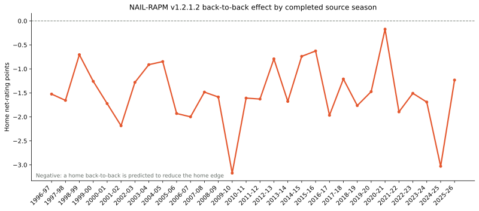

# NAIL-RAPM v1.2.1.2: Back-to-Back Schedule Control

*Last updated: 2026-08-24*

This controlled candidate starts from the standard-USG% NAIL v1.2.1.1 profile
contract and adds a single schedule adjustment. It does not alter the player
prior, additive profile, or the two retained non-additive lineup features.

For each game \(g\), the schedule feature is

\[
x_g = \mathbb{1}[\text{home played the previous calendar day}]
- \mathbb{1}[\text{away played the previous calendar day}].
\]

The completed source-season weighted Ridge coefficient is carried forward:

\[
\widehat{y}_{g,t+1} = \text{player edge} + \text{lineup edge}
+ \widehat{\beta}_{t}^{\mathrm{B2B}}x_g.
\]

Before the player RAPM refit, the same source-season schedule term is removed
from the current stint target. This prevents a repeatable calendar effect from
being assigned to the players who happened to play under it.

The full catalog is used to derive the flag, so a failed or excluded possession
file cannot make the following game appear more rested than it was. Target
season outcomes remain outside the fit boundary; its calendar is allowed
because it is available before tipoff.

## Frozen Results

The strict three-season replay forecasts 2023-24 through 2025-26 using only
the state available before each target season. The candidate is compared to
its direct parent, v1.2.1.1, which keeps the same conventional-USG% profile
contract but omits the schedule control.

| Split | Model | Poss. RMSE | Poss. MAE | Eligible game RMSE | Full-game RMSE | Winner accuracy | Team NetRtg RMSE |
| --- | --- | ---: | ---: | ---: | ---: | ---: | ---: |
| Regular | v1.2.1.1 standard USG% | 1.197951 | 1.141332 | 14.0264 | 14.2516 | 68.10% | **3.2658** |
| Regular | v1.2.1.2 B2B control | **1.197946** | **1.141313** | **14.0107** | **14.2330** | 67.96% | 3.2847 |
| Playoffs | v1.2.1.1 standard USG% | **1.192708** | **1.137593** | **16.5989** | -- | -- | -- |
| Playoffs | v1.2.1.2 B2B control | 1.192710 | 1.137604 | 16.6032 | -- | -- | -- |

The B2B control wins the possession and regular-season margin metrics, with a
small 0.0186-point improvement in pooled full-game RMSE. It loses the team
net-rating, winner-accuracy, and pooled playoff comparisons. The comprehensive
[Three-Season Frozen Leaderboard](three-season-frozen-backtest.md) remains the
source of record for ranks across all candidates.

## Bootstrap Gate

The paired bootstrap resamples games within each frozen season and compares
full-game margin RMSE to the direct parent. The promotion guardrail allows at
most 0.5% practical harm. A lower difference favors the candidate.

| Scope | Candidate minus parent | 95% CI | Better-draw probability | Gate |
| --- | ---: | ---: | ---: | --- |
| Pooled | -0.0186 | [-0.0559, +0.0194] | 83.33% | Pass |
| 2023-24 | -0.0178 | [-0.0608, +0.0255] | -- | Pass |
| 2024-25 | -0.0662 | [-0.1126, -0.0209] | -- | Pass |
| 2025-26 | +0.0246 | [-0.0661, +0.1141] | -- | Fail |

The pooled estimate favors the B2B control but its confidence interval crosses
zero, and the final frozen season fails the gate. Combined with weaker team and
playoff metrics, v1.2.1.2 is **not promoted**.

## Annual Schedule Effect

The plotted coefficient is the source-season Ridge coefficient in home
net-rating points for `home back-to-back - away back-to-back`. A value of
-3.03 in 2024-25 means a home team on a B2B versus a rested visitor receives a
-3.03 expected-margin adjustment before player and lineup terms; reversing the
situation changes the sign. Every completed source season is negative.

The sign stability supports the basketball interpretation. The magnitude varies
by season, including the compressed 2020-21 schedule, so the model retains the
rolling one-season source-state rather than imposing a pooled constant.

## Artifacts

- Recursive fit: `artifacts/models/forward_nail_rapm_v1212_back_to_back/2025-26/forward-nail-rapm-v1212-back-to-back-2025-26-20260824T140929Z-e99e9646`
- Frozen replay: `artifacts/models/nail_v1212_back_to_back_frozen_backtest/frozen_multiseason_backtest/2023-24_to_2025-26/frozen_multiseason_backtest-2023-24-to-2025-26-20260824T141701Z-1b7f1e15`
- Bootstrap: `artifacts/models/nail_v1212_back_to_back_bootstrap/2023-24_to_2025-26/nail-v1212-back-to-back-bootstrap-20260824T142245Z-1f66ebb7`
- Weight audit: `artifacts/models/analysis/nail_v1212_back_to_back_weight_audit/nail-v1212-back-to-back-weight-audit-20260824T142248Z-cba6d361`

See [Schedule Controls](../data/schedule-controls.md) and [the training guide](../guides/train-nail-v1212-back-to-back.md).
