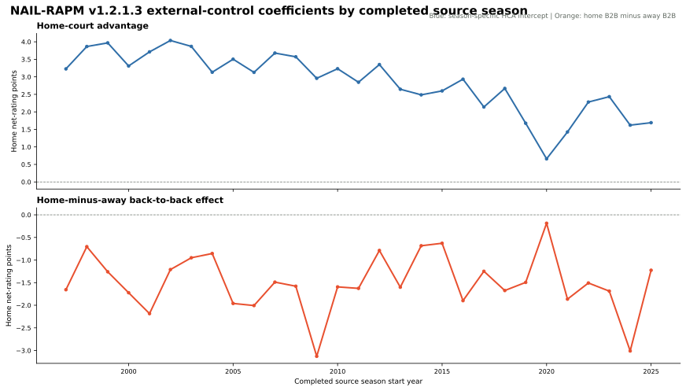
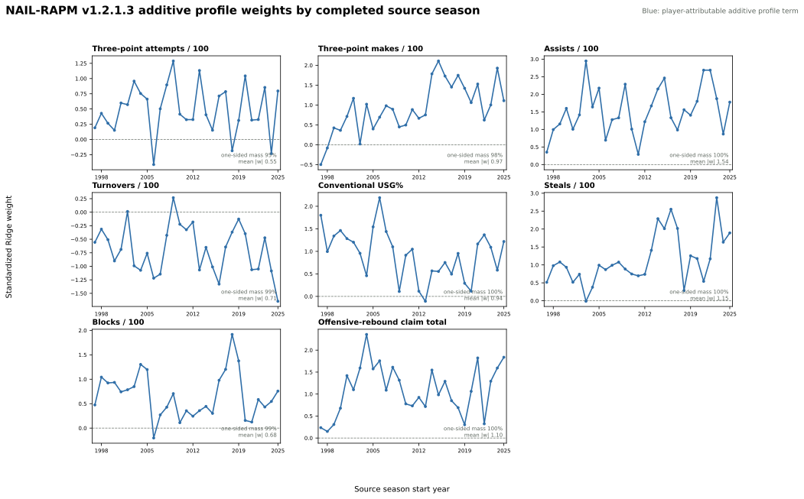
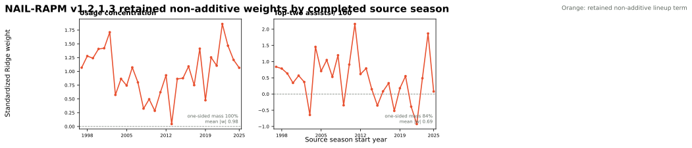

# NAIL-RAPM v1.2.1.3 Residualized-Target Lambda CV

This release changes exactly one modeling decision from
[v1.2.1.2](nail-rapm-v1212-back-to-back.md): the player-RAPM Ridge penalty is
selected from the completed source season's residualized training target rather
than imported from a separate forward RAPM run.

The rest of the contract is unchanged: reconstructed regular-season stints,
forward value-conditioned aging and gap-returner priors, exposure-gated cold
starts, Medvedovsky-style additive-profile padding, the retained two-feature
non-additive context bundle, linear antisymmetric context Ridge with alpha
`10,000`, and the forward B2B control with alpha `10,000`.

## Lambda Selection

For a forecast target season \(t\), let \(s=t-1\) be its completed source
season. In season \(s\), the context and B2B forecasts from \(s-1\) are first
removed from the source-season training target. Three chronological folds of
that residualized \(s\) data then select the player penalty:

\[
\lambda_s \in
\{10^{-5}, 3\!\times\!10^{-5}, 10^{-4}, 3\!\times\!10^{-4}, 10^{-3},
3\!\times\!10^{-3}, 10^{-2}, 0.03, 0.1, 0.3, 1, 3, 10\}.
\]

For example, the frozen 2025-26 forecast uses \(\lambda_{2024\text{-}25}\),
selected only from chronological folds within 2024-25. The fit performed on
2025-26 after that season ends is retained for the next state update and is
not used to score the 2025-26 frozen cohort.

No fitted lambda schedule, state, or hyperparameter is imported from another
model artifact. The only fixed profile-shrinkage constants are the accepted
Medvedovsky-style padding contract shared with v1.2.1.2.

## Frozen Result

The immutable comparison artifact is
`artifacts/models/nail_v1212_residualized_lambda_frozen_backtest/frozen_multiseason_backtest/2023-24_to_2025-26/frozen_multiseason_backtest-2023-24-to-2025-26-20260827T221820Z-1a0cc90d`.

| Metric | v1.2.1.2 imported schedule | v1.2.1.3 residualized CV |
| --- | ---: | ---: |
| Regular full-game RMSE | 14.2330 | **14.2166** |
| Regular winner accuracy | 67.96% | **68.30%** |
| Team net-rating RMSE | 3.2847 | **3.2351** |
| Pythagorean-win RMSE | 7.0551 | **6.9423** |
| Playoff eligible game-margin RMSE | 16.6032 | **16.5784** |

It cleared the frozen metric comparison against v1.2.1.2 and passed review of
the player rankings and coefficient histories. It is the **promoted production
release**. The [frozen leaderboard](three-season-frozen-backtest.md) contains
the full metric table and ranks.

## Promotion Review

The following review is calculated from the completed 2025-26 candidate fit.
Its player rating is the fitted player RAPM plus the centered, exactly
compilable additive-profile adjustment. It is not a frozen 2026-27 forecast.

| Rank | Player | Team | Pos. | NAIL | Prior | Season update | Additive profile | Poss. |
| ---: | --- | --- | --- | ---: | ---: | ---: | ---: | ---: |
| 1 | Victor Wembanyama | SAS | F-C | +10.26 | +2.50 | +4.79 | +2.96 | 3,896 |
| 2 | Nikola Jokic | DEN | C | +9.70 | +4.36 | +1.39 | +3.95 | 4,786 |
| 3 | Shai Gilgeous-Alexander | OKC | G | +9.18 | +5.18 | +1.28 | +2.72 | 4,730 |
| 4 | Kawhi Leonard | LAC | F | +7.27 | +2.89 | +3.27 | +1.11 | 4,167 |
| 5 | Derrick White | BOS | G | +6.68 | +2.04 | +3.30 | +1.34 | 5,180 |
| 6 | Bam Adebayo | MIA | C-F | +6.28 | +2.61 | +2.84 | +0.82 | 5,031 |
| 7 | Alex Caruso | OKC | G | +6.07 | +1.01 | +1.83 | +3.24 | 2,125 |
| 8 | Dyson Daniels | ATL | G | +6.01 | +0.29 | +2.78 | +2.93 | 5,317 |
| 9 | Jimmy Butler III | GSW | F | +6.00 | +1.80 | +2.41 | +1.79 | 2,449 |
| 10 | Chet Holmgren | OKC | C-F | +5.96 | +3.03 | +2.63 | +0.30 | 4,129 |
| 11 | Giannis Antetokounmpo | MIL | F | +5.78 | +4.03 | +1.15 | +0.61 | 2,129 |
| 12 | Jayson Tatum | BOS | F-G | +5.30 | +4.39 | -0.20 | +1.10 | 1,046 |
| 13 | Lauri Markkanen | UTA | F-C | +5.08 | +2.90 | +2.07 | +0.10 | 3,080 |
| 14 | Donovan Mitchell | CLE | G | +4.93 | +1.57 | +0.94 | +2.42 | 4,925 |
| 15 | LaMelo Ball | CHA | G | +4.78 | +0.66 | +1.41 | +2.71 | 4,101 |
| 16 | Ausar Thompson | DET | G-F | +4.76 | +0.93 | +1.52 | +2.31 | 3,897 |
| 17 | OG Anunoby | NYK | F-G | +4.76 | +2.56 | +1.63 | +0.57 | 4,531 |
| 18 | Luka Doncic | LAL | F-G | +4.69 | +2.46 | -0.71 | +2.93 | 4,759 |
| 19 | Devin Booker | PHX | G | +4.57 | +2.19 | +2.11 | +0.28 | 4,442 |
| 20 | Franz Wagner | ORL | F | +4.49 | +4.26 | -0.81 | +1.04 | 2,190 |
| 21 | Steven Adams | HOU | C | +4.35 | +1.34 | +1.43 | +1.58 | 1,455 |
| 22 | Collin Gillespie | PHX | G | +4.19 | -0.80 | +2.85 | +2.13 | 4,626 |
| 23 | Jalen Smith | CHI | F-C | +4.15 | +0.65 | +2.20 | +1.31 | 2,316 |
| 24 | Day'Ron Sharpe | BKN | C | +4.12 | +0.84 | +0.22 | +3.05 | 2,330 |
| 25 | Karl-Anthony Towns | NYK | C-F | +4.04 | +3.04 | +0.29 | +0.71 | 4,716 |

### Home Court And Back-To-Back

Home-court advantage is a season-specific home-net-rating intercept. The B2B
series is the raw coefficient for `home back-to-back - away back-to-back`; a
negative value means a home B2B lowers the predicted home edge.



### Context Coefficients

Context weights are standardized Ridge coefficients on each home-minus-away
five-man feature. Blue panels are player-attributable additive profile terms;
orange panels are the two retained non-additive lineup terms.





The immutable review artifact is
`artifacts/models/analysis/nail_v1213_promotion_review/nail-v1213-promotion-review-20260828T002159Z-62888daf`.

## Reproduction

```bash
uv run python -m nba_lineup_model.modeling.forward_nail_v1212_residualized_lambda \
  --log-path artifacts/logs/nail-v1212-residualized-lambda.log

uv run python -m nba_lineup_model.modeling.nail_v1212_residualized_lambda_frozen_backtest \
  --log-path artifacts/logs/nail-v1212-residualized-lambda-frozen.log

uv run python -m nba_lineup_model.modeling.nail_v1213_promotion_review
```

See the [training guide](../guides/train-nail-v1212-residualized-lambda.md) and
[NAIL model contract](nail-model-contract.md) for the complete provenance and
remaining validation priorities.
