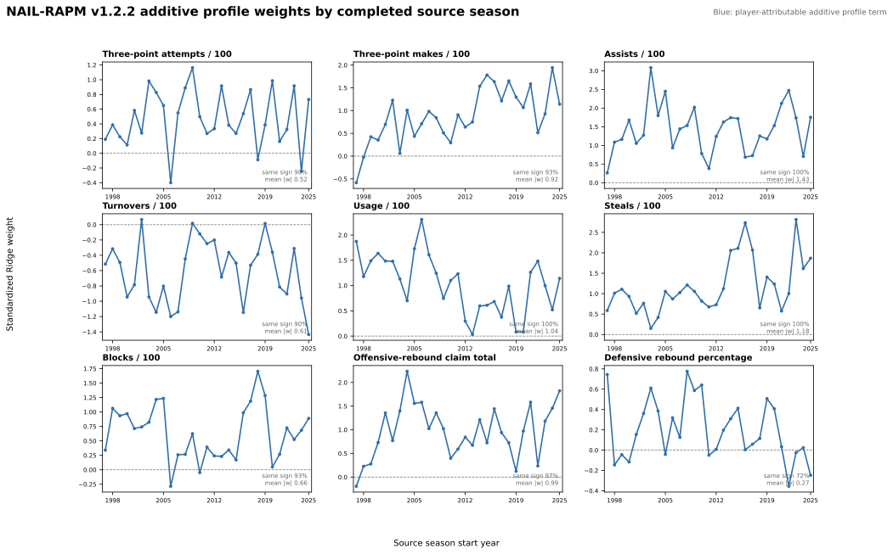
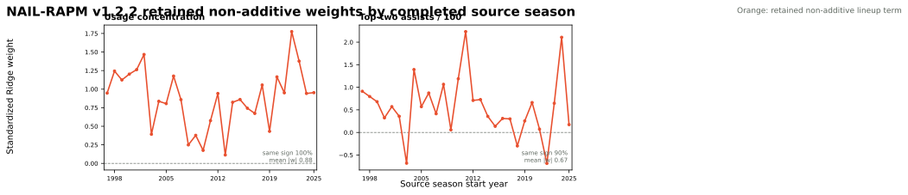

# NAIL-RAPM v1.2.2: Defensive-Rebound Profile

NAIL-RAPM v1.2.2 is a strict one-feature extension of
[v1.2.1](nail-rapm-v121-pruned-nonadditive.md). It adds the sum of the five
players' forward-safe, stat-specifically padded defensive-rebound percentages
as a ninth additive player-profile coordinate. The two retained non-additive
terms, value-conditioned aging prior, cold-start gate, gap-returner bridge,
and context penalty are unchanged.

## Contract

For unit (U), the new additive coordinate is

\[
\operatorname{DRB\%}(U) = \sum_{i \in U} \widetilde{\operatorname{DRB\%}}_i,
\]

where the tilde denotes the same lagged, 108.26-pseudo-possession padded player
rate already used by the profile mart. The fitted home-minus-away coefficient
can be compiled into the player-attributable additive rating; it is not a new
non-additive lineup effect.

## Decision Plan

The branch will be trained recursively through 2025-26, then compared directly
with v1.2.1 on the frozen 2023-24 through 2025-26 regular seasons and playoffs.
The DRB% trajectory will be retained as a defensible profile feature only if it
has a positive sign in at least 80% of the 29 source-season fits. Promotion
also requires the existing paired full-game-RMSE non-promotion gate to pass in
the pooled replay and each frozen season.

## Coefficient Audit

The recursive fit produced 29 source-season coefficients: 1997-98 through
2025-26. Each panel is a standardized conditional Ridge coefficient, so it
answers how the home-minus-away stint estimate changes for a one-standard-
deviation increase in the named unit total while the other eight additive
coordinates and the two retained non-additive terms are held fixed.

`defensive_rebound_pct` is positive in 21 of 29 source seasons (72.4%), with
a median standardized coefficient of +0.126, mean absolute coefficient of
0.269, and range from -0.356 to +0.776. It therefore fails the predeclared
80% positive-sign gate. The other eight inherited additive coordinates retain
their resolved dominant signs, so adding DRB% did not displace a previously
stable profile feature; it simply fails to earn a place alongside them.

The two retained non-additive terms remain directionally resolved in this
joint fit: usage concentration is positive in all 29 source seasons, and
top-two assists is positive in 26 of 29.

## Frozen Results

The direct incumbent is v1.2.1. Both models forecast 2023-24 through 2025-26
from the matching preseason information set; target-season outcomes are never
available to the forecast.

| Model | Poss. RMSE | Eligible game RMSE | Full-game RMSE | Winner accuracy | Team NetRtg RMSE | Pythagorean-win RMSE | Playoff eligible-game RMSE |
| --- | ---: | ---: | ---: | ---: | ---: | ---: | ---: |
| **NAIL-RAPM v1.2.1** | **1.197952** | 14.0246 | **14.2521** | 68.24% | **3.2706** | **7.0351** | 16.5942 |
| NAIL-RAPM v1.2.2 | 1.197952 | **14.0238** | 14.2529 | **68.39%** | 3.2723 | 7.0434 | **16.5875** |

v1.2.2 is essentially tied at possession level, modestly improves eligible
game RMSE, winner accuracy, and playoff eligible-game RMSE, but is slightly
worse on the primary full-game and team-level metrics. The point estimates are
too small to settle the decision, so the predeclared paired bootstrap remains
the predictive guardrail.

Differences below are v1.2.2 minus v1.2.1; negative values favor the DRB%
candidate. The non-promotion threshold is +0.5% of the incumbent full-game
RMSE in each scope.

| Scope | Full-game RMSE difference | Paired 95% interval | Gate threshold | Gate |
| --- | ---: | ---: | ---: | --- |
| Pooled | +0.0008 | [-0.0036, +0.0051] | +0.0713 | Pass |
| 2023-24 | +0.0038 | [-0.0095, +0.0167] | +0.0698 | Pass |
| 2024-25 | -0.0021 | [-0.0057, +0.0013] | +0.0719 | Pass |
| 2025-26 | +0.0007 | [-0.0016, +0.0031] | +0.0721 | Pass |

## Decision

**Not promoted.** The direct bootstrap clears the no-material-harm gate, but
the new DRB% coefficient is positive in only 72.4% of source seasons, below
the agreed 80% interpretability requirement. The minimal predictive movement
does not justify adding a directionally unresolved ninth additive player
profile term. NAIL-RAPM v1.2.1 remains the promoted model and website bundle.

## Artifacts

- Recursive candidate: `artifacts/models/forward_nail_rapm_v122_defensive_rebound_profile/2025-26/forward-nail-rapm-v122-defensive-rebound-profile-2025-26-20260822T213244Z-706ca7b2`
- Frozen replay: `artifacts/models/nail_v122_defensive_rebound_profile_frozen_backtest/frozen_multiseason_backtest/2023-24_to_2025-26/frozen_multiseason_backtest-2023-24-to-2025-26-20260822T214052Z-9e7684d0`
- Paired bootstrap: `artifacts/models/nail_v122_defensive_rebound_profile_bootstrap/2023-24_to_2025-26/nail-v122-defensive-rebound-profile-bootstrap-20260822T214132Z-4453ca36`
- Coefficient audit: `artifacts/models/analysis/nail_v122_defensive_rebound_profile_weight_audit/nail-v122-defensive-rebound-profile-weight-audit-20260822T213316Z-2ac00473`

## Reproduction

See [Train NAIL-RAPM v1.2.2 Defensive-Rebound Profile](../guides/train-nail-v122-defensive-rebound-profile.md).
