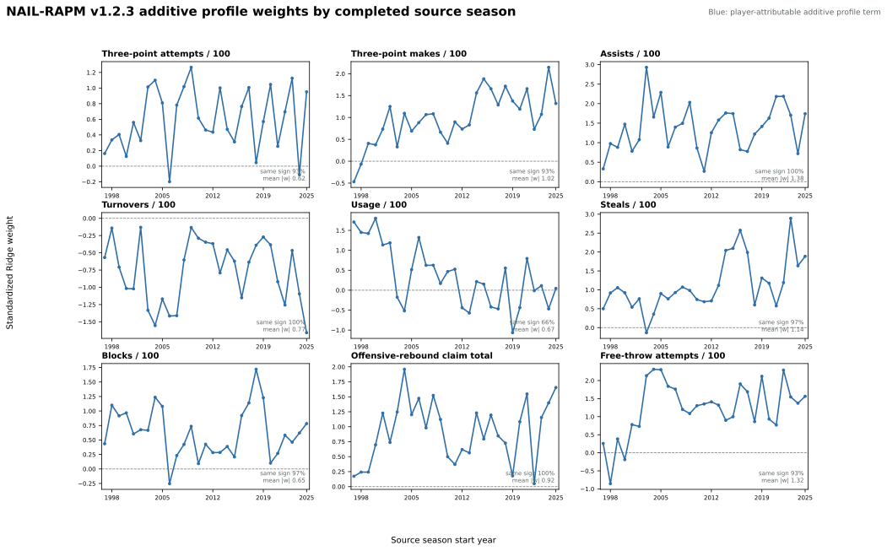
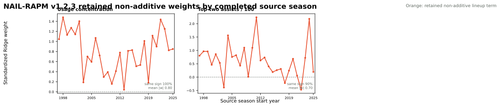

# NAIL-RAPM v1.2.3: Free-Throw Profile

NAIL-RAPM v1.2.3 is a strict one-feature extension of
[v1.2.1](nail-rapm-v121-pruned-nonadditive.md). It adds the sum of the five
players' forward-safe, stat-specifically padded free-throw attempts per 100
possessions as a ninth additive player-profile coordinate. It deliberately
does not include v1.2.2's rejected defensive-rebound percentage term.

The value-conditioned aging prior, exposure-gated cold starts, gap-returner
bridge, stat-specific profile padding, Ridge penalty, and the two retained
non-additive terms are unchanged.

## Contract

For unit \(U\), the new additive coordinate is

\[
\operatorname{FTA100}(U) = \sum_{i \in U} \widetilde{\operatorname{FTA100}}_i,
\]

where the tilde is the lagged, stat-specifically padded player rate. The
home-minus-away coefficient is compiled into the player-attributable additive
rating; it is not a new non-additive lineup effect.

## Decision Plan

The recursive model will be fitted through 2025-26, then replayed against
v1.2.1 on the frozen 2023-24 through 2025-26 regular seasons and playoffs.
The audit will report both binary sign share and directional mass:

\[
D_+ =
\frac{\sum_t \max(\beta_t, 0)}
     {\sum_t |\beta_t|},
\]

where \(\beta_t\) is the standardized source-season coefficient. This avoids
treating a near-zero crossing as equivalent to a large reversal. We will also
report the same statistic for the most recent ten source seasons, so a
historical positive effect cannot conceal a currently unresolved direction.

Promotion requires directional stability and a competitive frozen replay. The
formal paired full-game-RMSE non-promotion gate is retained as a safety check,
but passing it alone does not establish a performance improvement. No website
bundle changes until the results are reviewed.

## Frozen Result

The 2023-24 through 2025-26 frozen replay does not promote the feature.

| Metric | v1.2.1 | v1.2.3 | Difference (v1.2.3 - v1.2.1) |
| --- | ---: | ---: | ---: |
| Regular possession RMSE | 1.197952 | 1.197964 | +0.000012 |
| Regular possession MAE | 1.141355 | **1.141341** | -0.000014 |
| Regular eligible game RMSE | **14.0245** | 14.0456 | +0.0211 |
| Regular full-game RMSE | **14.2521** | 14.2726 | +0.0204 |
| Game-winner accuracy | 68.24% | **68.47%** | +0.23 pp |
| Team NetRtg RMSE | **3.2706** | 3.2974 | +0.0268 |
| Pythagorean-win RMSE | **7.0351** | 7.0511 | +0.0160 |
| Playoff possession RMSE | **1.192709** | 1.192714 | +0.000005 |
| Playoff eligible game RMSE | **16.5942** | 16.6157 | +0.0215 |

The paired 2,000-draw bootstrap gives a pooled full-game-RMSE difference of
`+0.0204`, with 95% interval `[-0.0012, +0.0420]`; v1.2.3 is better in only
3.3% of draws. It clears the deliberately permissive no-material-harm safety
gate, but it is not competitive with v1.2.1 on the primary margin metrics.
The isolated possession-MAE and winner-accuracy gains do not outweigh that
broader regression.

## FTA/100 Stability

FTA/100 is not rejected for instability. Its standardized coefficient is
positive in 27 of 29 completed source seasons (93.1%), with median `+1.319`.
The positive-directional mass share is 97.3% across the full history and
100.0% in the most recent ten source seasons. The negative result is therefore
useful: the feature is directionally credible, but redundant after the existing
additive profile rather than a source of out-of-sample improvement.

## Additive Profile Coefficients

Each panel shows the standardized Ridge coefficient from the completed
source-season state. FTA/100 is the ninth panel. The new directional-mass
summary weights the visible magnitude of each season rather than treating every
sign crossing equally.

## Retained Non-Additive Coefficients

The two retained lineup-level terms are unchanged from v1.2.1 and are shown
here to verify that adding FTA/100 does not produce an implausible shift in the
non-additive component.

The complete fit, frozen replay, paired bootstrap, and directional-mass ledger
are persisted under `artifacts/models/forward_nail_rapm_v123_free_throw_profile`,
`artifacts/models/nail_v123_free_throw_profile_frozen_backtest`,
`artifacts/models/nail_v123_free_throw_profile_bootstrap`, and
`artifacts/models/analysis/nail_v123_free_throw_profile_weight_audit`.

## Reproduction

See [Train NAIL-RAPM v1.2.3 Free-Throw Profile](../guides/train-nail-v123-free-throw-profile.md).
