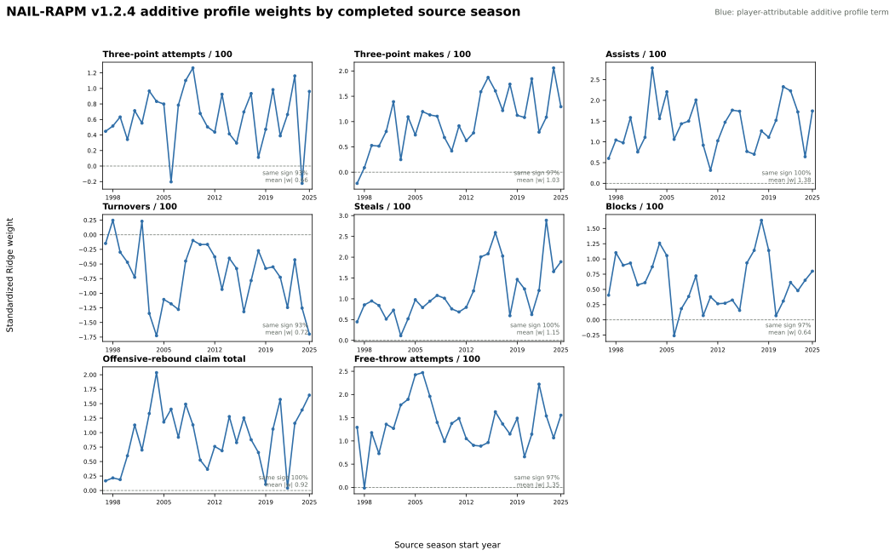
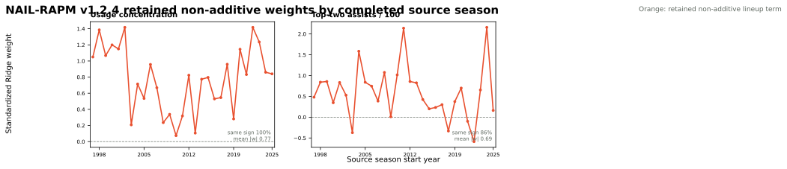

# NAIL-RAPM v1.2.4: Free-Throw Replacement

NAIL-RAPM v1.2.4 tests the conditional-credit hypothesis exposed by
[v1.2.3](nail-rapm-v123-free-throw-profile.md): replace additive
`usage_per_100` with additive `free_throw_attempts_per_100` rather than
including both. This is a strict sibling of v1.2.1 with eight additive player
profile coordinates and the same two retained non-additive lineup terms.

All other contracts are unchanged: value-conditioned aging, exposure-gated
cold starts, gap-returner bridging, forward-safe stat-specific padding, and
the Ridge lineup fit.

## Contract

For a unit (U), v1.2.4 replaces

\[
\operatorname{Usage}(U) = \sum_{i \in U} \widetilde{\operatorname{USG100}}_i
\]

with

\[
\operatorname{FTA100}(U) = \sum_{i \in U} \widetilde{\operatorname{FTA100}}_i.
\]

The retained non-additive terms remain `top_two_assists` and
`usage_concentration`. Thus this tests the additive offensive-load coordinate,
not whether distribution of usage within a unit matters.

## Decision Rule

Fit recursively through 2025-26, evaluate frozen 2023-24 through 2025-26
regular seasons and playoffs against v1.2.1, then run a paired 2,000-draw
game-stratified bootstrap. Promotion requires a competitive primary
full-game-margin result, not merely a permissive no-material-harm gate.

The coefficient audit includes binary sign share and directional mass,

\[
D_+ = \frac{\sum_t \max(\beta_t, 0)}{\sum_t |\beta_t|},
\]

so a small sign crossing does not outweigh a persistently material direction.

## Frozen Result

v1.2.4 does not promote the FTA/100 replacement. It makes the isolated
possession-MAE result better, but the primary regular-season margin metrics
remain worse than v1.2.1.

| Metric | v1.2.1 | v1.2.4 | Difference (v1.2.4 - v1.2.1) |
| --- | ---: | ---: | ---: |
| Regular possession RMSE | **1.197952** | 1.197966 | +0.000014 |
| Regular possession MAE | 1.141355 | **1.141328** | -0.000027 |
| Regular eligible game RMSE | **14.0245** | 14.0457 | +0.0211 |
| Regular full-game RMSE | **14.2521** | 14.2733 | +0.0212 |
| Game-winner accuracy | **68.24%** | 68.19% | -0.06 pp |
| Team NetRtg RMSE | **3.2706** | 3.2933 | +0.0226 |
| Pythagorean-win RMSE | **7.0351** | 7.0459 | +0.0108 |
| Playoff possession RMSE | 1.192709 | **1.192706** | -0.000003 |
| Playoff eligible game RMSE | **16.5942** | 16.5988 | +0.0046 |

The paired 2,000-draw bootstrap estimates pooled full-game RMSE at `+0.0212`
for v1.2.4 relative to v1.2.1, with 95% interval `[-0.0025, +0.0433]`; the
challenger is better in 3.5% of draws. It passes the permissive no-material-harm
safety gate but fails to provide a reason to displace v1.2.1.

## Profile Coefficients

Removing additive Usage/100 resolves the conditional collinearity seen in
v1.2.3. FTA/100 is positive in 28 of 29 source seasons, has median
standardized coefficient `+1.360`, and carries 99.96% positive directional
mass over the full history (100% across the latest ten seasons). This is a
credible coordinate, but its predictive contribution is redundant after the
remaining profile contract.

## Retained Non-Additive Coefficients

The two retained non-additive lineup terms do not change under this replacement
experiment.

The fit, frozen replay, bootstrap, and directional-mass ledger are persisted
under `artifacts/models/forward_nail_rapm_v124_free_throw_replacement`,
`artifacts/models/nail_v124_free_throw_replacement_frozen_backtest`,
`artifacts/models/nail_v124_free_throw_replacement_bootstrap`, and
`artifacts/models/analysis/nail_v124_free_throw_replacement_weight_audit`.

## Reproduction

See [Train NAIL-RAPM v1.2.4 Free-Throw Replacement](../guides/train-nail-v124-free-throw-replacement.md).
