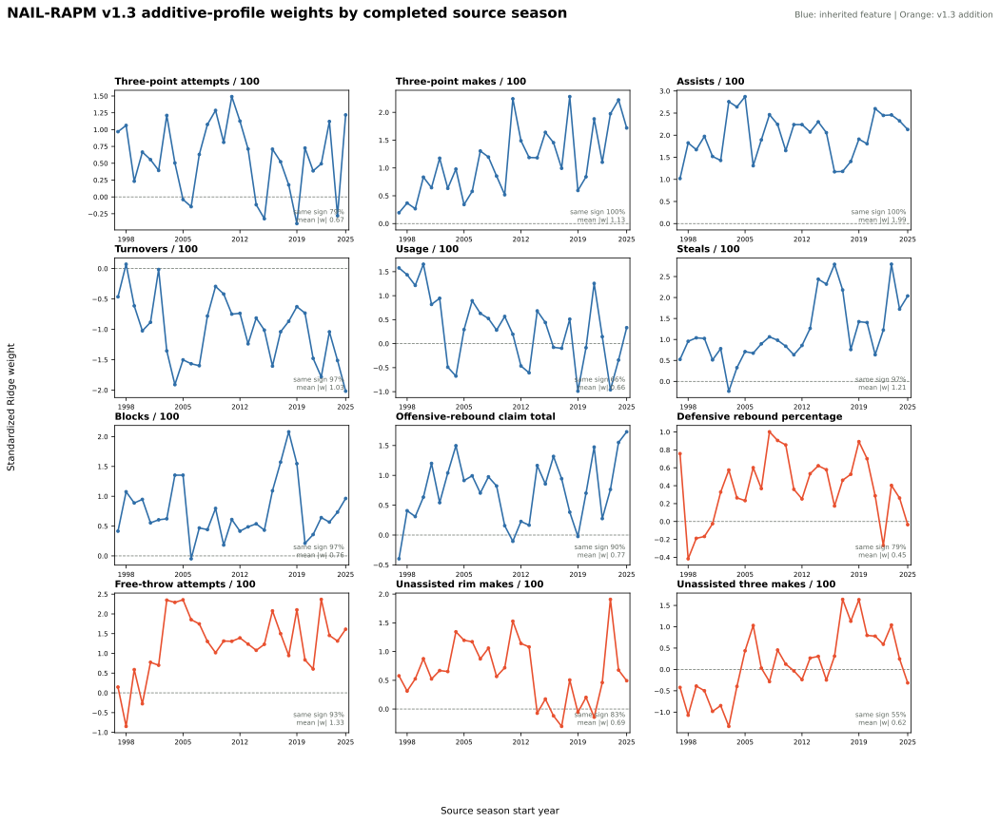

# NAIL-RAPM v1.3: Expanded Additive Profiles

NAIL-RAPM v1.3 tests four additional **additive** player-profile features while
holding the v1.2 prior, cold-start, gap-returner, and five non-additive lineup
terms fixed. It is a documented, non-promoted experiment; production remains
[NAIL-RAPM v1.2](nail-rapm-v12-gap-returners.md).

## Feature Contract

The candidate retains v1.2's eight additive profile components and adds:

| Feature | Source | Shrinkage contract |
| --- | --- | --- |
| Defensive rebound percentage | Historical player-season panel | Existing stat-specific padding |
| Free-throw attempts per 100 possessions | Historical player-season panel | Existing published FTA padding |
| Unassisted rim makes per 100 | [Assisted shot profiles](../data/assisted-shot-taxonomy.md) | 480 pseudo-possessions toward the qualified-player median |
| Unassisted three-point makes per 100 | [Assisted shot profiles](../data/assisted-shot-taxonomy.md) | 480 pseudo-possessions toward the possession-weighted mean |

The unassisted-shot centers and 480-possession padding constants were selected
strictly through 2022-23 by predicting each qualifying player's next-season
rate. The frozen 2023-24 through 2025-26 target seasons do not influence that
selection.

## Additive Weight Audit

The contextual Ridge model standardizes every home-minus-away five-man feature
before fitting. A coefficient below is therefore the change in predicted net
rating per 100 possessions for a one-standard-deviation change in that lineup
differential, conditional on the other profile and non-additive terms. It is a
conditional model weight, not a causal player value or a standalone stat
ranking.

Each column below is a separate completed **source** model. For example, the
2022-23 column was used to forecast frozen 2023-24 outcomes; no target-season
outcomes enter these weights. This panel is the relevant view for the frozen
evaluation.

| Additive feature | 2022-23 source -> 2023-24 target | 2023-24 source -> 2024-25 target | 2024-25 source -> 2025-26 target |
| --- | ---: | ---: | ---: |
| Assists / 100 | +2.447 | +2.459 | +2.323 |
| Three-point makes / 100 | +1.103 | +1.975 | +2.223 |
| Steals / 100 | +1.225 | +2.795 | +1.724 |
| Offensive-rebound claim total | +0.276 | +0.764 | +1.552 |
| Turnovers / 100 | -1.782 | -1.040 | -1.512 |
| **Free-throw attempts / 100** | **+2.367** | **+1.455** | **+1.312** |
| Blocks / 100 | +0.642 | +0.567 | +0.734 |
| **Unassisted rim makes / 100** | **+0.460** | **+1.908** | **+0.678** |
| Usage / 100 | +0.145 | -0.961 | -0.342 |
| Three-point attempts / 100 | +0.492 | +1.121 | -0.280 |
| **Defensive rebound percentage** | **-0.268** | **+0.403** | **+0.262** |
| **Unassisted three makes / 100** | **+0.590** | **+1.041** | **+0.246** |

The four bolded rows are v1.3 additions. FTA rate is consistently strong and
positive. Unassisted rim makes are positive in all three source fits but vary
in magnitude. Defensive rebound percentage changes sign, while unassisted
three-point makes stay positive but have a smaller and declining weight. These
patterns motivate ablation work before any future profile release.

### Full Historical Trajectories

The same extraction is available for all 29 persisted source models, from
1997-98 through 2025-26. Green traces are inherited terms; orange traces are
v1.3 additions. The annotation in each panel reports the dominant-sign share
and mean absolute standardized weight over the complete history.

| Feature | Dominant direction | Same-sign seasons | Mean absolute weight |
| --- | --- | ---: | ---: |
| Assists / 100 | Positive | 29 / 29 | 1.99 |
| Three-point makes / 100 | Positive | 29 / 29 | 1.13 |
| Steals / 100 | Positive | 28 / 29 | 1.21 |
| Turnovers / 100 | Negative | 28 / 29 | 1.03 |
| Blocks / 100 | Positive | 28 / 29 | 0.76 |
| **Free-throw attempts / 100** | **Positive** | **27 / 29** | **1.33** |
| Offensive-rebound claim total | Positive | 26 / 29 | 0.77 |
| **Unassisted rim makes / 100** | **Positive** | **24 / 29** | **0.69** |
| Three-point attempts / 100 | Positive | 23 / 29 | 0.67 |
| **Defensive rebound percentage** | **Positive** | **23 / 29** | **0.45** |
| Usage / 100 | Positive | 19 / 29 | 0.66 |
| **Unassisted three makes / 100** | **Positive** | **16 / 29** | **0.62** |

This makes the v1.3 diagnosis sharper. FTA rate is a credible persistent
addition; unassisted rim finishing is promising but less stable; defensive
rebound percentage is modest; and unassisted three-point make volume is too
sign-unstable to justify retaining without a more focused experiment.

## Frozen Results

Both models replay the same persisted recursive state into 2023-24, 2024-25,
and 2025-26 with no target-season refit. v1.3 is effectively tied on pooled
regular-season possession error, improves pooled playoff error slightly, but
has worse regular full-game RMSE.

| Model | Regular poss. RMSE | Regular full-game RMSE | Winner accuracy | Team NetRtg RMSE | Pythagorean-win RMSE | Playoff poss. RMSE | Playoff eligible-game RMSE |
| --- | ---: | ---: | ---: | ---: | ---: | ---: | ---: |
| **NAIL-RAPM v1.2** | **1.197958** | **14.265989** | 68.16% | **3.2908** | 7.0899 | 1.192734 | 16.6148 |
| NAIL-RAPM v1.3 | 1.197987 | 14.298111 | **68.44%** | 3.3320 | **7.0619** | **1.192630** | **16.5034** |

## Non-Promotion Gate

The primary metric is full-game margin RMSE. The candidate is eligible only if
the upper endpoint of the paired 95% game-block bootstrap interval for

\[
\mathrm{RMSE}_{\mathrm{v1.3}} - \mathrm{RMSE}_{\mathrm{v1.2}}
\]

is no greater than 0.5% of v1.2's RMSE in the pooled sample and in each frozen
season. Positive values favor v1.2.

| Scope | v1.3 minus v1.2 | Paired 95% interval | Gate threshold | Gate |
| --- | ---: | ---: | ---: | --- |
| Pooled | +0.0321 | [-0.0114, +0.0740] | +0.0713 | Fail |
| 2023-24 | +0.0171 | [-0.0671, +0.1014] | +0.0697 | Fail |
| 2024-25 | +0.1026 | [+0.0182, +0.1876] | +0.0722 | Fail |
| 2025-26 | -0.0200 | [-0.0685, +0.0285] | +0.0720 | Pass |

The 2024-25 result demonstrates a material loss under the agreed rule.
Therefore, v1.3 is not promoted despite its small pooled playoff and
Pythagorean-win improvements.

## Artifacts

- Candidate fit: `artifacts/models/forward_nail_rapm_v13_additive_profiles/2025-26/forward-nail-rapm-v13-additive-profiles-2025-26-20260821T230733Z-def6e560`
- Frozen replay: `artifacts/models/nail_v13_additive_profiles_frozen_backtest/frozen_multiseason_backtest/2023-24_to_2025-26/frozen_multiseason_backtest-2023-24-to-2025-26-20260821T232409Z-81841f20`
- Bootstrap gate: `artifacts/models/nail_v13_additive_profiles_bootstrap/2023-24_to_2025-26/nail-v13-additive-profiles-bootstrap-20260821T232731Z-c13f1209`
- Weight audit: `artifacts/models/analysis/nail_v13_additive_weight_audit/nail-v13-additive-weight-audit-20260822T002651Z-74535a75`

Reproduction commands are in [Train NAIL-RAPM v1.3 additive profiles](../guides/train-nail-v13-additive-profiles.md).
