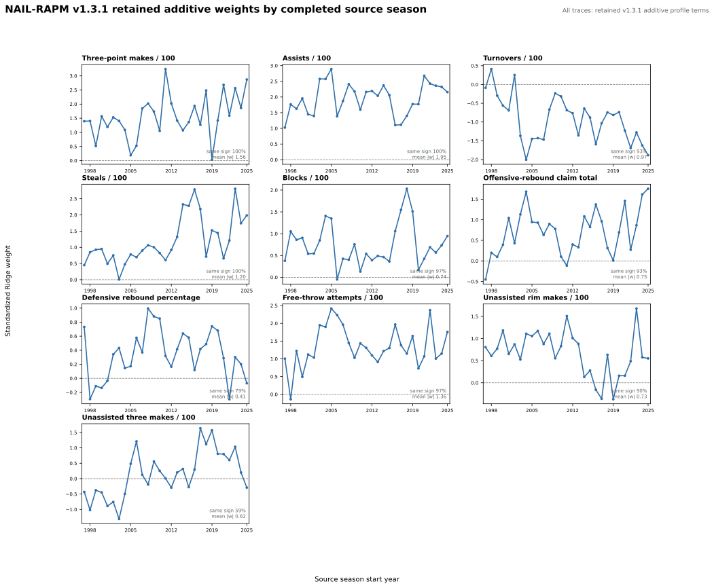

# NAIL-RAPM v1.3.1: Pruned Additive Profile

NAIL-RAPM v1.3.1 is a controlled parsimony ablation of
[v1.3](nail-rapm-v13-additive-profiles.md). It retains the same forward player
prior, value-conditioned aging, exposure-gated cold starts, gap-returner
bridge, profile shrinkage, five non-additive lineup terms, ordinary linear
Ridge context fit, and regularization. The only differences are two removed
additive player-profile coordinates.

## Feature Change

| Additive profile feature | v1.3 | v1.3.1 |
| --- | --- | --- |
| Three-point attempts / 100 | Included | Removed |
| Usage / 100 | Included | Removed |
| Three-point makes / 100 | Included | Included |
| Unassisted three-point makes / 100 | Included | Included |
| All other additive and non-additive terms | Included | Included |

The rationale is collinearity, not a claim that shot volume or usage are
unimportant. FTA volume, three-point makes, unassisted rim makes, unassisted
three-point makes, assists, and turnovers already encode much of the workload
and self-creation signal. In the v1.4 partial-effect audit, usage was
insufficiently resolved and three-point attempts had resolved evidence in only
7 of 29 completed posterior states. The experiment asks whether retaining
those two conditional partial effects improves frozen prediction enough to
justify their complexity.

## Retained Coefficient Trajectories

The chart below extracts the standardized Ridge coefficient for each of the
ten retained additive profile terms from every completed source-season model.
Each point is a conditional effect of a one-standard-deviation home-minus-away
lineup differential, holding the other profile and non-additive lineup terms
fixed. It is not a standalone player rating or a causal estimate.

The completed 2022-23 source model, for example, was used to forecast the
frozen 2023-24 season; no target-season outcomes enter the corresponding
coefficient. The 10-panel chart intentionally omits only the two ablated
coordinates, `three_pa_per_100` and `usage_per_100`.

The retained terms are directionally stable in most source seasons. Assists,
three-point makes, and steals retain the same sign in all 29 source models;
free-throw attempts, blocks, turnovers, and offensive-rebound claim are also
consistently signed. Unassisted three-point makes remain the least stable
retained term, which keeps that coordinate a candidate for a future focused
ablation rather than a settled profile component.

## Evaluation Contract

The candidate is fit recursively from 1996-97 through 2025-26. The same
completed source-model boundary is replayed into frozen 2023-24, 2024-25, and
2025-26 regular seasons and their playoffs. v1.3 is the direct incumbent,
because this is strictly a two-feature ablation rather than a comparison with
an older NAIL release.

The non-promotion gate is unchanged: for the primary full-game margin RMSE,
the upper endpoint of the paired 95% game-block bootstrap interval for
v1.3.1 minus v1.3 must be no greater than 0.5% of v1.3's RMSE in the pooled
sample and each individual frozen season.

## Results

The full recursive fit, frozen replay, and paired bootstrap completed. The
two-feature removal is extremely close to v1.3 and is modestly worse on most
aggregate regular-season measures. It is also simpler, and its paired
full-game error is within the agreed practical-harm limit in the pooled sample
and every frozen season.

| Model | Regular poss. RMSE | Regular full-game RMSE | Winner accuracy | Team NetRtg RMSE | Pythagorean-win RMSE | Playoff poss. RMSE | Playoff eligible-game RMSE |
| --- | ---: | ---: | ---: | ---: | ---: | ---: | ---: |
| NAIL-RAPM v1.3 | **1.197987** | **14.298111** | **68.44%** | **3.3320** | **7.0619** | **1.192630** | **16.5034** |
| NAIL-RAPM v1.3.1 | 1.197990 | 14.307243 | 68.36% | 3.3446 | 7.1012 | 1.192646 | 16.5248 |

### Direct Bootstrap Gate

The gate is evaluated only against v1.3, because it is the parent feature
contract. Positive values mean that the pruned candidate has higher full-game
margin RMSE.

| Scope | v1.3.1 minus v1.3 | Paired 95% interval | Gate threshold | Gate |
| --- | ---: | ---: | ---: | --- |
| Pooled | +0.0091 | [+0.0010, +0.0175] | +0.0715 | Pass |
| 2023-24 | +0.0111 | [+0.0014, +0.0207] | +0.0698 | Pass |
| 2024-25 | +0.0217 | [+0.0021, +0.0416] | +0.0727 | Pass |
| 2025-26 | -0.0044 | [-0.0160, +0.0071] | +0.0719 | Pass |

v1.3.1 becomes the preferred **v1.3-branch** profile contract: it removes two
features whose conditional effects were redundant or insufficiently resolved,
with no practically material frozen-prediction loss under the established
gate. It does not replace production NAIL-RAPM v1.2, which remains stronger on
the global frozen regular-season leaderboard.

## Artifacts

- Recursive fit: `artifacts/models/forward_nail_rapm_v131_pruned_additive_profiles/2025-26/forward-nail-rapm-v131-pruned-additive-profiles-2025-26-20260822T053222Z-cbd60be0`
- Frozen replay: `artifacts/models/nail_v131_pruned_additive_profiles_frozen_backtest/frozen_multiseason_backtest/2023-24_to_2025-26/frozen_multiseason_backtest-2023-24-to-2025-26-20260822T053952Z-3b461e0c`
- Bootstrap gate: `artifacts/models/nail_v131_pruned_additive_profiles_bootstrap/2023-24_to_2025-26/nail-v131-pruned-additive-profiles-bootstrap-20260822T054031Z-0391b3fe`
- Coefficient audit: `artifacts/models/analysis/nail_v131_pruned_additive_weight_audit/nail-v131-pruned-additive-weight-audit-20260822T123232Z-4fd27653`

## Reproduction

See [Train NAIL-RAPM v1.3.1 Pruned Profiles](../guides/train-nail-v131-pruned-additive-profiles.md).
