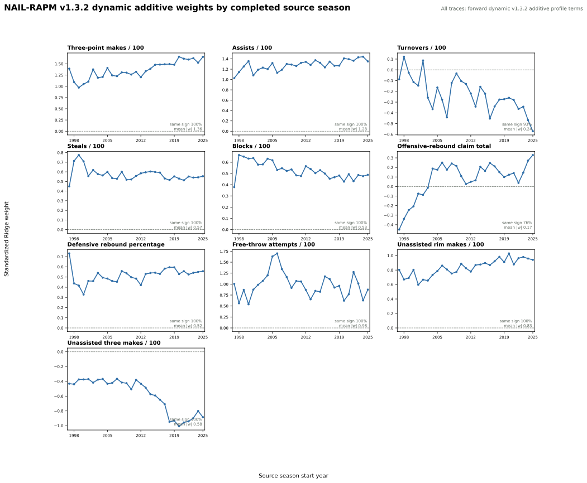

# NAIL-RAPM v1.3.2: Dynamic Additive Profiles

NAIL-RAPM v1.3.2 is the state-space successor to
[v1.3.1](nail-rapm-v131-pruned-additive-profiles.md). It keeps the same ten
retained additive player-profile terms, player prior, cold starts, gap-returner
bridge, non-additive lineup terms, and linear Ridge context fit. Its only
change is how the additive coefficients move from one completed season to the
next.

## Dynamic State Contract

Let \(\theta_{j,t}\) denote raw coefficient \(j\) after completed season
\(t\), and let \(\bar\theta_{j,t-1}\) be its running mean over only the prior
completed posterior states. Before season \(t\), v1.3.2 uses

\[
\theta_{j,t}^{-} = \bar\theta_{j,t-1} + \phi_{j,t}
\left(\theta_{j,t-1} - \bar\theta_{j,t-1}\right),
\]

\[
P_t^{-} = \Phi_t P_{t-1}\Phi_t^\top +
\operatorname{diag}(q_{1,t}, \ldots, q_{10,t}).
\]

The coefficient-specific \(\phi_{j,t}\) is a shrunk AR(1) estimate from the
prior completed history. The innovation variance \(q_{j,t}\) is the prior-only
empirical AR innovation variance, floored by 10% of the preceding posterior
variance. This allows a consistently stable feature to persist while allowing
a genuinely changing feature to move.

Nine terms classified as stable material use a persistent default reversion
target of 0.90. Unassisted three-point makes, the one sustained-regime-shift
term, uses a more responsive target of 0.60 and may estimate a mildly negative
AR coefficient. The category-4 zero gate is implemented but empty: v1.3.1
already removed its two insufficiently resolved terms, usage and three-point
attempts per 100.

The transition is strictly forward. A state used to forecast 2024-25 can use
the complete history through 2023-24, never 2024-25 outcomes or later states.

## Coefficient Trajectories

The panel below records the standardized Ridge coefficient for each retained
additive term after each completed source season. It uses the same coordinate
definition as v1.3.1: the conditional effect of a one-standard-deviation
home-minus-away lineup differential, holding the remaining profile and
non-additive terms fixed. The dynamic state is used as a forward prior; each
point remains the posterior after that season's observed evidence.

The trajectories are visibly more stable for the material terms, especially
assists, steals, blocks, defensive rebound percentage, and unassisted rim
makes. This supports the intended interpretive behavior. It does not itself
establish a predictive gain: the relevant test is the frozen result below.

## Evaluation

The full recursive fit, three-season frozen replay, and direct paired
game-block bootstrap completed. v1.3.1 is the direct incumbent because v1.3.2
changes only the between-season additive-coefficient state transition.

| Model | Regular poss. RMSE | Regular full-game RMSE | Winner accuracy | Team NetRtg RMSE | Pythagorean-win RMSE | Playoff poss. RMSE | Playoff eligible-game RMSE |
| --- | ---: | ---: | ---: | ---: | ---: | ---: | ---: |
| NAIL-RAPM v1.3.1 | 1.197990 | 14.307243 | **68.36%** | **3.3446** | **7.1012** | **1.192646** | **16.5248** |
| NAIL-RAPM v1.3.2 | **1.197969** | **14.282764** | 68.27% | 3.3465 | 7.0846 | 1.192690 | 16.5587 |

### Direct Bootstrap Gate

Positive full-game values mean v1.3.2 has higher error than v1.3.1. Although
the pooled estimate favors v1.3.2 by 0.0245 RMSE, its 95% interval crosses
zero and the candidate materially worsens two of three individual seasons.
It therefore does not meet the stricter per-season promotion requirement.

| Scope | v1.3.2 minus v1.3.1 | Paired 95% interval | Gate threshold | Gate |
| --- | ---: | ---: | ---: | --- |
| Pooled | -0.0245 | [-0.0778, +0.0290] | +0.0715 | Pass |
| 2023-24 | +0.0676 | [-0.0107, +0.1484] | +0.0698 | Fail |
| 2024-25 | -0.2445 | [-0.3732, -0.1213] | +0.0728 | Pass |
| 2025-26 | +0.0964 | [+0.0288, +0.1643] | +0.0719 | Fail |

v1.3.2 is a useful forward-only state experiment, but it is not promoted over
v1.3.1. Its dynamic coefficients improve interpretive stability without a
consistent frozen-prediction gain.

## Artifacts

- Recursive fit: `artifacts/models/forward_nail_rapm_v132_dynamic_additive_profiles/2025-26/forward-nail-rapm-v132-dynamic-additive-profiles-2025-26-20260822T133348Z-1760349c`
- Frozen replay: `artifacts/models/nail_v132_dynamic_additive_profiles_frozen_backtest/frozen_multiseason_backtest/2023-24_to_2025-26/frozen_multiseason_backtest-2023-24-to-2025-26-20260822T161207Z-9c4a6bea`
- Bootstrap gate: `artifacts/models/nail_v132_dynamic_additive_profiles_bootstrap/2023-24_to_2025-26/nail-v132-dynamic-additive-profiles-bootstrap-20260822T161422Z-2457d335`
- Coefficient audit: `artifacts/models/analysis/nail_v132_dynamic_additive_weight_audit/nail-v132-dynamic-additive-weight-audit-20260822T162754Z-153e3de7`

## Reproduction

See [Train NAIL-RAPM v1.3.2 Dynamic Additive Profiles](../guides/train-nail-v132-dynamic-additive-profiles.md).
