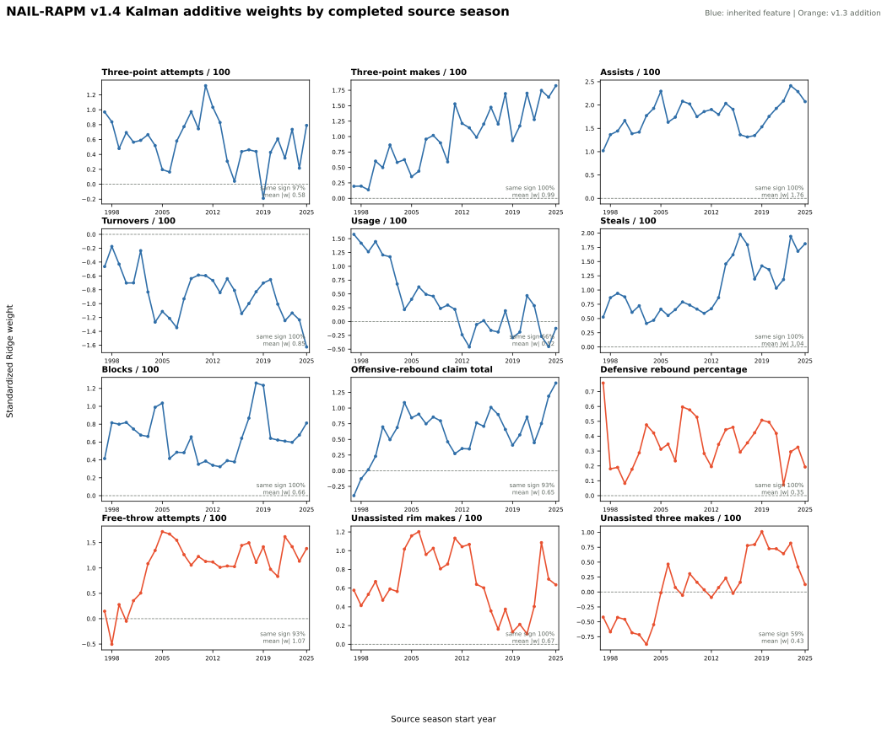
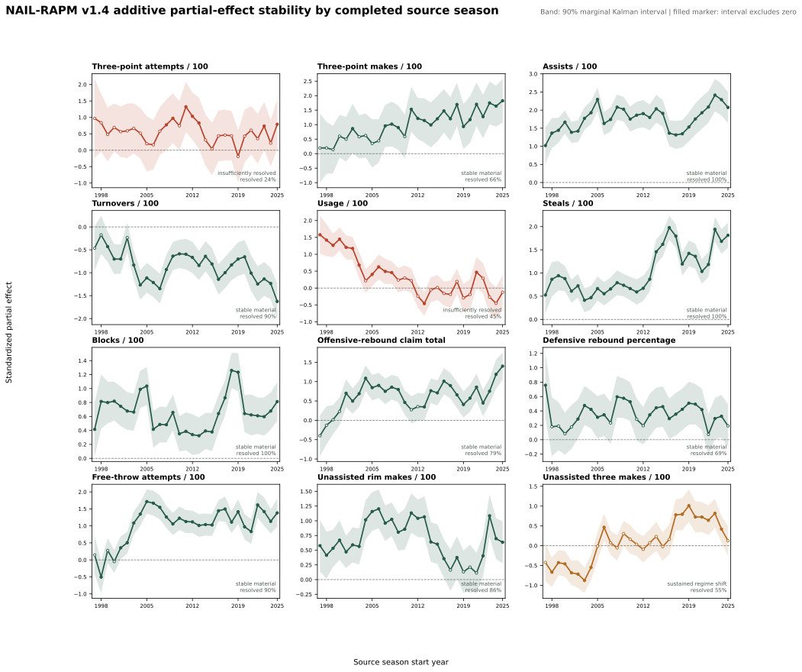

# NAIL-RAPM v1.4: Kalman Additive Profiles

NAIL-RAPM v1.4 keeps v1.3's twelve additive player-profile features and v1.2's player prior, cold-start, and gap-returner machinery. Its change is temporal: the additive profile coefficients evolve through a proper forward Kalman filter. The six non-additive lineup terms remain ordinary zero-centered Ridge coefficients, because they are unit-level interactions rather than persistent player-profile value.

## State-Space Contract

Let \(\theta_t\) be the twelve raw-unit additive-profile coefficients for completed season \(t\), and \(P_t\) their posterior covariance. Before season \(t\), the filter carries the prior state forward through a diagonal random walk:

\[
\theta_t^- = \theta_{t-1}, \qquad
P_t^- = P_{t-1} + Q_t, \qquad
Q_t = \kappa\,\operatorname{diag}(\operatorname{diag}(P_{t-1})).
\]

The initial run fixes \(\kappa=1\): every coefficient receives process uncertainty equal to its prior posterior variance. This lets a coefficient move when the current season provides evidence, while retaining the uncertainty learned from all prior completed fits.

For current-season standardized context coordinates \(\beta_t\), the raw state maps using the twelve current scaling factors \(D_t\):

\[
m_t^- = D_t\theta_t^-, \qquad
V_t^- = D_t P_t^- D_t.
\]

Given signed, possession-weighted stint residuals \((y_s, x_s, w_s)\), the context posterior solves

\[
\min_{\beta_t}
\sum_s w_s\left(y_s-x_s^\top\beta_t\right)^2
+ \alpha\lVert\beta_t\rVert_2^2
+ \sigma_t^2\left(\beta_t^{\mathrm{add}}-m_t^-\right)^\top
\left(V_t^-\right)^{-1}
\left(\beta_t^{\mathrm{add}}-m_t^-\right).
\]

Here \(\sigma_t^2\) is estimated from the current season's weighted residual variance. The posterior coefficient covariance is obtained from the same normal matrix, then mapped back into raw units and persisted for the next completed season. This makes the filter coordinate-safe despite season-specific feature scaling, and avoids the arbitrary pseudo-row weight used by the discarded first v1.4 attempt.

The state is strictly forward: a 2024-25 model may use the 2023-24 posterior, never outcomes or coefficients from 2024-25 or later.

## Twelve-Panel Coefficient History

The audit will show each standardized additive coefficient after the Kalman measurement update. Green traces are inherited features; orange traces are the four expanded v1.3 profiles.



Unlike the discarded pseudo-observation attempt, the Kalman traces materially
temper individual-season swings while retaining movement when the current
season has strong evidence. Across the twelve coefficients, mean absolute
year-to-year standardized movement falls from `0.475` in v1.3 to `0.223` in
v1.4, a 53.3% reduction. For example, the 2023-24 through 2025-26
unassisted-three coefficient moves from `+0.82` to `+0.42` to `+0.13`, rather
than inheriting a fixed raw pseudo-row weight.

## Partial-Effect Stability Audit

The coefficient traces are **conditional partial effects**, not independent
measures of basketball value. Each asks what incremental association remains
for a profile feature after the other eleven additive features are held fixed.
That distinction matters for correlated inputs such as three-point attempts,
three-point makes, usage, and unassisted makes: a coefficient changing sign is
not evidence that the underlying basketball action became harmful.

The audit uses each of the 29 persisted forward Kalman states from 1997-98
through 2025-26. A filled point below denotes that the feature's marginal 90%
Kalman interval excludes zero; an open point does not. No later season enters
an earlier point or interval.



| Classification | Rule | Result |
| --- | --- | --- |
| Stable, material | Median absolute standardized effect at least `0.10`; interval resolves the direction in at least half of seasons; at least 80% of resolved seasons have one sign | Assists, free-throw attempts, three-point makes, steals, turnovers, offensive-rebound claim, blocks, unassisted rim makes, defensive-rebound percentage |
| Sustained regime shift | Resolved positive and negative runs each last at least three seasons | Unassisted three-point makes |
| Insufficiently resolved | Does not meet either rule above | Three-point attempts, usage |

The stable group has the directional evidence needed for a persistent dynamic
coefficient. For example, assists, steals, blocks, and turnovers resolve in
the same direction in every observed posterior state; three-point makes and
offensive-rebound claim have the same resolved direction whenever their
intervals exclude zero. The unresolved group is different: its raw paths may
look directional, but the model cannot distinguish a nonzero *conditional*
increment from the correlated profile terms often enough to justify a durable
claim.

Unassisted three-point makes is the one clear regime candidate. It has an
eight-season resolved positive run and a seven-season resolved negative run,
with a single resolved sign transition. The next dynamic-prior experiment
should therefore not merely make every coefficient stickier. It should retain
persistent state for the stable group, shrink insufficiently resolved terms
toward zero, and allow a mean-reverting regime mechanism for unassisted
three-point makes. This audit is diagnostic only; it does not change the
non-promoted v1.4 model.

## Frozen Evaluation

The candidate was compared directly with [NAIL-RAPM v1.2](nail-rapm-v12-gap-returners.md)
under the established 2023-24 through 2025-26 frozen contract.

| Model | Regular poss. RMSE | Regular full-game RMSE | Winner accuracy | Team NetRtg RMSE | Pythagorean-win RMSE | Playoff poss. RMSE | Playoff eligible-game RMSE |
| --- | ---: | ---: | ---: | ---: | ---: | ---: | ---: |
| **NAIL-RAPM v1.2** | **1.197958** | **14.265989** | 68.16% | **3.2908** | 7.0899 | 1.192734 | 16.6148 |
| NAIL-RAPM v1.4 Kalman | 1.197972 | 14.274957 | **68.39%** | 3.3174 | **7.0088** | **1.192674** | **16.5836** |

The Kalman state is highly competitive but does not beat v1.2 on the primary
regular-season full-game objective. It does improve Pythagorean-win RMSE and
the pooled playoff metrics.

## Non-Promotion Gate

The gate requires the upper endpoint of the paired 95% game-block bootstrap
interval for v1.4 minus v1.2 full-game RMSE to be at most 0.5% of the v1.2
RMSE in the pooled sample and every frozen season.

| Scope | v1.4 minus v1.2 | Paired 95% interval | Gate threshold | Gate |
| --- | ---: | ---: | ---: | --- |
| Pooled | +0.0090 | [-0.0264, +0.0432] | +0.0713 | Pass |
| 2023-24 | +0.0032 | [-0.0553, +0.0620] | +0.0697 | Pass |
| 2024-25 | +0.0161 | [-0.0577, +0.0888] | +0.0722 | Fail |
| 2025-26 | +0.0075 | [-0.0383, +0.0531] | +0.0720 | Pass |

The single 2024-25 gate failure leaves v1.4 non-promoted. Its uncertainty
interval still overlaps improvement, but it does not satisfy the agreed
non-promotion rule.

## Artifacts

- Recursive fit: `artifacts/models/forward_nail_rapm_v14_kalman_additive_profiles/2025-26/forward-nail-rapm-v14-kalman-additive-profiles-2025-26-20260822T031459Z-7cf3b16b`
- Frozen replay: `artifacts/models/nail_v14_kalman_additive_profiles_frozen_backtest/frozen_multiseason_backtest/2023-24_to_2025-26/frozen_multiseason_backtest-2023-24-to-2025-26-20260822T032236Z-65e413bb`
- Bootstrap: `artifacts/models/nail_v14_kalman_additive_profiles_bootstrap/2023-24_to_2025-26/nail-v14-kalman-additive-profiles-bootstrap-20260822T032314Z-259be46f`
- Weight audit: `artifacts/models/analysis/nail_v14_kalman_additive_weight_audit/nail-v14-kalman-additive-weight-audit-20260822T032317Z-c39e9e8e`
- Partial-effect stability audit: `artifacts/models/analysis/nail_v14_partial_effect_stability_audit/nail-v14-partial-effect-stability-audit-20260822T044056Z-9ab837b9`

## Reproduction

See [Train NAIL-RAPM v1.4 Kalman Profiles](../guides/train-nail-v14-filtered-additive-profiles.md).

To rebuild the partial-effect stability artifact and chart:

```bash
uv run nba-audit-nail-v14-partial-effects
```
