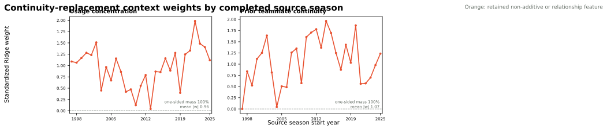

# NAIL Teammate-Continuity Replacement Candidate

## Question

The first [prior teammate-continuity candidate](nail-teammate-continuity.md)
added continuity on top of production's two non-additive terms. Its continuity
coefficient was much more directionally stable than the `top_two_assists`
coefficient, while the fitted top-two-assists weight fell by about `0.33`
standardized points on average. This experiment asks the narrower question:

> Can prior teammate continuity replace top-two assists rather than compete
> with it?

## Controlled Contract

Everything from
[NAIL-RAPM v1.2.1.3](nail-rapm-v1213-residualized-lambda.md) remains fixed:

- eight Medvedovsky-padded additive player-profile coordinates;
- usage concentration as a non-additive lineup term;
- back-to-back and home-court schedule controls;
- residualized-target player-lambda cross-validation;
- the same recursive aging, cold-start, centering, playoff-training, and
  regularization contracts.

The only substitution is

\[
\{\text{usage concentration},\ \text{top-two assists}\}
\longrightarrow
\{\text{usage concentration},\ \text{prior teammate continuity}\}.
\]

For five-player unit \(U\), let \(c_{ij,t-1}\) be prior-regular-season shared
possessions for teammate pair \((i,j)\). The continuity coordinate is

\[
\phi_{\text{continuity}}(U,t)
=\frac{1}{10}\sum_{i<j}\log\left(1+c_{ij,t-1}\right).
\]

Every one of the ten player pairs contributes. An unseen pair contributes
zero. This is a prediction-only relationship feature; it is not an intrinsic,
portable property of a hypothetical lineup.

## Evaluation

The candidate is fit recursively through the full historical sequence, then
evaluated against production on the standard frozen 2023-24, 2024-25, and
2025-26 regular seasons and their pooled playoffs. The final decision also
uses a paired 10,000-draw game-block bootstrap and the complete historical
coefficient trajectories.

## Results

### Frozen Comparison

| Metric | Production v1.2.1.3 | Replacement | Change |
|---|---:|---:|---:|
| Regular possession RMSE | 1.198147 | 1.198149 | +0.000002 |
| Regular possession MAE | 1.141455 | 1.141537 | +0.000082 |
| Eligible game-margin RMSE | 14.0051 | 14.0031 | -0.0021 |
| Full-game margin RMSE | 14.2166 | 14.2119 | -0.0047 |
| Winner accuracy | 68.30% | 68.41% | +0.11 pp |
| Team NetRtg RMSE | 3.2351 | 3.2853 | +0.0502 |
| Pythagorean win RMSE | 6.9423 | 6.9815 | +0.0393 |
| Playoff possession RMSE | 1.192728 | 1.192657 | -0.000071 |
| Playoff game-margin RMSE | 16.5782 | 16.4638 | -0.1144 |

The paired 10,000-draw game-block bootstrap estimates a pooled full-game RMSE
change of `-0.0047`, with a 95% interval of `[-0.0364, +0.0272]` and a `61.7%`
probability that the replacement is better. The interval includes zero by a
wide margin. Possession MAE is worse in every bootstrap draw, although the
absolute difference is very small.

### Coefficient Stability

| Feature | Median standardized weight | Positive seasons | Positive mass | SD |
|---|---:|---:|---:|---:|
| Usage concentration | +1.06 | 29 / 29 | 100.000% | 0.43 |
| Prior teammate continuity | +1.12 | 28 / 29 | 99.999% | 0.52 |

Usage concentration remains close to its production trajectory
(`r = 0.963`), with mean absolute movement of `0.097` standardized points.
The replacement therefore behaves as intended: continuity occupies the
second context coordinate without destabilizing the primary non-additive
term.

## Decision

Do **not** promote this candidate. It demonstrates that the historically weak
`top_two_assists` term can be removed without materially damaging game-margin
prediction. It does not demonstrate that continuity is a better production
coordinate: possession MAE and team NetRtg error worsen, the primary bootstrap
interval includes zero, and prior teammate continuity cannot score new or
hypothetical teammate combinations as an intrinsic lineup property.

The result is still useful. It confirms that the stable continuity signal is
largely interchangeable with existing recursive state and shared-playmaking
context rather than a missing independent source of forecast value.

## Artifacts

- Recursive fit: `artifacts/models/forward_nail_rapm_teammate_continuity_replacement/2025-26/forward-nail-rapm-teammate-continuity-replacement-2025-26-20260830T152259Z-2e6dd7d8`
- Frozen replay: `artifacts/models/nail_teammate_continuity_replacement_frozen_backtest/frozen_multiseason_backtest/2023-24_to_2025-26/frozen_multiseason_backtest-2023-24-to-2025-26-20260830T153016Z-24f97568`
- Coefficient audit: `artifacts/models/analysis/nail_teammate_continuity_replacement_weight_audit/nail-teammate-continuity-replacement-weight-audit-20260830T153056Z-bfa0f6d2`
- Paired bootstrap: `artifacts/models/nail_teammate_continuity_replacement_bootstrap/2023-24_to_2025-26/nail-teammate-continuity-replacement-bootstrap-20260830T153059Z-1db6feb0`

## Reproduction

See
[Train the NAIL Teammate-Continuity Replacement Candidate](../guides/train-nail-teammate-continuity-replacement.md).
