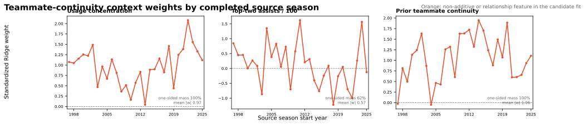

# NAIL Prior Teammate Continuity Candidate

**Status: tested, not promoted.** This candidate adds one relationship feature
to [NAIL-RAPM v1.2.1.3](nail-rapm-v1213-residualized-lambda.md). It passes the
paired non-inferiority gate and has a remarkably stable positive coefficient,
but it does not materially improve the primary frozen metrics.

## Hypothesis

Five players who shared meaningful possessions in the previous season may
coordinate more effectively than an equally talented group without that shared
history. For target season (t), let (P_{ij,t-1}) be regular-season
possessions shared by players (i) and (j) in season (t-1). For a unit
(U), define

\[
\phi_{\mathrm{continuity}}(U,t)
=\frac{1}{10}\sum_{i<j,\ i,j\in U}\log\left(1+P_{ij,t-1}\right).
\]

All ten player pairs enter the mean. A pair with no prior shared possessions
contributes zero. The logarithm lets the first shared possessions matter more
than another equal-sized block added to an already familiar pair.

The model uses the standard antisymmetric matchup coordinate

\[
x_{\mathrm{continuity}}(U,O,t)
=\phi_{\mathrm{continuity}}(U,t)
-\phi_{\mathrm{continuity}}(O,t).
\]

This is a **prediction-only relationship feature**. It is not an intrinsic,
portable property of a five-player unit and should not penalize hypothetical
or mixed-era lineups merely because they have no shared history.

## Leakage Boundary

The pair table for target season (t) is rebuilt only from regular-season
stints in (t-1). Target-season games, target-season lineup exposures, and
playoffs do not enter the feature. The resulting context correction is fitted
jointly with the incumbent additive and non-additive context terms, then rolls
forward through the recursive player-state update exactly like the production
context block.

## Frozen Screen

The compute-saving screen first held production v1.2.1.3 predictions fixed and
compared continuity with target residuals. The relationship was positive in
all three frozen seasons. Weighted correlations were `+0.0093`, `+0.0081`, and
`+0.0106` for 2023-24 through 2025-26; the pooled correlation was `+0.0093`.

The screen justified one full recursive fit. It did not establish that the
feature would survive joint refitting.

## Frozen Results

The recursive candidate was fit across all 30 seasons, then evaluated on the
frozen 2023-24, 2024-25, and 2025-26 regular seasons and playoffs. Candidate
and incumbent use the same 625,615 regular-season possessions, 3,511 regular
games, 39,967 playoff possessions, and 238 playoff games. This is broader than
the older common-support snapshot used to initialize the multi-model table;
the direct paired deltas below are therefore the authoritative comparison.

<!-- teammate-continuity-results:start -->
| Model | Poss. RMSE | Eligible game RMSE | Full-game RMSE | Winner accuracy | Team NetRtg RMSE | Pythagorean-win RMSE | Playoff eligible-game RMSE |
| --- | ---: | ---: | ---: | ---: | ---: | ---: | ---: |
| Production v1.2.1.3 | **1.198147** | **14.005121** | 14.216588 | 68.30% | **3.235071** | **6.942255** | 16.578243 |
| Prior teammate continuity | 1.198154 | 14.006961 | **14.214574** | **68.50%** | 3.283263 | 6.964772 | **16.459694** |

The candidate's pooled full-game RMSE improves by only `0.0020`, while winner
accuracy rises by `0.20` percentage points. Team net-rating RMSE worsens by
`0.0482`. Its playoff eligible-game RMSE improves by `0.1185`, but that is a
secondary check rather than a promotion criterion.

The paired 10,000-draw game-block bootstrap confirms that the full-game result
is a statistical tie:

| Scope | Full-game RMSE difference | Paired 95% interval | Non-inferiority gate |
| --- | ---: | ---: | --- |
| Pooled | -0.0020 | [-0.0323, +0.0275] | Pass |
| 2023-24 | -0.0243 | [-0.0758, +0.0260] | Pass |
| 2024-25 | +0.0071 | [-0.0493, +0.0635] | Pass |
| 2025-26 | +0.0096 | [-0.0376, +0.0561] | Pass |

Negative differences favor continuity. The candidate passes in every scope,
but the pooled probability that it improves full-game RMSE is only `55.1%`.
<!-- teammate-continuity-results:end -->

## Coefficient Audit

The standardized continuity coefficient is positive in 27 of 29 fitted
source-season states. Positive coefficient mass is `30.71`, versus only `0.08`
negative mass, for a **99.75% positive one-sided mass share**. Its median is
`+1.11` net-rating points per seasonal standard deviation, with a range from
`-0.05` to `+1.95`.

The historical consistency is strong evidence that continuity identifies a
real repeatable relationship. It is not, by itself, evidence of incremental
forecast value after the player prior and retained context terms are refit.

The displacement audit sharpens that interpretation. Candidate and production
usage-concentration weights remain highly aligned (`r = 0.964`), with a mean
absolute change of only `0.09` standardized points. Top-two assists also keeps
the same historical shape (`r = 0.977`), but its candidate coefficient falls
by `0.33` standardized points on average. Continuity is therefore absorbing
part of the same repeatable coordination signal previously assigned to shared
playmaking rather than adding a fully independent source of prediction.

## Decision

Do **not** promote this candidate. It passes the predeclared no-material-harm
gate, and its coefficient is far more stable than most rejected context
features. However, the pooled full-game change is effectively zero, possession
MAE is slightly worse, and team net-rating RMSE is worse. The most likely
interpretation is that teammate continuity is real but largely redundant with
the recursive player state, lineup allocation, and the existing context block.

The feature remains useful for future forecasting work and may become more
valuable in a lineup-usage or roster-change model. It should remain outside the
portable public Lab score unless exposed as an explicit optional forecast
control.

## Artifacts

- Frozen screen: `artifacts/models/analysis/frozen_feature_screen/prior_teammate_continuity/frozen-feature-screen-prior_teammate_continuity-20260830T042640Z-911b48a2`
- Recursive fit: `artifacts/models/forward_nail_rapm_prior_teammate_continuity/2025-26/forward-nail-rapm-prior-teammate-continuity-2025-26-20260830T052409Z-f8ca24aa`
- Coefficient and displacement audit: `artifacts/models/analysis/nail_teammate_continuity_weight_audit/nail-teammate-continuity-weight-audit-20260830T060140Z-3bff16e1`
- Frozen replay: `artifacts/models/nail_teammate_continuity_frozen_backtest/frozen_multiseason_backtest/2023-24_to_2025-26/frozen_multiseason_backtest-2023-24-to-2025-26-20260830T054930Z-00665efd`
- Paired bootstrap: `artifacts/models/nail_teammate_continuity_bootstrap/2023-24_to_2025-26/nail-teammate-continuity-bootstrap-20260830T055212Z-5f74edf7`

## Reproduction

See [Train the NAIL Prior Teammate Continuity Candidate](../guides/train-nail-teammate-continuity.md).
