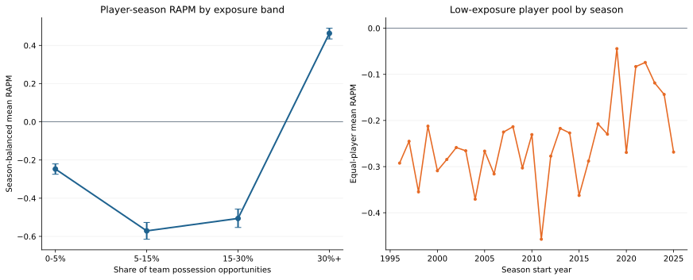

# Replacement-Level Exposure Study

This study documents a rejected attempt to estimate replacement level by
averaging individual low-exposure RAPM coefficients.

It is a descriptive report, not a predictive model and not a Leaderboard
entry. In particular, it must not be read as a value estimate for a player
who never appears in NBA play-by-play data.

## Exposure Contract

For player \(i\), team \(j\), and season \(t\), let \(P_{ijt}\) be the
player's on-court RAPM possessions with that team and let \(T_{jt}\) be that
team's total regular-season RAPM possession opportunities. The study defines
the season share as

\[
s_{it} = \sum_j \frac{P_{ijt}}{T_{jt}}.
\]

This matches the possession definition used by the RAPM target. A player who
is traded is credited with the fraction of each team's full-season opportunity
set during which he was on court. The construction is validated against the
player-season panel's `rapm_possessions` column for every row.

The cohort contains every regular-season player-season with a RAPM outcome,
not only rookies. This better represents the pool of low-minute players that
rookies compete with for an NBA rotation spot, including likely two-way,
10-day, and fringe-roster seasons. Contract type is not yet available in the
panel, so the pool can also contain established players returning from injury
or otherwise playing little; the report publishes experience bands to make
that contamination visible.

Players who never record an NBA possession are still absent. The exposure
analysis is therefore conditional on reaching the NBA play-by-play data set.

## Rejected Estimate

The current immutable run is
`artifacts/models/replacement_level/2025-26/replacement-level-2025-26-20260806T005038Z-5393fb5c/`.
It covers 14,550 regular-season player-seasons across 1996-97 through 2025-26.

| Exposure share | Players | Mean share | Season-balanced RAPM | 90% season-block interval | Possession-weighted RAPM |
| --- | ---: | ---: | ---: | ---: | ---: |
| 0-5% | 2,519 | 2.0% | -0.247 | [-0.275, -0.220] | -0.311 |
| 5-15% | 2,275 | 9.8% | -0.571 | [-0.615, -0.527] | -0.565 |
| 15-30% | 2,770 | 22.4% | -0.506 | [-0.553, -0.457] | -0.481 |
| 30%+ | 6,986 | 51.1% | 0.463 | [0.434, 0.490] | 0.611 |

The original low-exposure reference was the season-balanced equal-player mean
across all player-seasons with \(s_{it}<5\%\):

\[
R^{replacement}_{candidate} = -0.247.
\]

Its season-block bootstrap interval is `[-0.275, -0.220]`. Each season gets
equal influence in that estimate, rather than allowing the larger modern
player pools to dominate it.

| Experience band within the 0-5% pool | Player-seasons | Equal-player RAPM |
| --- | ---: | ---: |
| First year | 939 | -0.228 |
| Years 1-3 | 788 | -0.205 |
| Years 4+ | 792 | -0.261 |

## Interpretation

The low-exposure estimate is **rejected** as a replacement-level measure. The
0-5% cohort is less negative than the higher-exposure groups because
small-sample individual RAPM coefficients are regularized toward zero. The
three experience bands are similarly near zero for the same reason; they do
not identify contract status or separate injuries from fringe roles.

It therefore does not establish a usable fallback value or a hard "below 5%
means replacement level" rule. It does not alter the draft-informed prior or
the frozen preseason evaluation. The [Pooled Replacement-Token
RAPM](replacement-token.md) applies the correct group-token design.

## Next Model

The next slice can build a preseason-only exposure gate and mix a validated
replacement token with a profile-rate prior:

\[
\widehat{R}^{cold}_i =
(1-p^{rotation}_i)R^{replacement}
+ p^{rotation}_i\widehat{R}^{profile}_i.
\]

That gate must be evaluated strictly out of season. A complete candidate
population, including drafted players with zero NBA possessions, is required
before it can estimate the probability of appearing at all rather than merely
rotation share conditional on appearance.

## Artifacts

| File | Contents |
| --- | --- |
| `player_exposure_cohort.parquet` | One all-player-season row with RAPM, on-court possessions, team opportunities, exposure share, and experience band |
| `exposure_band_summary.parquet` | Band counts, means, and season-block bootstrap intervals |
| `low_exposure_season_estimates.parquet` | One equal-player estimate per season below the 5% cutoff |
| `low_exposure_experience_summary.parquet` | Low-exposure pool summary by career stage |
| `candidate_replacement_prior.json` | Candidate reference, uncertainty interval, and diagnostic-only status |
| `replacement-level-study.svg` | Published two-panel diagnostic chart |
| `metadata.json` / `manifest.json` | Source, code, cutoff, and artifact-integrity contract |
