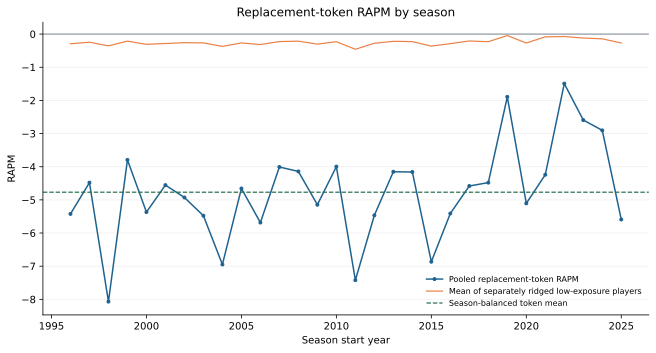

# Pooled Replacement-Token RAPM

This diagnostic estimates a replacement-player group effect directly in the
RAPM design matrix. It corrects a failed first attempt that averaged the
separately ridged coefficients of low-exposure players; those individual
coefficients were mechanically shrunk toward zero and cannot estimate the
group's impact.

## Token Design

Within each completed regular season, identify cataloged player IDs with a
realized team-possession share below a cutoff. Replace every such individual
player token with one shared `replacement` token. For stint \(t\), its signed
feature is

\[
z_t = n^{home}_{replacement,t} - n^{away}_{replacement,t},
\]

where \(n\) is the number of low-exposure players in the lineup. All other
players retain their ordinary signed RAPM token. The fitted equation is

\[
y_t = \alpha + z_t\beta_{replacement}
+ \sum_{i \notin L} x_{it}\beta_i + \epsilon_t.
\]

Thus \(\beta_{replacement}\) is the per-player RAPM coefficient applied once
for each replacement token in a lineup. It pools the group's possession
exposure instead of regularizing hundreds of sparse individual columns
independently toward zero.

The model reuses the canonical season-specific RAPM lambda. This isolates the
tokenization change; it does not claim that the existing lambda is optimal for
the lower-dimensional token design.

## Historical Result

The primary immutable run is
`artifacts/models/replacement_token/2025-26/replacement-token-2025-26-20260806T010704Z-4863a48f/`.
It fits one full-season token model for each season from 1996-97 through
2025-26, using a 5% realized exposure cutoff.

| Exposure cutoff | Season-balanced token RAPM | 90% season-block interval |
| ---: | ---: | ---: |
| 2% | -3.870 | [-4.306, -3.448] |
| **5%** | **-4.768** | **[-5.180, -4.344]** |
| 10% | -4.732 | [-4.979, -4.472] |

At the 5% cutoff, the mean of the original separately ridged player
coefficients was only `-0.247`. The pooled token therefore demonstrates the
expected shrinkage failure directly: low-exposure individual estimates are
not an estimate of low-exposure group quality.

The pooled estimate is more negative than the usual informal `-2` replacement
benchmark. It is a valid consequence of this exact retrospective group and
this RAPM scale, but it should not yet be promoted as the project-wide
replacement level. The cutoff is based on realized same-season exposure, and
the low-minute pool can contain injury cases alongside two-way, 10-day, and
fringe-roster players.

## What This Establishes

This is the correct measurement strategy for the proposed group: represent
replacement candidates with a shared feature and let the lineup model estimate
their pooled effect. It is **not** a preseason cold-start model because group
membership uses future, realized exposure.

The next predictive slice is to learn a preseason-only gate that assigns a
replacement token before the season, then evaluate that gate on a complete
future-season holdout. Contract, transaction, and roster-status data would
make the historical group definition more precise.

## Artifacts

| File | Contents |
| --- | --- |
| `season_replacement_token_coefficients.parquet` | One shared-token coefficient per season, canonical lambda, group size, and comparison to separately ridged values |
| `replacement_token_summary.json` | Season-balanced estimate, bootstrap interval, cutoff, and retrospective status |
| `replacement-token-by-season.svg` | Published comparison of pooled and separately ridged estimates |
| `metadata.json` / `manifest.json` | Token, cutoff, source, code, and artifact-integrity contract |
