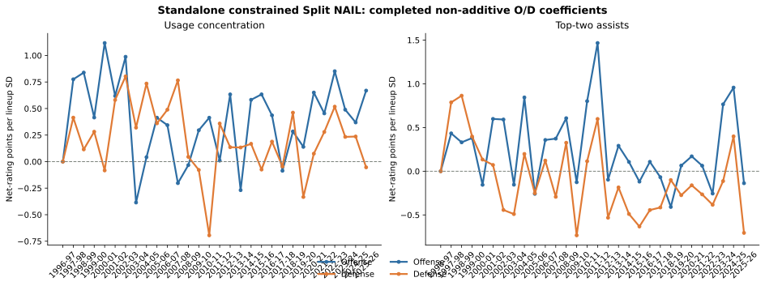

# Split NAIL-RAPM

Split NAIL is the planned offense/defense extension of NAIL-RAPM. It estimates
points-created and points-prevented player ratings while retaining NAIL's
separation of additive player profiles from non-additive lineup effects.

## Possession-side target

For offensive unit \(U\) against defensive unit \(V\), the model predicts:

\[
\widehat{\operatorname{PPP}}(U,V)=
\alpha +
\sum_{i\in U}O_i-
\sum_{j\in V}D_j+
C^O(U)-C^D(V)+b^O B(U)-b^D B(V)+h^O I_{\mathrm{home\ offense}}-h^D I_{\mathrm{home\ defense}}.
\]

Higher \(D_i\) means more points prevented. A player's combined rating remains
\(O_i+D_i\). Stints produce two observations: home offense against away defense
and away offense against home defense.

## Unconstrained feature contract

No profile feature is preassigned to offense or defense. For the same strictly
lagged player profile \(x_i\):

\[
O_i=\mu_i^O+\Delta_i^O+x_i^\top\gamma^O
\]

\[
D_i=\mu_i^D+\Delta_i^D+x_i^\top\gamma^D.
\]

All eight current additive profile features, plus the retained non-additive
lineup features `top_two_assists` and `usage_concentration`, receive separate
offense and defense coefficients. Ridge regularization, rather than semantic
zero constraints, determines whether a feature has useful signal on either
side. This permits effects such as free-throw generation indirectly predicting
defensive performance through game-state or transition mechanisms.

Before fitting, each profile or lineup feature is divided by its
possession-weighted standard deviation in the completed season. That puts its
Ridge penalty on the same one-standard-deviation scale as the other feature
blocks. Player coefficients remain in their native per-100-possession units;
artifacts record both standardized and raw profile coefficients.

The B2B flag is a distinct schedule control, known before tipoff from the game
calendar. It has an offense coefficient \(b^O\) and a defense coefficient
\(b^D\), rather than being forced into a single signed game-level term. Thus,
when the home team is on a back-to-back, the home-offense row gets
\(+b^O\), while the away-offense row gets \(-b^D\). The same two parameters
are estimated with the feature block and are carried only from a completed
season into its next-season forecast. Home court uses the same side-specific
logic: \(h^O\) is a home scoring advantage and \(h^D\) is a home defensive
advantage that suppresses the away scoring row. Neither is forced to be zero
or to equal the other.

## Standalone Forward Prior Bridge

Split NAIL derives its combined prior \(P_{i,t}\) within its own forward
history. It uses the same accepted scalar-prior ingredients as production NAIL:
lagged player value, value-conditioned aging, exposure-gated cold starts,
replacement tokens, and gap-returner handling. It does **not** import a fitted
production NAIL player vector or context artifact.

The neutral initial side split is \(P_{i,t}/2\) on each side. The model carries
the previous Split NAIL specialization \(d_{i,t-1}=O_{i,t-1}-D_{i,t-1}\):

\[
\mu_{i,t}^{O}=\frac{P_{i,t}+d_{i,t-1}}{2},\qquad
\mu_{i,t}^{D}=\frac{P_{i,t}-d_{i,t-1}}{2}.
\]

Therefore \(\mu_{i,t}^{O}+\mu_{i,t}^{D}=P_{i,t}\) exactly. New players have
\(d_{i,t-1}=0\), so they receive the neutral side split while retaining the
forward aging and exposure-gated cold-start total prior.

## Constrained O/D Coordinates

Every offense/defense coefficient pair, including player, additive-profile,
non-additive lineup, B2B, and home-court terms, is fit in total and
specialization coordinates:

\[
m = O + D, \qquad s = O - D, \qquad O = \frac{m+s}{2}, \qquad D = \frac{m-s}{2}.
\]

Ridge precision on \(s\) is four times the corresponding precision on \(m\).
This prevents an unconstrained O/D refit from cheaply changing a player’s total
rating through two separately penalized side coefficients. Raw O/D coefficients
are reconstructed only after the constrained fit.

## Recursive fitting protocol

For completed season \(t\), Split NAIL fits both scoring directions for every
stint: home offense against away defense, and away offense against home defense.
The player-state penalty is centered on the scalar NAIL prior and the preceding
Split NAIL side difference. Profile and lineup columns are divided by their
season-specific possession-weighted standard deviations; their Ridge precision
is fixed relative to the player-state precision.

The next season uses only completed source-season information:

1. The completed standalone Split history supplies \(P_{i,t+1}\), including
   its aging and cold-start logic.
2. Split NAIL carries \(d_{i,t}=O_{i,t}-D_{i,t}\).
3. Prior-season player profiles construct target-season lineup features.
4. The completed season \(t\) profile coefficients score those features for a
   frozen evaluation of \(t+1\).

The first historical season has no earlier profile data, so its profile block
is set explicitly to zero rather than imputed from the future.

## Frozen evaluation

For each held-out season, the scorer uses the prior season's O/D feature and
schedule coefficients with its separate home-offense and home-defense terms, then combines them with
the scalar NAIL total prior and carried O/D specialization. It predicts both
teams' points per 100 possessions on the exact shared frozen possession support
used by the three-season leaderboard. Game margins use the same observed
offensive possession allocation and game-reconstruction rules as every other
candidate.

## Attribution Audit

The no-refit attribution audit, persisted under
`artifacts/audits/split_nail_attribution/`, replays the persisted Split state
on the exact frozen possession support and verifies
that its term-by-term reconstruction equals the published replay prediction to
floating-point precision. It is an explanatory audit, not a new candidate or a
hybrid refit.

For a home offensive possession, the source-season Split state is evaluated as:

\[
\widehat{r}_{H\text{ offense}}=
\alpha+
P^O(H)-P^D(A)+
A^O(H)-A^D(A)+
N^O(H)-N^D(A)+
h^O+b^O B_H-b^D B_A,
\]

where \(P\) is the O/D player state, \(A\) is the additive profile block,
\(N\) is the retained non-additive block, \(h\) is home court, and \(b\) is
the back-to-back effect. The away-offense equation reverses the units and uses
the defense-side home and rest coefficients. The audit converts each row into
home-net-rating units before summarizing it, so all terms use the same sign
convention.

Every frozen target season uses only the preceding completed Split state. Thus,
for example, 2025-26 uses 2024-25 O/D player specialization, profile
coefficients, home-court terms, and B2B terms. The completed 2025-26
coefficients shown below are descriptive diagnostics only; they are not used to
predict 2025-26.

### Frozen agreement with production NAIL

The Split forecast is related but not a numerical reformat of production NAIL.
Its scalar player prior has roughly \(0.95\) correlation with production on
each target-season player pool, while its possession predictions have
\(0.77\) to \(0.84\) correlation. The gap arises after the scalar prior: from
the recursively carried O/D specialization and side-specific profile, lineup,
and schedule terms.

| Target | Cohort | Possessions | Prediction correlation | Split minus NAIL RMSE |
| --- | --- | ---: | ---: | ---: |
| 2023-24 | Regular season | 182,729 | 0.835 | 0.0501 |
| 2023-24 | Playoffs | 12,570 | 0.828 | 0.0566 |
| 2024-25 | Regular season | 183,431 | 0.843 | 0.0448 |
| 2024-25 | Playoffs | 13,144 | 0.813 | 0.0515 |
| 2025-26 | Regular season | 218,810 | 0.825 | 0.0377 |
| 2025-26 | Playoffs | 14,253 | 0.771 | 0.0510 |

| Target | Shared players | Scalar-prior correlation | Prior-difference RMSE |
| --- | ---: | ---: | ---: |
| 2023-24 | 567 | 0.948 | 0.699 |
| 2024-25 | 565 | 0.945 | 0.705 |
| 2025-26 | 578 | 0.948 | 0.681 |

### Component scale

These are not variance shares: player, profile, and lineup terms co-vary. They
show the average absolute size of each scored home-net-rating term across the
three frozen regular seasons. The large profile values reflect the O/D scoring
construction, in which a unit's offensive profile and its opponent's defensive
profile both enter a possession row. They should not be interpreted as a
separate amount of player credit.

| Component | Mean absolute net-rating points | Standard deviation |
| --- | ---: | ---: |
| O/D player state | 2.91 | 3.65 |
| Additive profile | 7.32 | 8.38 |
| All retained non-additive terms | 5.27 | 5.52 |
| `top_two_assists` | 2.12 | 2.54 |
| `usage_concentration` | 3.16 | 3.40 |
| Home court | 0.89 | 0.14 |
| Back-to-back | 0.17 | 0.35 |

### Four non-additive coefficient series

There are exactly two retained non-additive features, but Split NAIL estimates
each on both scoring sides: `top_two_assists` on offense and defense, plus
`usage_concentration` on offense and defense. The chart puts all four on a
common scale: expected net-rating change from a one completed-season lineup
standard-deviation increase in the feature. Blue is offense and orange is
defense. A positive defense-side coefficient means the defensive unit is
expected to suppress more opponent scoring.

For the actual frozen 2025-26 forecast, the source is 2024-25. Its one-SD
effects were: top-two assists \(+0.96\) offense and \(+0.40\) defense;
usage concentration \(+0.37\) offense and \(+0.24\) defense. The full series
is visibly less stable than the scalar player state, which is one reason Split
NAIL remains a transparent non-promoted companion rather than the production
rating.

## Status

The constrained B2B-aware 1996-97 through 2025-26 recursive refit is evaluated
through the shared-support harness. Its leaderboard row remains visible whether
or not it meets the promotion gate. The artifact contains per-season O/D player
ratings, combined priors, standardized and raw side-feature coefficients,
side-specific B2B coefficients, and the immutable shared-support evaluation
audit.

## Three-Season Result

The no-refit replay asserted identical possession identifiers and realized
outcomes against the production frozen artifact for every target season,
including all 39,967 playoff possessions. Regular support is 182,729
possessions / 1,026 games in 2023-24; 183,431 / 1,028 in 2024-25; and 218,810 /
1,230 in 2025-26. Full-game regular outcomes also match across all 3,511
reconstructed games.

| Pooled eligible-cohort metric | B2B Split NAIL | Production NAIL-RAPM v1.2.1.2 |
| --- | ---: | ---: |
| Possession RMSE | 1.198026 | **1.197946** |
| Possession MAE | 1.142568 | **1.141313** |
| Possession skill | 0.1144% | **0.1279%** |
| Eligible game-margin RMSE | **13.9679** | 14.0107 |
| Eligible game skill | **18.8598%** | 18.3623% |
| Full-game margin RMSE | 14.2668 | **14.2330** |
| Game-winner accuracy | 66.56% | **67.96%** |
| Team NetRtg RMSE | 3.3020 | **3.2847** |
| Pythagorean-win RMSE | **6.9130** | 7.0551 |

| Pooled playoff metric | Constrained Split NAIL | Production NAIL-RAPM v1.2.1.2 |
| --- | ---: | ---: |
| Possession RMSE | 1.194415 | **1.192710** |
| Possession MAE | 1.140791 | **1.137604** |
| Possession skill | -0.2214% | **0.0645%** |
| Eligible game-margin RMSE | **16.5301** | 16.6032 |
| Eligible game skill | **8.4506%** | 7.6393% |

The decomposition improves eligible-possession game-margin accuracy in both
cohorts, but it loses on the primary possession metrics, full-game accuracy,
and winner accuracy. It therefore does not clear promotion and is retained in
the [Three-Season Frozen Leaderboard](three-season-frozen-backtest.md) as a
comparable non-promoted candidate.
