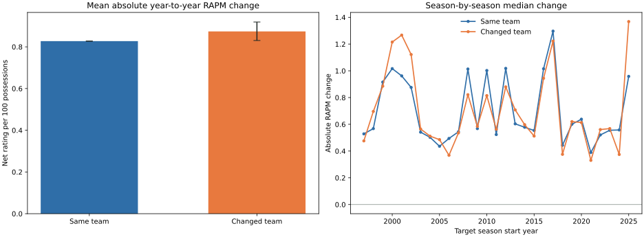

# Team Change And Player-Rating Stability

This descriptive study asks whether a completed player RAPM is less stable from
one season to the next when the player changes teams. It is a screen for a
future **prior-precision** feature, not evidence for shifting a player's mean
rating up or down after a move.

## Design

The study uses completed raw player RAPM from production
[NAIL-RAPM v1.2.1.3](nail-rapm-v1213-residualized-lambda.md), before the
display-only additive-profile compilation. A transition is eligible only when:

- the seasons are consecutive;
- the player has one primary team in each season;
- the player has at least 1,000 RAPM possessions in both seasons.

`Changed team` means the primary team differs across the two seasons. This
excludes in-season multi-team players rather than assigning an arbitrary team.
The response is:

\[
\left|R_{i,t} - R_{i,t-1}\right|.
\]

The primary comparison is a player-cluster bootstrap: resample players rather
than individual transitions, preserving each player's serial dependence. The
adjusted check estimates the team-change coefficient after target-season fixed
effects, age, age squared, and log minimum two-season possessions.

## Result

| Group | Transitions | Mean absolute change | Median absolute change |
| --- | ---: | ---: | ---: |
| Same primary team | 4,727 | 0.827 | 0.644 |
| Changed primary team | 1,444 | 0.874 | 0.678 |

The changed-minus-same mean difference is **+0.046** rating points per 100
possessions (player-cluster 95% interval **[+0.003, +0.092]**; 98.1% of
bootstrap draws are positive). The adjusted estimate is **+0.050**.



The direction is consistent with the hypothesis, but the size is modest: the
unadjusted difference is about 5.6% of the same-team mean absolute change, and
the season-by-season relationship is not uniform. The unadjusted signed change
is lower for switchers, but that difference is heavily confounded by why
players move teams and does not establish a portable directional effect.

## Forward Precision Test

The descriptive screen was tested as **NAIL-RAPM v1.2.1.5 team-change
precision**. It changes no player-prior mean and no context feature. For a
clean offseason mover only, it changes the player-prior penalty from the
uniform value of one to:

\[
p_i(q) = \frac{1}{1 + q s_i},
\]

where \(s_i\) is the player's prior on-court possessions on a normalized
`log(1 + possessions)` scale. Non-movers retain \(p_i = 1\). A mover must have
one primary team in each of two consecutive completed seasons, with different
team identifiers; rookies, gaps, multi-team seasons, and in-season trades are
excluded.

The candidate jointly selected the player lambda and variance-ratio \(q\) on
each source season's chronological folds. The fixed grid was:

\[
q \in \{0, 0.05, 0.10, 0.20, 0.40\}.
\]

`q = 0` is exactly the uniform-precision production control. The interior
values were never selected: 16 of 30 completed seasonal fits selected `0`, and
14 selected the upper boundary `0.40`. The source-fold advantage of `0.40`
over `0` in those 14 seasons was only 0.03 to 1.17 weighted-MSE units on
seasonal baselines of roughly 9,200 to 10,600. This is not a stable estimate
of a usable move effect.

## Frozen Result And Conclusion

The strict frozen replay compared the candidate with production
[NAIL-RAPM v1.2.1.3](nail-rapm-v1213-residualized-lambda.md) for 2023-24,
2024-25, and 2025-26. Pooled regular-season full-game RMSE was **14.21696**
for the candidate versus **14.21659** for production, a difference of
**+0.00037**. The paired 95% interval was **[-0.01014, +0.01118]**.

The candidate passes the project's non-promotion harm gate but does not show a
predictive improvement. Combined with the binary boundary selection, the
evidence does **not** support team-change-aware prior precision at this time.
Production NAIL-RAPM remains unchanged.

This conclusion also avoids treating a completed-season primary-team field as
an operational opening-roster feed. Any future retry should first use a
time-stamped transaction or opening-roster artifact and pre-register a wider,
interior-capable precision grid.

## Artifact And Reproduction

The completed study artifact is
`artifacts/models/analysis/team_change_rating_stability/team-change-rating-stability-20260908T151345Z-5ffd8b50`.

The unpromoted candidate and validation artifacts are:

- `artifacts/models/forward_nail_rapm_v1215_team_change_precision/2025-26/forward-nail-rapm-v1215-team-change-precision-2025-26-20260908T161602Z-daeaec7f`
- `artifacts/models/nail_v1215_team_change_precision_frozen_backtest/frozen_multiseason_backtest/2023-24_to_2025-26/frozen_multiseason_backtest-2023-24-to-2025-26-20260908T162110Z-6096661d`
- `artifacts/models/nail_v1215_team_change_precision_bootstrap/2023-24_to_2025-26/nail-v1215-team-change-precision-bootstrap-20260908T162137Z-87d2c4f9`

```bash
uv run python -m nba_lineup_model.modeling.team_change_rating_stability \
  --draws 10000 --seed 20260908

uv run python -m nba_lineup_model.modeling.forward_nail_v1215_team_change_precision \
  --through-season 2025-26

uv run python -m nba_lineup_model.modeling.nail_v1215_team_change_precision_frozen_backtest

uv run python -m nba_lineup_model.modeling.nail_v1215_team_change_precision_bootstrap
```
